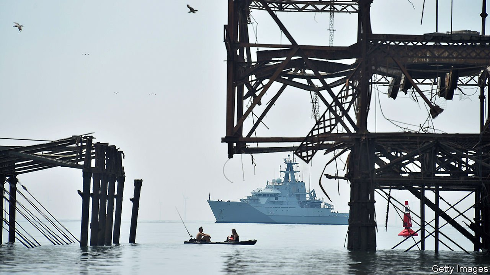
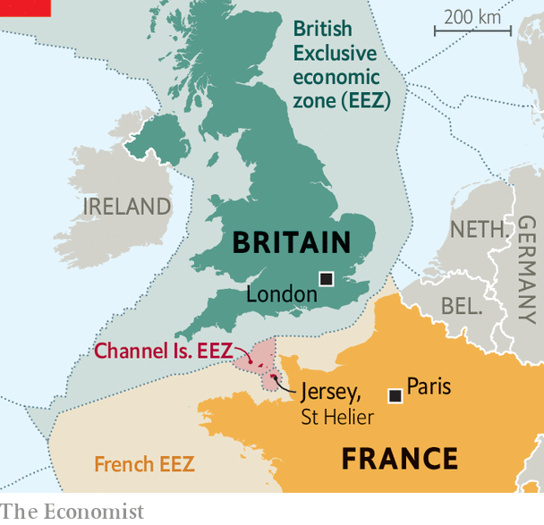

###### Brexit

# A fish fight between Britain and France 

##### Jersey is the centre of a row over fishing rights 

 

> May 8th 2021 

IT IS NOT exactly the Royal Navy task force steaming towards the Falklands, but the news that the prime minister has sent ships to protect an island threatened by an angry neighbour has historical resonance. On May 6th two navy vessels headed for the Channel Island of Jersey from the north, while a flotilla of French fishing boats, later followed by two of their own country’s patrol ships, sailed towards it from the south. 

The Channel Islands were part of the Duchy of Normandy that stuck with Britain after the French lost them in the 13th century. Crown dependencies whose foreign affairs are run by Britain, they never joined the EU, but relations between Britain and Europe have shaped their history—Germany occupied them in the second world war—and now Brexit is causing tension.


The problem is fishing. Under an agreement between Britain and the EU, French fishermen must acquire licences to fish in Jersey’s waters. To get them, they must provide data showing that they were doing so for five years before the referendum in 2016. But they say smaller boats lack the necessary equipment, and that the licences are arbitrary and restrictive. A member of the French parliament cited the case of a fisherman who used to catch sole and scallops 40 days a year, and had been told he could now catch only scallops, on only 11 days a year. Gregory Guida, Jersey’s assistant environment minister, said the problem was that the boats’ data were “very bad” and that he gave small boats extra time to prepare data using log books if they did not have electronic records.

 


Annick Girardin, France’s minister of maritime affairs, said she was “revolted” by the fishermen’s treatment: “We’re ready to resort to retaliatory measures…concerning Jersey, I’ll remind you of the transport of electricity via submarine cables.” Jersey gets 95% of its electricity from France. Clément Beaune, France’s junior minister for European affairs, said earlier that if Britain broke its commitments on fishing, retaliation could include action on financial services. Around 60 French fishing boats reportedly sailed towards St Helier on May 6th to protest, while a source in the French presidency said that France was hoping for “a return to calm and sang-froid”.

Calm of a sort has been restored. The French fishers ended their protest after talks between their representatives and island officials. But the row remains unresolved. The EU has weighed in on the French side, accusing Britain of breaching last December’s Brexit trade deal.

Before this incident, relations between Britain and the EU were improving. Britain had climbed down over its refusal to grant ambassadorial status to the EU’s representative, and the two sides were taking a more pragmatic approach to solving the post-Brexit problems in Northern Ireland. But, as Britain discovered during the Cod Wars with Iceland that sputtered on and off from the 1950s to the 1970s, fishing is a dangerous business, liable to slip out of control at any moment. ■

Editor’s note (May 6th 2021): This article has been updated since it was first published.

For more coverage of matters relating to Brexit, visit our 

