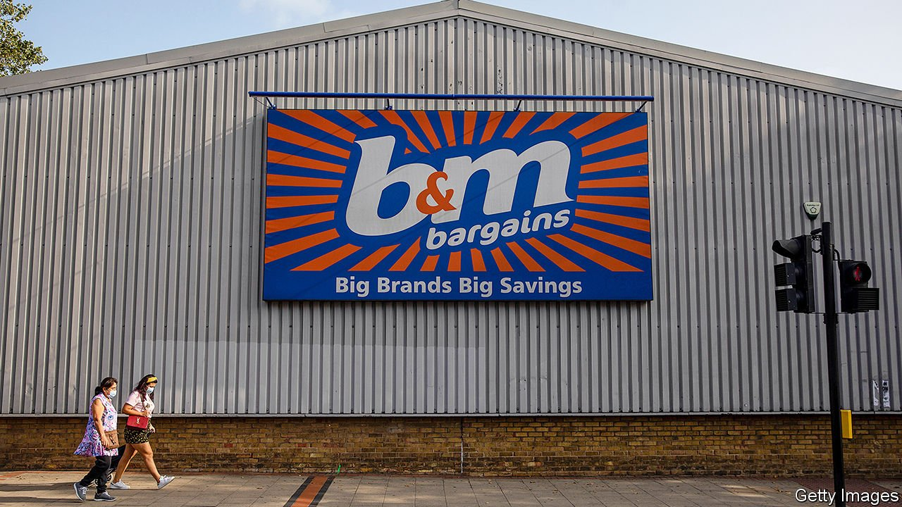

###### Discount shopping

# Quietly, B&M has become one of Britain’s most successful retailers 

##### Pile it high, sell it cheap 

 

> May 6th 2021 

B&amp;M’S STORE in Wingate Road sells a bewildering mixture of things: paint, toilet seats, pistachio nuts, Coca-Cola, screwdrivers, board games, birthday cards, wine, turf. You don’t go there looking for anything in particular, explains Jamie Tanner, as he browses the aisles. He begins by picking up pet food. By the time he reaches the checkout, a £100 ($140) metal gazebo is balanced precariously on top of his trolley.

Many Britons have done the same recently. Between April and December last year B&amp;M’s stores turned over £3.1bn, 24% more than a year earlier. Its revenues are likely to overtake those of John Lewis, a high-street stalwart, this year—although John Lewis is much bigger if you count its Waitrose stores. B&amp;M has thrived partly because it is classified as an essential retailer, allowing it to trade through the lockdowns. But that is not the only reason.


In 2004 Simon Arora and one of his brothers bought 21 stores formerly known as Billington and Mayman—old-fashioned bargain shops with what Mr Arora, B&amp;M’s chief executive, describes as a “jumble-sale” ambience. At first the company focused on Billington and Mayman’s stronghold in north-west England. But as retailers such as Comet, JJB Sports and Woolworths collapsed, it snapped up their shops in high streets and retail parks across the country. There are now 675 B&amp;M stores in Britain, a growing number in France and 300-odd convenience shops.

The firm has expanded socially as well as geographically. B&amp;M used to focus on working-class areas. It has three stores within five miles of central Luton—one of the poorest towns in south-east England—and only one within five miles of central London. But these days it will open a store almost anywhere with sufficient population density and a car park. Mr Arora says that rivals such as Aldi, Lidl and Primark have removed much of the stigma from discount shopping, which is now popular among people of all social classes.

Its business model is different from some other discounters, says Andrew Porteous, an analyst at HSBC, a bank. It does not rely on overstock—a surplus of steam irons or chocolate bars that a manufacturer will sell cheaply. Discounters that use that model struggle to find enough deals as they grow larger. B&amp;M, by contrast, is a “limited assortment discounter”. Although its range is wide, it tries to carry only the most popular things in each category, such as the 500 bestselling toys. It drives prices down by ordering huge volumes.

The firm also pulls a subtle trick. Often a shelf of groceries by well-known brands such as Heinz and Nescafé is on show at a store’s entrance. Deeper in, many products (including the gazebos) are non-brand goods sourced directly from Asian factories. The well-known brands reassure new customers that the store is legitimate. B&amp;M is not really asking Britons to trust its brand—just to trust that its prices are low.

Perhaps the strangest thing about the firm is its digital strategy. Its website is for marketing, not for selling. It is only beginning to experiment with click-and-collect shopping. If the rise of e-commerce continues, the firm will have to do better. But for now many people still shop by wandering into stores, picking up pet food and gazebos as the fancy takes them. Somebody might as well sell to such people. It might as well be B&amp;M. ■

