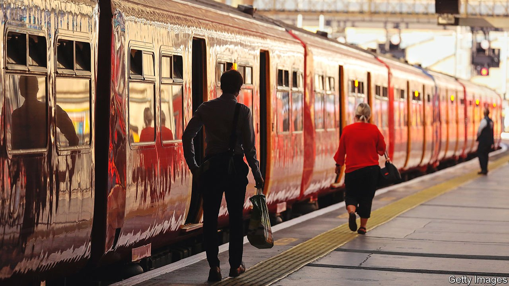

###### The fat controller

# The Treasury may use ticket pricing to discourage working from home 

##### Commuter groups aren’t happy about the prospect 

 

> May 8th 2021 

COMMUTING BY RAIL has rarely been so pleasant. The days of overcrowded, often late-running peak services seem long gone. With many people still working from home, commuters are now almost guaranteed a seat, and fewer passengers mean fewer delays. Last month half of Britain’s trains arrived ahead of schedule.

But the good times for commuters are unlikely to last. As firms and workers plot their return to the office, a row is brewing over season-ticket prices.


The pandemic has already reshaped the financial structure of Britain’s rail industry. The first national lockdown, which began in March last year, caused passenger numbers to fall by around 90%. The government stepped in within days to bail out the industry. The old franchise model, under which private firms bid to operate a section of the network, has been in effect replaced with a concession model under which the firms are paid a flat fee to run certain services.

The government now carries the revenue risk if fares undershoot expectations. The Treasury has forked out more than £10bn ($14bn) in subsidies to run services over the past year. Since the government carries the can, it is therefore the ultimate decision maker. “We’re basically tax collection officials now,” says a rail boss.

The Treasury seems inclined to use its new clout to shape working patterns in the aftermath of the pandemic. Many commuters, having discovered they can work effectively from home, want to go on doing so part-time. Many corporate finance directors are eyeing up the savings to be made by reducing their office footprint. Sir Peter Hendy, the boss of Network Rail, which owns the track, reckons that passenger numbers will be down by 20% over the long term.

Treasury officials are concerned about this shift. More working from home means less spending in city centres and lower commercial-property prices, both of which could hit tax revenues. Plans for ticket-pricing, which have leaked, suggest the government is prepared to use season-ticket prices to discourage people from working from home.

Under the current system, drawn up for an age of regular daily commutes rather than flexible working, a weekly ticket costs the same as three peak-time return journeys. There are bigger discounts on monthly or annual passes. For a commuter travelling into a city five days a week, that represents a considerable saving.

The government has written to the rail companies asking them to draw up plans for new pricing models to be unveiled later this summer. Reports suggest that season-ticket prices will still be based on the cost of three return journeys, making little concession to those intending to travel to the office three or four days a week.

Railfuture, a lobby group working on behalf of passengers, would prefer to see much wider use of carnets, a discount for the bulk purchase of tickets, which some train companies already offer. That would mean bigger savings for workers who want to go into the office only one or two days a week, or whose schedules vary from one week to the next.

If the current plans go ahead, train companies will face fury from commuters. But these days it is the Treasury, not them, that calls the tune. ■

