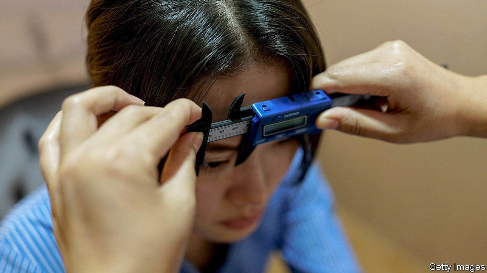

###### Nipping and tucking

# Why so many young Chinese seek plastic surgery 

##### It’s not just that they want to stay young 

 

> May 8th 2021 

HANNAH TANG, a company manager in Beijing, first went under the knife when she was 18. The surgeon made an incision across each of her eyelids, then stitched folds of skin back to transform her monolids into “double eyelids”. The result was eyes that look bigger, rounder, and in Ms Tang’s opinion, more beautiful. Now 35, Ms Tang (not her real name) has since had two more eyelid surgeries, as well as botox injections in her neck and monthly non-invasive “skin booster” treatments. “Pretty much everyone I know around me has had fillers or surgery,” she says.

China’s cosmetic-surgery market is booming. Some analysts think it is now the world’s biggest. In 2019 the Chinese “medical-aesthetics” industry (which includes surgery, injections and skin treatments) had revenue of $27bn, around one-fifth of the global total, estimates Deloitte, a consultancy. It reckons the average annual rate of growth in China’s market between 2015 and 2019 was 29%, compared with a global average of around 9%. By 2023, Deloitte estimates revenue will reach $48bn.


Figures can be vague partly because “there is a huge hidden market” that goes unreported, says Yi Wu of Maastricht University in the Netherlands. For example Dongguan, a city in southern China, has over 6,000 unlicensed clinics but only 43 licensed ones. The International Society of Aesthetic Plastic Surgery has not included detailed data on China in its global reporting since 2011.

Starting young is common. In 2020 61% of patients were aged 16-25, up from 48% two years earlier. More than 90% are under 35, and 85% are female. In America, 81% of cosmetic-surgery patients are over 30 and nearly one-quarter are over 55. Ms Wu believes part of the reason young people have surgery is the influence of Confucian parenting, which means that children grow up without unconditional approval. This normally leads to academic pressure, she says, but it can also be internalised so that children feel the need to improve their appearance from a young age.

Double-eyelid surgery accounts for half of all treatments. (In America breast augmentations are the most popular procedure, although in 2020, the year of Zoom, more Americans fixed their noses than their breasts.) Some say the desire for rounder eyes is about looking more Western. But women care more about achieving the “golden ratio” of facial proportions, a more Chinese requirement, reckons Joyce Xu, who works in marketing in Beijing.

The golden ratio is an upside-down triangle: big eyes, relatively flat cheekbones, a narrow jaw and a small mouth. Ms Xu (also not her real name) started Botox injections to that end when she was 27.

As middle-class incomes have risen, surgery has become more affordable. Ms Xu’s quarterly injections are 3,000-5,000 yuan ($460-770) each time, which she deems a bargain. However, the popularity of such things has led to widespread fakery. An estimated two-thirds of injectables in China are unlicensed. In February Gao Liu, an actress, shared shocking pictures on social media of her botched nose job. It resulted in the tissue on the tip of her nose dying and turning black.

Horror stories such as Ms Gao’s may not slow growth. One consequence of starting on treatments so young is that your “baseline appearance gets forgotten,” notes Ms Wu. As a movie character almost said, there’s a great future in plastic surgery. ■

