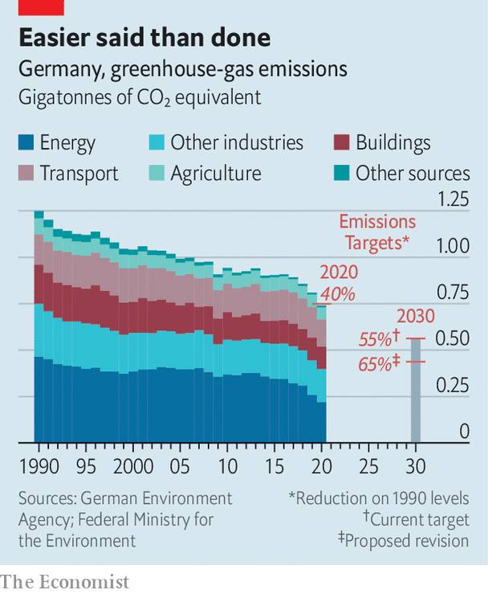

###### Red in robe, green in thought

# A court ruling triggers a big change in Germany’s climate policy 

##### Tougher targets will follow 

 

> May 8th 2021 

THE “EIGHT arseholes in Karlsruhe”, otherwise known as Germany’s Federal Constitutional Court, have been perennial irritants for politicians, as this outburst from an irate minister in the 1970s suggests. Yet on April 29th, when the court’s first senate declared Germany’s climate-change law partly unconstitutional, ministers in the ruling coalition fell over themselves to hail the judges’ wisdom in rejecting an act they had passed less than 18 months earlier. The judgment was “epoch-making”, said Peter Altmaier, the Christian Democrat economy minister. “This is a very special day,” added Olaf Scholz, the Social Democrat finance minister. The pair then bickered over which of them was to blame for the terrible law in the first place.

Passed after bruising intra-coalition negotiations in 2019, Germany’s first climate law decreed that by 2030 carbon emissions must be cut by 55% from the level of 1990, and laid out annual quotas for different sources of emissions. It also stated that Germany, like the rest of the EU, would aim to emit no net greenhouse gases by 2050.(The previous target for 2020 of a 40% cut was narrowly met, thanks to the pandemic.) The law was hopelessly unambitious, howled critics. “Politics is what is possible,” shrugged Angela Merkel, the chancellor. But now the constitutional court has redefined the limits of the possible. The judges said the law risked forcing future generations to “engage in radical abstinence” by leaving too much of the burden to the years after 2030.


“No one expected this,” says Felix Ekardt, a climate researcher and one of the jubilant plaintiffs. Young activists cheered the court’s novel approach to intergenerational justice. Legal theorists were struck by its discovery in Germany’s constitution of an obligation to cut emissions, given life by Germany’s commitments under the Paris climate deal of 2015. “This judgment shows that the Paris agreement has teeth,” says Paul Benson, a Berlin-based lawyer for ClientEarth, an NGO.

 


The verdict will loom over every climate-policy deliberation of future German governments. It could also, reckons Joana Setzer of the Grantham Research Institute, influence dozens of other climate lawsuits around the world, especially those brought by children. As governments enshrine climate commitments into law, courts are learning how to enforce them by watching each other. Litigants are emulating legal tactics that have worked elsewhere.

Wary of treading on political toes, the judges did not demand a change to the goal for 2030. Instead, Germany’s government was given until the end of 2022 to specify binding targets for the years after 2030. Yet rather than leave the job to the government that will take office after September’s election, Mrs Merkel’s coalition leapt into action, drawing up legislation that far exceeds the court’s instructions. The government now wants to lift the 2030 reduction target to 65%, and to bring forward the net carbon-neutral date to 2045. Among other things, this may mean accelerating the phase-out of coal and increasing the new carbon price on heating and transport.

Laying out a tighter emissions pathway now, notes a government source, will help shape post-election coalition negotiations in areas like transport and energy. It will also affect the campaign. The government’s scramble to respond to the ruling highlights the power of climate in the political debate, and the threat posed by the opposition Green Party, which is leading in polls and angling to take the chancellery.

As covid fades, the parties will place different bets on what will drive voters in September. Armin Laschet, the conservative aspirant to replace Mrs Merkel, hopes a mildly green-tinged economic pitch will appeal to Germans worried about debt and growth. The Greens think voters mean it when they tell pollsters climate is their biggest concern. Last week, eight judges in Karlsruhe lent them a hand. ■

For more coverage of climate change, register for The Climate Issue, our fortnightly , or visit our 

