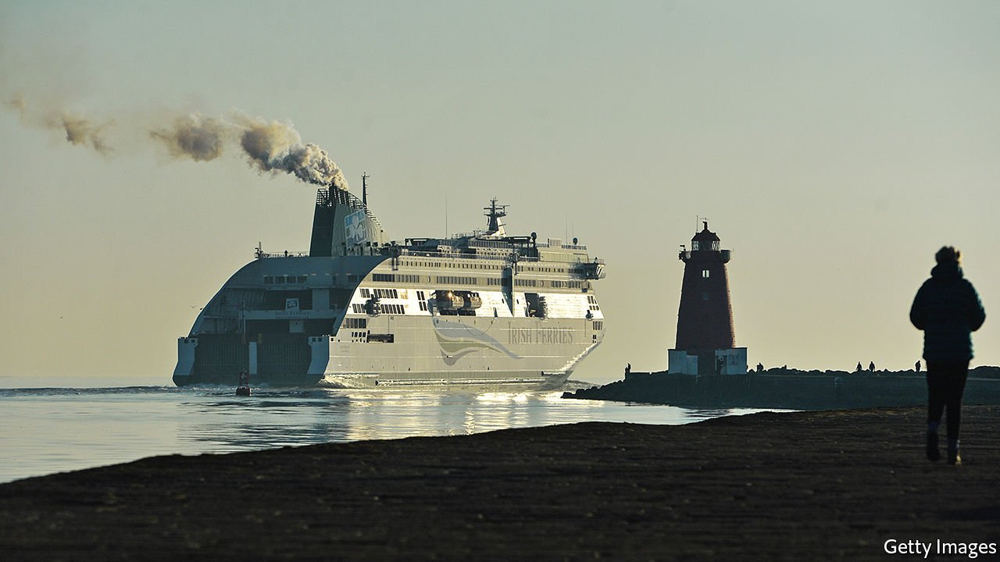

###### Dublin saw it coming

# How the Irish Republic is making the best of Brexit 

##### The North is finding things harder 

 

> May 8th 2021 

THE NEW trade frontier between Northern Ireland and the British mainland was intended as a conflict-prevention measure, allowing Great Britain to leave the European Union’s single market without reimposing a hard border between Northern Ireland and the Republic to the south. So far, not so good.

Unionist politicians, angered by disruption to shopping and trade with Great Britain, now call for the protocol that imposed a new Britain-Northern Ireland border to be scrapped. In Protestant areas of County Antrim youths rioted last month, egged on by loyalist paramilitaries. Last week Northern Ireland’s first minister, Arlene Foster, was forced to resign by her party, having reluctantly accepted the protocol as the least bad solution.


There has been much less fuss in the south, even though, in terms of trade with Britain, both parts of Ireland are in much the same post-Brexit boat. The Republic of Ireland has been independent from London since 1922, but Britain is still by far the biggest source of Irish imports of goods, at €17.8bn ($21.4bn) last year, and its fourth-largest customer for goods exports: €12.4bn in 2020. Consumers in both countries share many tastes, and until January 1st co-membership of the EU allowed British high-street retailers like Boots and JD Sports to treat the republic as a sub-region of their UK supply chains.

In Dublin, as in Belfast, grocery shelves in British-owned retailers grew notably barer after Brexit kicked in on New Year’s Day, although supplies have since recovered as businesses find ways to navigate the new system.

The mood is calmer in the south, partly because it saw the problem coming. Arnold Dillon of Retail Ireland, a trade group, says that the Irish government began planning for a worst-case hard Brexit right after the referendum in 2016. Northern Ireland was less well-prepared, not least because it had to wait until Christmas Eve to see the outlines of a last-minute trade deal. Boris Johnson, Britain’s prime minister, made planning almost impossible by issuing contradictory statements, asserting that there would be no new customs border on the island of Ireland, no new regulatory checks between Britain and Northern Ireland, and yet also regulatory divergence between the UK and Europe. “Our experience is that the UK has been woefully, awfully, badly, naively underprepared for Brexit,” says Simon McKeever, the boss of the Irish Exporters Association.

Another difference in the south is that businesses and politicians expect to see benefits from Brexit, as well as losses. Kieran Donoghue, head of financial services at Ireland’s industrial-development authority, a state booster for investment, said that Ireland has already secured around 100 new investments and 6,000 jobs, half of them in finance, as UK-based businesses shift their headquarters out of London so as to retain an EU domicile and access to the European single market.

While red tape and delays have roughly halved lorry traffic on Ireland’s traditional “land bridge” across Britain to the rest of the EU, the number of direct ferry sailings from the Republic to the continent has gone up from around 12 a week to more than 40. Irish trade groups hope that Irish chains will now source more products locally, and replace UK supply hubs with local depots, creating new jobs.

Yet, as with Brexit itself, this isn’t all about money or trade. For a century since it won independence, the Republic of Ireland has tried to escape the shadow of its former colonial power and to reach out to the world. By contrast, Northern Ireland’s unionists and many pragmatic businesses have no interest in distancing themselves further from the rest of the UK.

“Even though most Irish people think that Brexit is crazy, the government here is realistic that you have to deal with what you get,” says Bobby McDonagh, a former Irish ambassador to London and senior diplomat in Brussels. “We still need to co-operate with London on Northern Ireland, and in other ways.” ■

For more coverage of matters relating to Brexit, visit our 

