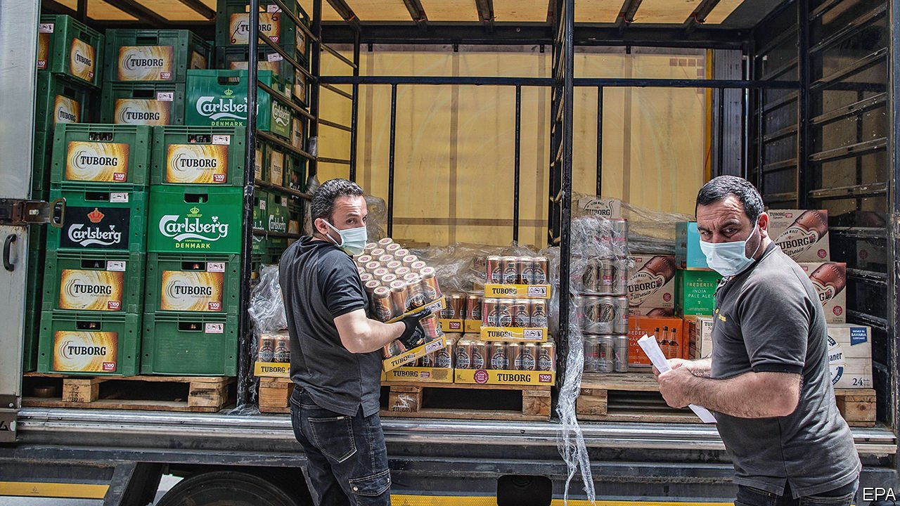

###### A no-wine situation

# In Turkey’s latest covid-19 lockdown, alcohol sales are barred 

##### A backlash brews, as critics fear encroaching Islamism 

 

> May 6th 2021 

EUROPE’S AUTOCRATS have different views on covid-19 and strong drink. Alexander Lukashenko, Belarus’s president, says vodka might ward off the virus. Turkey’s president, Recep Tayyip Erdogan, begs to differ. Shortly after he ordered Turks to stay at home for 18 days, starting on April 29th, after a record surge in covid cases, his government said it would ban alcohol sales during the entire lockdown.

The reaction was as predictable as a hangover after too many glasses of raki, a local aniseed-flavoured firewater sometimes called “lion’s milk”. Thirsty Turks besieged supermarkets and liquor stores. Beer and wine disappeared from shelves at a record pace. Secular types accused Mr Erdogan of using a health crisis to impose an Islamist policy. Similar accusations flew when, a few weeks ago, the government ordered all eating and drinking establishments to shut down over the holy month of Ramadan, ostensibly to curb the virus.


“This is a clear attempt to interfere with people’s private lives and their way of life,” said Veli Agbaba, the deputy chairman of Turkey’s main opposition party, referring to the alcohol ban. It also has political undertones. Opposition supporters tend to be metropolitan and secular; ruling-party supporters are more likely to be rural, pious and teetotal.

The case for the new lockdown is hard to dispute. Covid infections and deaths soared to record levels in April. Over the last two weeks of the month, Turkey reported the highest number of active cases per head of any big country. The  has gone from decent to bad to worse. The spike in infections came after the authorities relaxed restrictions in March. Mr Erdogan and his ministers flouted their own rules by attending large funerals and holding rallies in stadiums packed to the rafters.

They have not explained exactly how banning booze sales will help. When Turkey imposed similar measures during weekend lockdowns last year, the interior minister, Suleyman Soylu, claimed that “all Western countries” had limited alcohol sales during the pandemic and that the decision was “consistent with scientific views”. In fact, only a handful of countries, including Thailand, India and South Africa, have imposed such bans. And though the WHO recommends that people avoid alcohol to protect their immune system, it does not recommend that governments decide for them.

The backlash has been surprisingly strong. Scores of supermarkets and liquor shops across Turkey have ignored the restrictions, arguing they have no basis in law. But the authorities have started to double down. At least one liquor vendor has been arrested. And on May 4th, the government not only confirmed the booze ban but extended it, “so as to prevent overcrowding” at supermarkets, to other goods it deemed “unessential”. The newly proscribed items range from toys to electronics to gardening tools. Turks will have to brace for two weeks without raki or rakes.

A version of this article was published online on May 2nd, 2021

