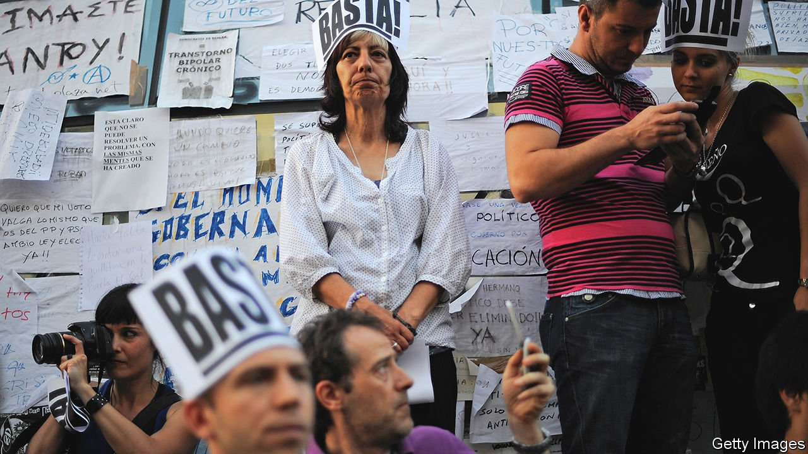
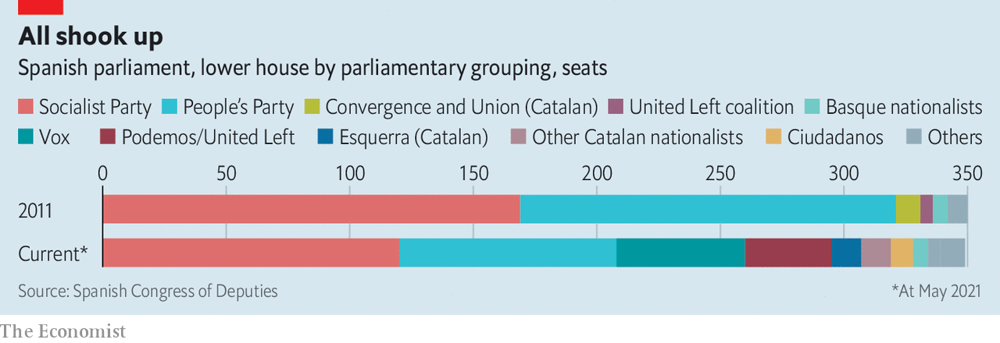

###### From rage to disillusion

# Ten years after Spain’s indignados protests 

##### Politics are still broken 

 

> May 8th 2021 

ON MAY 15TH 2011 some 20,000 mainly young, middle-class Spaniards occupied the Puerta del Sol, in the heart of Madrid, angry at austerity and the sense of entitlement among politicians and bankers. Organised through social media and calling themselves los indignados (“the indignant ones”), it was a new kind of protest movement, one that would be swiftly copied elsewhere, notably by Occupy Wall Street and Occupy London later that year.

Initially enjoying broad public support, the indignados shook Spain to the core. Within three years they helped to spawn two new national political parties, Podemos on the left and Ciudadanos on the centre-right. In 2015 these parties grabbed 34% of the vote between them. A stable political system long based on the Socialists and the conservative People’s Party (PP) fragmented. The result has been four general elections in the past six years, none of which has produced a majority government.


A decade on, Spain is in many ways a different country. The legacy of the indignados is palpable but far from straightforward. “May 15th was a great outburst of dismissal,” says Carolina Bescansa, a sociologist who took part and was one of the founders of Podemos. “The consensus was on what we didn’t want. We didn’t want more cuts, we didn’t want corruption and we didn’t want that way of doing politics behind the backs of citizens.”

 


On the first two points the movement achieved changes. Unlike the policy during the slump of 2008-12, Spain’s government has spent heavily to protect household income during the pandemic, partly thanks to more accommodating policies from the European Central Bank and the European Commission. “Corruption still exists but there’s no longer impunity,” says Ms Bescansa. Dozens of politicians and bankers have been jailed over the past decade. Banks treat people with mortgages better. The indignados also heralded a generational change, as new political leaders rose through the introduction of party primaries. At 49, Pedro Sánchez, the Socialist prime minister since 2018, is the oldest of the national party leaders.

But in other ways remaking Spanish politics has proved elusive. Last year Podemos entered government as the Socialists’ junior partner in Spain’s first coalition government since the 1930s. But Podemos itself has changed. It began as a broad left-populist outfit, with some similarities to Italy’s Five Star Movement. In 2015 its leader, Pablo Iglesias, hoped to displace the Socialists, just as Syriza, another insurgent party, did in Greece. Podemos peaked in 2016 when it won 21% of the vote. It has declined ever since, as Mr Iglesias ruthlessly sidelined his fellow leaders and mimicked the Communist Party, with which he allied. He stepped down as a deputy prime minister to run in Madrid’s regional election on May 4th, but did poorly. He then announced his resignation from politics.

The best chances of renewal were squandered. In 2016 the Socialists and Ciudadanos, with 130 of 350 parliamentary seats between them, agreed on a programme of political and economic reforms but were thwarted when others refused to let them govern. An election in April 2019 gave the two a combined majority of 180 seats. But Albert Rivera, Ciudadanos’s leader, had steered his party to the right and was set on a bid to displace the PP. It failed, too. Mr Sánchez showed no interest in wooing him. By then the two “detested each other”, writes Ramón González Férriz in a book on why regeneration failed.

“The opportunity for reform is no longer on the table,” says Pablo Simón of Carlos III University in Madrid. “Now there’s a different logic, of polarisation.” That dynamic was at work when Mr Sánchez, with the help of Catalan and Basque nationalists as well as Podemos, toppled a PP government with a censure motion over corruption in 2018. It was intensified by the rise of another new party, Vox, a hard-right splinter from the PP, initially in response to the threat of Catalan separatism.

Polarisation reached a new low in a nasty campaign for the recent snap election on May 4th in Madrid, which saw death threats, mailed with bullets, against six politicians, starting with Mr Iglesias. Isabel Díaz Ayuso, the PP regional president, campaigned against Mr Sánchez, rather than her local rivals, under the banner of “freedom”—to keep taxes light and bars open despite the pandemic. This message and her spontaneous manner resonated far more with madrileños, weary of lockdowns, than Mr Iglesias’s overheated claim to be fighting “fascism”. Ms Díaz Ayuso doubled the PP’s vote and came close to an absolute majority of seats. The Socialists suffered a heavy defeat and were overtaken by Más Madrid, a regional party of dissidents from Podemos driven out by Mr Iglesias. Vox failed to gain much. Ciudadanos lost all its seats in the regional assembly, a failure that could prove terminal.

In some ways this result points to the resilience of the old two-party system, wounded though it remains. It suffers from “two very disruptive parties at the extremes” in Vox and Podemos, Mr González warns. Mr Iglesias’s departure, like Mr Rivera’s last year, underlined their failure to forge a “new politics”. A decade on, the politicians look just as disconnected from the voters. But citizens’ rage has given way to disillusion, aggravated by the pandemic’s destruction of lives and livelihoods. Five years of vigorous economic growth from 2014 to 2019 failed to restore Spaniards’ trust in their politicians and their institutions, among the lowest of any country in the European Union. The indignados broke more than they managed to build. ■

