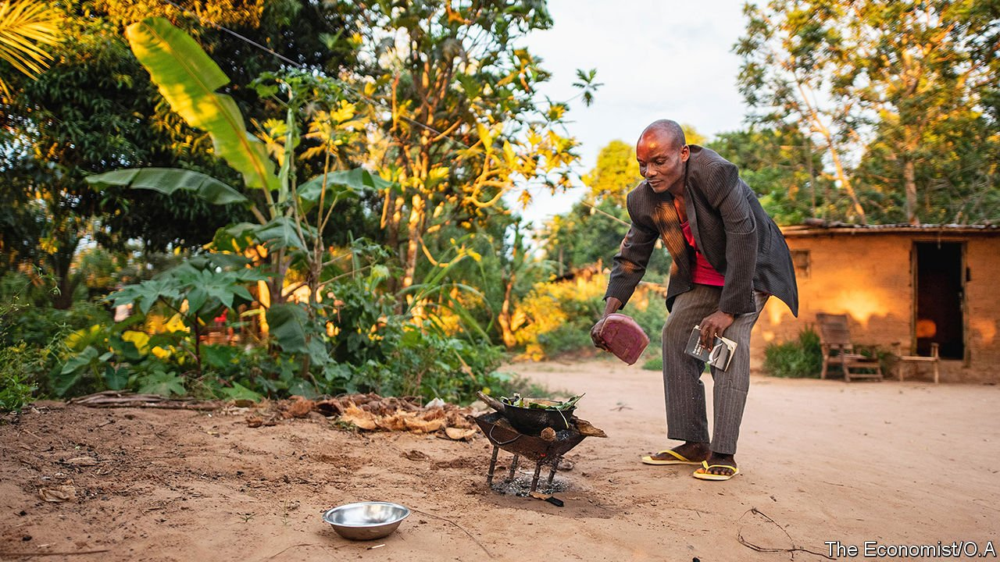

###### Fire escape

# Donors make it harder for Africans to avoid deadly wood smoke 

##### Making the cleanest the enemy of the clean 

 

> May 8th 2021 

YVONNE KAYAYA has never seen a gas cooker. In a poorly ventilated room in her home in Kasai, Congo, she stews potato leaves over a charcoal stove no bigger than a small stool—as generations before her have done. “I sometimes cook with firewood. If I have money, I always buy charcoal,” she says, unaware that both fuels are clogging up her lungs.

Ms Kayaya is one of the 4bn people who heat their food over a smoky fire. In sub-Saharan Africa nine out of ten people cook with dirty fuel, such as wood, charcoal or kerosene. This is unhealthy. Some 2.5m-4m people die prematurely every year because of indoor air pollution, most of which is from cooking, according to the Paris-based International Energy Agency (IEA) and the World Health Organisation. Breathing soot is particularly dangerous for infants: worldwide it may cause almost half of all fatal cases of pneumonia among children under five.


There are environmental costs, too. Wood may be renewable, but chopping down trees for firewood or to make charcoal contributes to deforestation. The charcoal industry is one of the main reasons why the rainforest of the Congo basin is shrinking. The damage done to this rainforest, the world’s second largest, is not just a tragedy for Congo; it is also one for the world, since the forest removes hundreds of millions of tonnes of carbon from the atmosphere each year.

How Africans can cook more healthily for more than a billion stomachs is a conundrum. The poor need energy to have comfier, more prosperous lives. How can they do so without cooking the planet?

Africa’s population is growing faster than any other continent’s. It is urbanising faster, too. As people move to cities, they tend to switch from firewood to charcoal, which, because it is made from wood that is then heated by burning more wood, destroys forests still faster.

Since few Africans, whether in cities or villages, have grid-connected electricity, the obvious way to wean them off wood and coal is to encourage the use of bottled gas. India and China have managed to reduce pollution from cooking fires in this way in the past decade. But markets for gas have been slow to take off in Africa because rural folk in countries like Congo, where almost three-quarters of people live on less than $1.90 a day, do not see the need to pay for gas when wood is free. “I only cook with wood,” says Martin Batumala, a Congolese farmer. “I go and collect it every day on a bicycle with my children.”

By contrast, refilling a canister of 12kg with liquefied petroleum gas (LPG) costs $20, almost as much as farmers make in a month. Charcoal can be bought in small quantities, which makes it easier for the cash-strapped to afford. And cost is not the only consideration. Charcoal creates distinctive flavours, which many people like and do not wish to give up.

Advocates of clean cooking hope eventually to change people’s habits. It would be easier if gas were cheaper, but to make it so will require lots more public and private investment. One big obstacle is that donors in rich countries are reluctant to back investment in any fossil fuels, even though the alternatives to gas—wood and charcoal—are worse for the environment, for the cooks and their children.

Opponents of gas note that it contributes to climate change, which is true. They suggest that Africa should “leapfrog” to powering itself primarily with solar, wind and other renewable sources of electricity. But some perspective is in order. The continent is responsible for less than 2% of global carbon emissions. Its people, the world’s poorest, are in effect being asked to bear the costs of a sudden energy transition that many rich countries have been reluctant to embark on. Switching millions of Africans away from charcoal and firewood to a cleaner fuel would still mean Africa is helping to reduce carbon emissions, says Mansoor Hamayun, the boss of Bboxx, an international energy company that initially provided only rooftop solar systems in Africa, but now also offers LPG cookers. Gas “is not a perfect choice”, he says. “But it’s part of a journey to net zero.” ■

