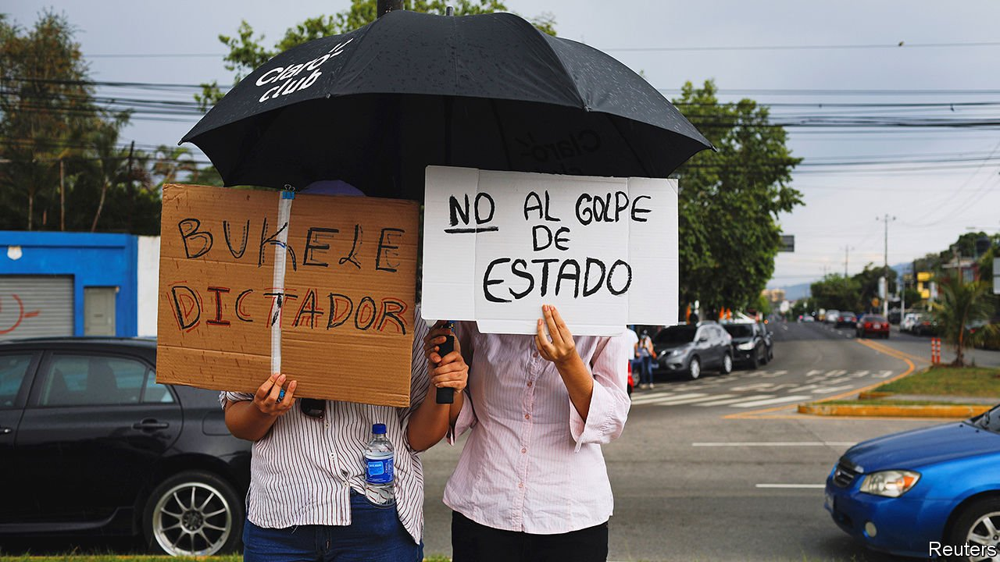

###### A presidential power grab

# El Salvador’s parliament sacks the country’s top judges 

##### President Nayib Bukele is proving even less of a democrat than his opponents feared 

 

> May 6th 2021 

WHEN NAYIB BUKELE’S New Ideas (NI) party won a sweeping majority in El Salvador’s elections in February, fans of democracy held their breath. Mr Bukele, who with a 90% approval rating is the most popular president in Latin America, has shown little regard for checks and balances since he came to power in 2019. On May 1st, the day new lawmakers first took their seats in the legislative assembly, fears about the 39-year-old president appeared well founded. The assembly promptly voted to sack the attorney-general and the five judges who sit in the constitutional chamber of the Supreme Court, which oversees most laws. Mr Bukele crowed on Twitter: “And the Salvadorean people, through their representatives, said ‘DISMISSED!’”

The assembly’s decision was quickly declared unconstitutional by the court itself. Hundreds of protesters took to the streets to denounce “the coup”. Officials in the United States including Kamala Harris, the vice-president, condemned it. Juan Gonzalez, an envoy of President Joe Biden, tweeted “Así no se hace” (“That’s not the way you do things”). Nonetheless, five new judges and a new attorney-general were escorted to their desks, flanked by armed police. Four of the six sacked officials then resigned, suggesting no way back. Mr Bukele now controls all three branches of the state. “Democracy has died in El Salvador,” declared Revista Factum, a local magazine.


The assault on the judicial system is part of a pattern. Mr Bukele is impatient with any institution that appears to stand in his way. Last year he entered the assembly, then controlled by the opposition, with gun-waving police to force it to approve a loan. When the Supreme Court ruled as unconstitutional some of his harsh covid-19 measures, such as soldiers and police picking people off the streets and throwing them into quarantine, he called on officials to disobey the ruling. Raúl Melara, the sacked attorney-general, had annoyed Mr Bukele by investigating claims of graft within his government.

But the speed and boldness with which NI moved was surprising, says Juan Meléndez of the Netherlands Institute for Multiparty Democracy, an NGO. In the election NI won 56 of 84 seats—more than any recent government—which, along with the eight held by its allies, allows it to pass whatever laws it likes. This year the assembly was due to pick a new attorney-general and one of the five Supreme Court judges.

Mr Bukele has almost certainly breached the constitution, if not other laws. When the votes happened, police were surrounding the chambers of the Supreme Court and the offices of the attorney-general to prevent the embattled officials from entering. And although the assembly is allowed to dismiss judges, it neglected to hold the requisite hearings. It named the new magistrates and a new attorney-general without following the correct nomination process. They seem likely to side with Mr Bukele. The new president of the constitutional chamber has little experience in constitutional law. Another is a former adviser to the president.

The firing lays bare not only Mr Bukele’s , but also the weakness of the system set up after the civil war, which ended in 1992. A secretly negotiated amnesty law that helped bring the war to a close set a precedent of impunity. Politicians saw institutions not as independent bodies but as spoils to be shared among the main parties: the Farabundo Martí National Liberation Front (FMLN), a left-wing outfit that started as an umbrella group for guerrilla forces, and the Nationalist Republican Alliance (Arena), a conservative party that was founded by a former soldier to oppose those guerrillas.

Other governments have tried to do similar things in the past. In 2012 the Supreme Court and the assembly, then dominated by the FMLN, clashed over appointments of judges, leading to a stand-off. But no one in the country has ever wielded as much power as Mr Bukele. The opposition parties, which hold only 20 seats between them, have been sidelined. They were left out of the planning meetings for the first legislative session. Opposition MPs had their microphones and voting screens turned off for most of it. Both the police and the army appear to be under Mr Bukele’s sway, too.

The president is likely to go after remaining state institutions, such as the human-rights ombudsman and the supreme electoral tribunal. On May 3rd he tweeted: “The people did not send us to negotiate. All are going.” Journalists fear they will be muzzled. Mr Bukele has already denounced some, threatened criminal charges against others and launched a money-laundering investigation against El Faro, an influential digital newspaper.

Criticism from abroad does not seem to worry the president, who increasingly behaves like a modern-day caudillo. He said it was no concern of the rest of the world that El Salvador was “cleaning” its house. Even so, the reaction from the United States—home to 2.3m Salvadoreans and, most importantly, a source of cash—will still matter. But the administration of Mr Biden is in a tricky bind, since it wants help from Central American countries to reduce northbound migration.

Mr Bukele’s weak point is the economy. He does not have the cash he needs to fund his ambitious social and infrastructure programmes. Some members of the United States Congress and Human Rights Watch, an NGO, are calling on the IMF to call off or make conditional a $1bn bail-out that El Salvador is currently negotiating (it received $389m in emergency loans during the pandemic). Rumours swirl that China, which did not condemn the ransacking of the court, would be willing to finance El Salvador’s short-term needs.

An economic squeeze might also be the only thing that can dent Mr Bukele’s incredible popularity. Salvadoreans point to tangible things he has done for them, such as sending out laptops for students and food parcels for many families during the pandemic. But even if people now regret voting for an authoritarian leader, it may be too late, as Mr Bukele will have already captured the state, says Celia Medrano, a Salvadorean candidate to head the Inter-American Commission on Human Rights, a regional body. “We are at the start of a long night.”■

Correction (May 3rd 2021): This article originally said that Mr Bukele's super-majority would have allowed him to replace all five Supreme Court judges this year. In fact he could have replaced only one.

A version of this article was published online on May 3rd, 2021

