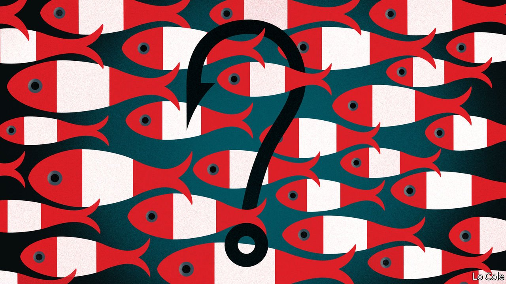

###### Bello

# Peru ponders: whose fish are they anyway? 

##### A bid to protect part of the Pacific raises legal conundrums 

 

> May 6th 2021 

AT 7.30AM ONE February morning last year, the great Bay of Paracas shimmered in the light from the desert. Storms of seabirds—small Inca terns and petrels, large cormorants and Peruvian boobies—swirled over the shore, retreating like a mirage on approach. Flamingos flew javelin-straight. Pelicans bobbed on the water, so ungainly that they seem designed by a committee until they took flight, elegantly skimming the waves.

All take advantage of a food chain centred on great shoals of anchoveta (Pacific anchovies), which in turn feed on the nutrient-rich plankton provided by the upwelling of the cold Humboldt current along much of Peru’s coastline of 2,500km (1,600 miles). These riches have given the country one of the world’s great fisheries, the third-biggest after China and Indonesia. Exports of fishmeal, oil and frozen and canned fish are worth around $3bn a year. All told, the fishing industry supports around 700,000 jobs. And fresh fish and seafood are at the heart of Peruvian cuisine, one of the world’s tastiest.


Peru has many problems at the moment. The pandemic has hit it hard. It is suffering political instability that a presidential run-off election next month is unlikely to resolve. But sustainably managing the country’s marine resources is a vital medium-term task. It is also a matter of current dispute.

Last month the government of Francisco Sagasti, the president since November, published a draft decree to establish a marine reserve, known as the Nazca Ridge. It would cover an area of the Pacific about the size of Latvia 100km offshore that contains a submerged mountain range up to 4kms down. This undersea massif is a refuge for endangered species, such as the loggerhead turtle, sharks, orcas and the blue whale, as well as yellowfin tuna and swordfish.

Environmentalists have pushed for this for years. Peru has been a pioneer in managing the anchoveta fishery. In 2009 it introduced a transferable quota system. The marine research institute fixes the total catch and monitors boats closely. The stock has remained roughly constant. But the country has been a laggard in creating marine protected areas. Under the international Convention on Biological Diversity, it signed up to a target of protecting 10% of its seas by 2020. But so far it has only designated four small coastal reserves (Paracas, the first, dates from 1975). That contrasts with a regional average in Latin America of almost a quarter.

The Nazca Ridge covers 7.3% of Peruvian waters. Both environmentalists and the fishing industry back it in principle. But a big row has broken out over the details. Article 5 of the draft decree separates the reserve vertically into two zones. It would allow commercial fishing for the first kilometre below the surface and ban it below that, with one exception: a single family with six boats would be allowed to continue deep-sea long-lining for Patagonian toothfish, as that family has done for a dozen years. The fishing industry has pushed for Article 5. “It’s important that the specifics are set out and not left open to interpretation,” says Cayetana Aljovín of the National Fisheries Society.

For some environmentalists Article 5 pre-empts a scientific discussion about the management of the reserve. For others it undermines the whole point of it. “It’s a power battle for the fishing industry,” says Patricia Majluf of the Peruvian branch of Oceana, an NGO. “They think Peruvian waters are theirs and they manage everything perfectly.” International experience shows that banning all fishing in an area leads stocks to regenerate and quickly increases catches nearby. And enforcement is easier if all boats are prohibited.

The problem is that Peruvian law recognises prior rights, even in protected areas. Officials are worried that a total ban would be legally unenforceable. “You have to allow a very small amount of activity to protect a very large area,” says a senior official. He says the government will try to prevent the toothfishing family from transferring their permit to any other fishermen.

Mr Sagasti’s government has done a creditable job of trying to mitigate the pandemic and organise vaccinations. But it is only a caretaker. An imperfect reserve may be the most it can manage before it leaves office on July 28th. Yet the issues at stake will surely recur. According to some scientists, climate change is likely to lead to fewer anchoveta. Peru should find a way to organise watertight reserves. Private property rights cannot be as absolute over the fish in the sea as they are on land.

