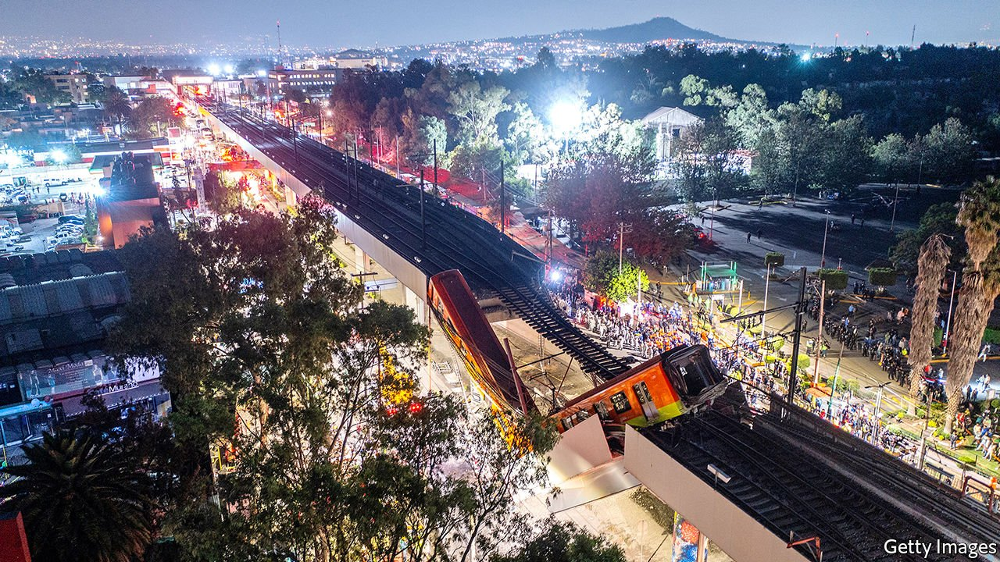

###### A terrible accident in Mexico City

# The collapse of a Mexico City railway bridge kills 25 people 

##### Current and past mayors with presidential aspirations may be blamed 

 

> May 8th 2021 

ON MAY 3RD a section of Mexico City’s metro collapsed into the street below. At least 25 people were killed; many more were injured. The accident occurred on Line 12, the newest part of the system, which has been plagued by problems since it opened in 2012. The political fallout could affect Claudia Sheinbaum, the mayor, and Marcelo Ebrard, the foreign minister, who was mayor during the construction of the line. Both are seen as potential successors to President Andrés Manuel López Obrador.

