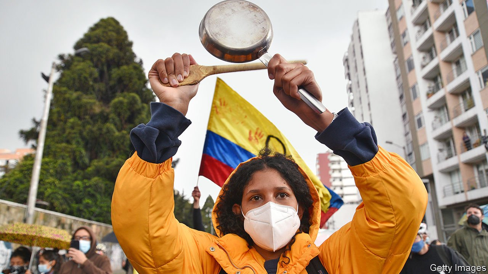
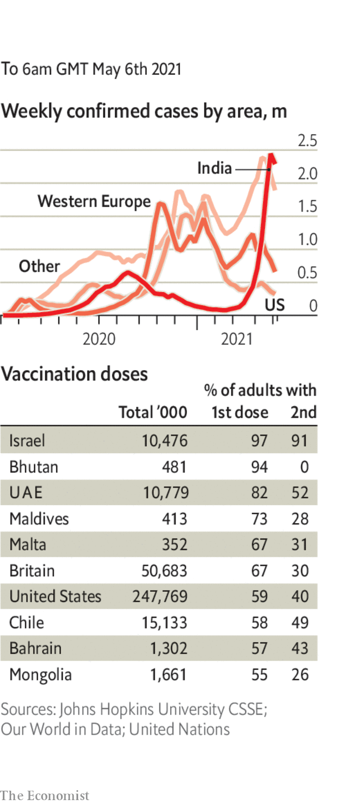

###### 

# Politics this week 

#####  

 

> May 6th 2021 

 raged on, despite the scrapping of an unpopular tax reform that had sparked them and the resignation of the finance minister who championed it. The government responded harshly; the protesters became increasingly violent in turn. At least 24 people have died and more than 800 civilians and police officers have been injured.

, once again displayed his authoritarian tendencies. The legislative assembly, which his party controls, sacked five Supreme Court judges and the attorney-general. Their replacements have links to Mr Bukele, who now controls all three branches of the state. American officials complained, but softly. President Joe Biden’s administration wants Central American governments to help it curb migration to the United States.


For the first time since 2005 members of the opposition in Venezuela were allowed onto the National Electoral Council. Nicolás Maduro, the dictator, wants to persuade the United States that his regime no longer deserves the sanctions imposed on it.

An  was a blow for Spain's prime minister, Pedro Sánchez. His Socialist party slumped to third place as the conservative People's Party triumphed. The result was even worse for Pablo Iglesias, the national leader of the radical-left Podemos; he had resigned as a deputy prime minister to run in the election, but his party came fifth. The pony-tailed Mr Iglesias said he would quit politics.

The European Commission said it would put its efforts to secure the ratification of an investment deal with China on hold. The European Parliament is refusing to consider ratification until China lifts sanctions on several of its members, after the EU imposed sanctions on China for abuses against the Uyghurs.

In a nasty , France threatened to cut off the electricity supply to the island of Jersey, a British dependency that lies close to the French coast. Britain sent two navy vessels to Jersey to monitor a protest by a flotilla of French fishing boats.

The deadline for Binyamin Netanyahu, Israel’s prime minister, to form a new government passed, putting his political future in doubt. President Reuven Rivlin asked Yair Lapid, Mr Netanyahu’s rival, to try to assemble a coalition.

Ace Magashule, the secretary-general of South Africa’s ruling party, was suspended from it while he answers charges of graft. Mr Magashule was the focus of resistance to President Cyril Ramaphosa, who has pledged to fight what he called “corrosive corruption” within the party.

The Democratic Republic of Congo is imposing military rule on two conflict-ridden provinces in the east following a surge in attacks by militias. Governors and provincial assemblies were suspended for 30 days and replaced by military governors with extensive powers.

Joe Biden raised the cap on  to 62,500 for the fiscal year ending September 30th. The president had been chided by his fellow Democrats when last month he left the cap at 15,000, a historically low bar introduced by Donald Trump. Mr Biden said he would lift the cap again next year. Between October 1st 2020 and March 31st this year, only 2,050 refugees were admitted.

Several companies, including American Airlines and Microsoft, urged the Texas legislature to drop a bill that critics say would make it harder for Texans to vote. Businesses are becoming more vocal in their support for voting rights as a number of Republican-leaning states consider similar measures. Florida’s legislature recently passed one such bill.

Joshua Wong, a democracy activist in Hong Kong, was sentenced to another ten months in prison, this time for taking part in an annual vigil marking the Tiananmen Square massacre. The vigil was banned last year, ostensibly because of covid-19. Mr Wong is already serving time for separate charges. Three others were also sentenced. The vigil is banned again this year.

Results from  revealed that voters are turning away from the ruling Bharatiya Janata Party. Though it won Assam, in the north-east, the party performed abysmally in the important state of West Bengal, where Narendra Modi, the prime minister, had campaigned extensively. The party also lost its only seat in Kerala.

 continued to worsen. The country registered its highest daily number of new infections, over 412,000, on May 5th. Half the world’s daily reported cases now come from India, as well as a quarter of deaths.

Cases are also rising across South-East Asia, with spikes in Cambodia, Laos, Malaysia and Thailand, as well as a handful of locally transmitted cases in Singapore, causing the city to restrict gatherings.

Teodoro “Teddy Boy” Locsin, the Philippines' foreign minister, issued a tweet asking China to “get the fuck out” of waters claimed by both countries. Mr Locsin later apologised, after his equally plainspoken president, Rodrigo Duterte, said that there was no need to be rude.

Coronavirus briefs

 


The entire Indian delegation to the G7 summit in London went into self-isolation when some of their team tested positive for covid-19. The meeting marked a return to face-to-face diplomacy, albeit with distancing measures in place. The Indian Premier League, the world’s biggest cricket tournament, was suspended after several players tested positive.

Canada approved the Pfizer jab for 12-15 year olds, the first country to endorse a vaccine for children under 16. America is ready to do the same.

This month Connecticut, New Jersey, New York and Pennsylvania will end most limits on the number of people allowed in shops, offices and so on. Rules on face masks and distancing will remain.

As an incentive to increase the state’s vaccination rate, New Jersey is offering a free beer to anyone over 21 who gets a first jab in May.

