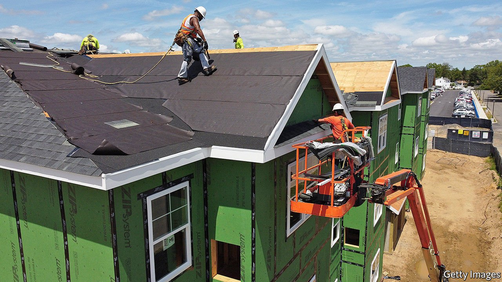
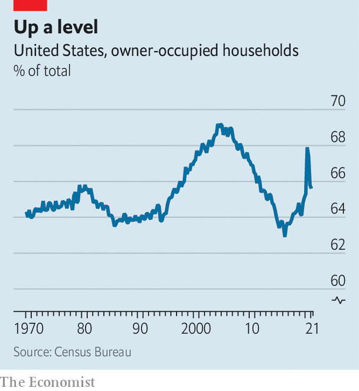

###### The house wins

# American home-ownership rises 

##### After years of decline, American home-ownership is rising 

 

> May 8th 2021 

DURING THE PANDEMIC America’s housing market has behaved oddly. Prices have increased rapidly, even as the economy fell off a cliff, defying predictions. In contrast with the last recession, few people have defaulted on their mortgages. A less-noticed trend is that the home-ownership rate has jumped (see chart). Part of the apparent increase, especially the enormous rise in the second quarter of 2020, is a statistical mirage: the pandemic made it hard to collect data, meaning that home-owners were oversampled in the surveys. Yet there is little doubt that a genuine surge in home-ownership is under way.

Politicians the world over would welcome such a rise, believing that owning a house turns people into model citizens. The evidence for this is surprisingly weak—and other research suggests that home-ownership has some negative consequences too, such as less entrepreneurial spirit and unwillingness to move in order to find work.


Yet rising home-ownership may bode well for America’s economic recovery from the pandemic. Home-owners are likelier than renters to live in single-family homes. This encourages the construction of such houses, instead of other types. And this, in turn, is likely to boost GDP, because single-family homes tend to be higher-quality and have more amenities. Spending per completion is almost 50% higher for single-family units than for multifamily ones, according to a paper published in 2017 by Goldman Sachs, a bank.

 


The pandemic has boosted home-ownership for a number of reasons. People’s preferences have shifted. In a world of stay-at-home orders and social distancing, security of tenure may be even more desirable than it was before (being evicted in the middle of a pandemic is grim). Families who have cut back on meals out and holidays have also accumulated more savings for a deposit (down-payment), making it easier to clamber onto the housing ladder. Generous fiscal-stimulus handouts have also helped swell households’ savings accounts. Interest rates on mortgages have fallen sharply.

Yet the rise in home-ownership predates the pandemic by a few years, meaning that other factors must also be in play. One relates to the last recession, more than a decade ago. From 2007 onwards many home-owners found themselves underwater and were forced to foreclose. This process, however, took many painful years to play out, reducing the home-ownership rate until about 2016-17. In addition, for much of the 2010s mortgage-lending standards were tight, making it difficult for a new generation of home-owners to emerge. Only in the latter part of that decade did lending conditions loosen sufficiently to allow the home-ownership rate to increase once again.

Long-term demographic change is another important factor behind America’s rising home-ownership rate. Millennials, on average, are less likely to be home-owners than their parents were at the same age. Blame that in part on high levels of student debt, which make other sorts of borrowing difficult. Nonetheless the millennial generation is entering its prime home-buying period (the median age of a first-time home-buyer is 34). After falling prior to 2012, the share of 30-somethings in the overall American population is now rising.

How much higher could home-ownership go? The biggest impediment could prove to be the supply of available homes. People cannot become home-owners if they have nowhere to move to. The number of houses available to buy is now near historical lows. Yet there are some signs of a revival in home-building; in January the number of new authorised housing permits hit its highest level since before the financial crisis of 2007-09. Housing starts, meanwhile, are also looking surprisingly strong. America’s home-ownership surge could last for a while yet.■

