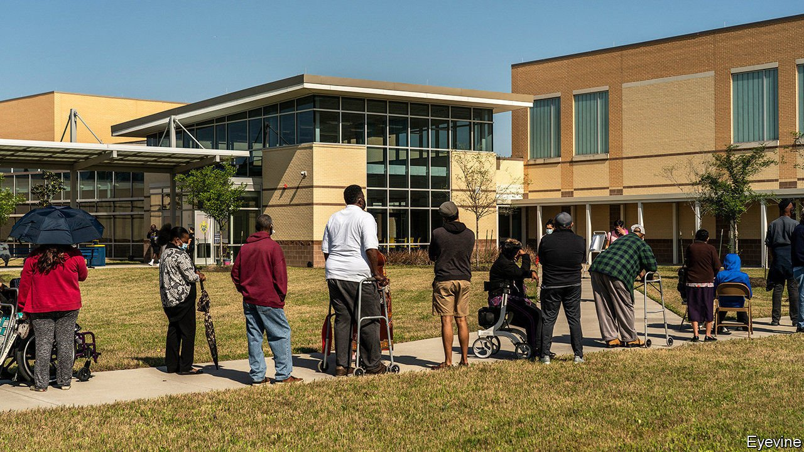
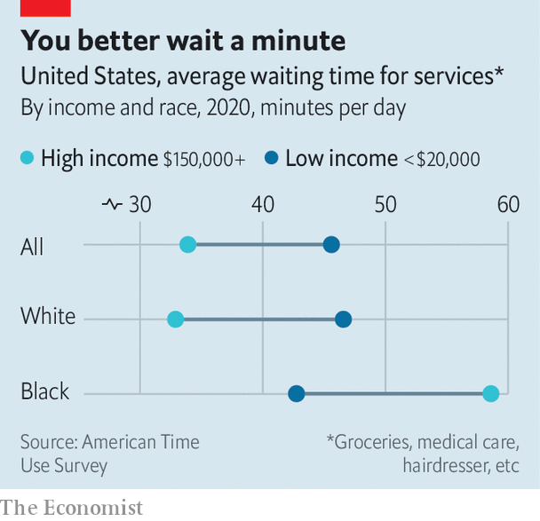

###### Time and money

# Black Americans spend more of the day being kept waiting 

##### Numbers from the Bureau of Labour Statistics show how time is wasted by race and class 

 

> May 8th 2021 

TIME SHOULD be a great leveller. Jeff Bezos or Amazon warehouse clerk, everyone gets 24 hours a day. But worse-off Americans have more of their time wasted just waiting around.

Poorer people have to wait longer for basic services. Low-income neighbourhoods often have fewer shops and medical centres, with fewer staff on hand and crowds at their doors. The worse-off claim unemployment benefits or food stamps, which means interacting with creaky government administration. And low-wage jobs come with rigid hours, which make it difficult to take an extended lunch break and pop to the bank when it’s quiet. The time squandered in delays could be better spent working, studying or just kicking back with a beer, points out Stephen Holt at the University at Albany. “Time is a finite resource,” he says. “It’s something you just don’t get back.” (Which is why this article is so concise.)


It was when Mr Holt’s partner came home fuming from the crowded local optician that he began crunching the data. Americans who make less than $20,000 a year spend around 46 minutes a day waiting for basic services like child care, health care and groceries, according to Mr Holt’s analysis of Bureau of Labour Statistics (BLS) surveys. That is almost 12 minutes more than those earning over $150,000 a year. The gap adds up to an extra hour and 20 minutes a week or ten full working days per year. Add the time spent waiting for transport, and the inequality would probably be even worse.

 


Rich or poor, Americans may have it better than others. In Britain, where queuing is a national pastime, a survey found the average person wastes 44 hours a year waiting. However this included time spent in traffic, which the estimates for America leave out, perhaps on the grounds that caraoke and texting really ought to count as time well-spent.

In America, it is the difference across racial groups that is most striking. Mr Holt’s calculations suggest wealthy white Americans get what they want quickly. But among black Americans, those earning at least $150,000 actually spend more time cooling their heels than those earning $20,000 or less. That could be because they live in under-served predominantly black neighbourhoods, but use services like shops and salons more often. Whether it’s about being asked to produce more paperwork for a mortgage or waiting while someone white is bumped to the front of the queue, says Elizabeth Cohen, a professor at Syracuse University and author of “The Political Value of Time”, “waiting is part of the experience of racism in the US”.

Darren Hromadka, founder of InLine4You, sees it first-hand. It was this week four years ago at Berkshire Hathaway’s annual shareholder meeting that he got the idea for his business. The Omaha resident spotted investors paying people to wait in line overnight to bag a plum spot when Warren Buffett took to the stage. His app extends that service to all sorts of other things, from gigs and new iPhone launches to coronavirus tests.

Mr Hromadka has spotted a trend: it is almost always white Americans who pay for so-called “line-standing” services. Meanwhile, 80% of those willing to wait around for $25-100 an hour are black or Hispanic. “Minorities are used to waiting for things,” he says.■

