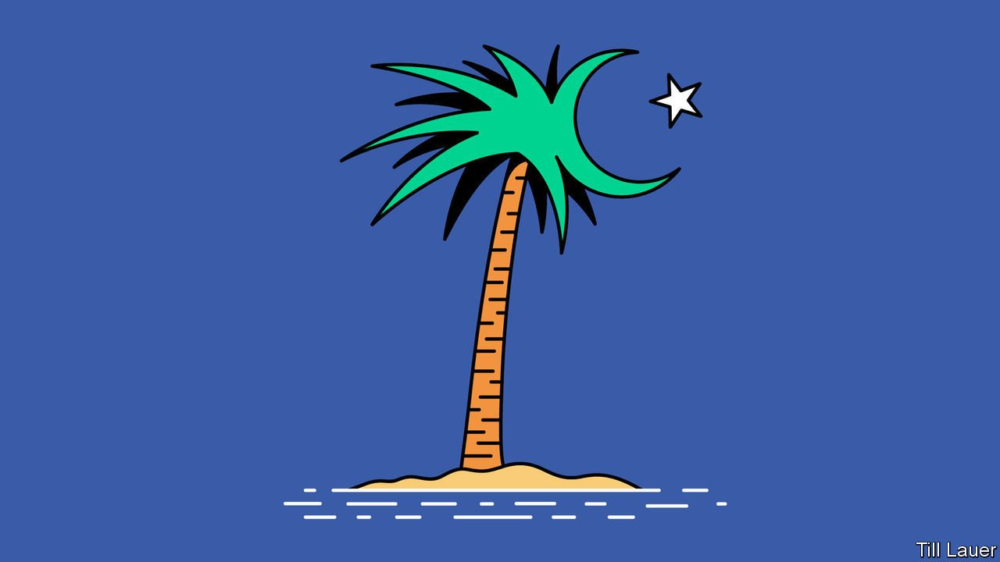

###### Banyan

# In the Maldives, an ominous rise in intolerant Islam 

##### An assassination attempt on a former president jolts the atoll nation 

 

> May 15th 2021 

THE INDIAN OCEAN’S most exquisite building must be the Old Friday Mosque in Malé, the capital of the Maldives. It was built in the 17th century from interlocking coral blocks. Inside, the carved-wood panelling and lacquerwork represent ravishing embellishments by master craftsmen who happily borrowed from Arabia, Persia and South Asia to make an art that was their own. Maldivians today are proud of their history as a maritime crossroads of culture and commerce. They say it informs their tiny atoll nation’s open-mindedness. So the recent smashing of some of the ornate tombs outside the mosque carried an ominous note—as if some people want to shatter the tolerance for which the Maldives is known and replace it with something more puritanical and austere.

A brutal realisation of that omen was the detonation of a bomb on May 6th that rocked the densely packed capital. Its target was the country’s best-known figure, Mohamed Nasheed. A political prisoner under the former dictator, Maumoon Abdul Gayoom, he became the Maldives’ first democratically elected president in 2008 before being ousted in a coup. In 2018 he returned from self-exile after his ally, Ibrahim “Ibu” Mohamed Solih, won a presidential election that the authoritarian incumbent, Gayoom’s half-brother, Abdulla Yameen, tried but failed to rig. Mr Nasheed is now speaker of parliament.


Mr Nasheed was rushed to hospital and flown to Germany for further treatment (bodyguards and bystanders were also injured). Three alleged assailants have been arrested. They are said by the authorities to be tied to jihadist groups.

Strands of the Maldives’ traditional Sunni Islam have certainly hardened in recent years. Money from Saudi Arabia has made its way to Maldivian mosques, and with it a fundamentalist Salafist doctrine. More alarmingly, both al-Qaeda and Islamic State have been recruiting. In 2019 a presidential commission concluded that al-Qaeda was behind the disappearance of a liberal journalist five years earlier. Dozens of jihadists fighting in Syria with Islamic State have since sneaked home to Malé or the outlying atolls.

The Maldives has a population of less than 540,000. It does not take many troublemakers to cause mayhem. The attack on Mr Nasheed, who has long been a critic of fundamentalism, seemed intended to show what Islamists are capable of. Under-resourced, the government has called in Australian police to help investigate.

For many Maldivians, radical Islam is an alien toxin poisoning the domestic well. Yet that, argues Azim Zahir of the University of Western Australia, is to ignore home-grown sources of extremism. For one, the identity of the Maldives as a nation-state (it gained independence in 1965) is bound up with Islam. Sunni Islam is the state religion. Only Sunni Muslims may be citizens. Maldivians’ behaviour, says Mr Zahir, may appear to be modern and liberal, but the national identity is fused with religion. That makes it a lot easier for radical Islam to subvert the existing version.

Besides, to blame only outside forces is to ignore the social and political context of the growing fundamentalism. The Maldives promotes itself to the outside world as an island paradise of honeymooners’ resorts. In reality, the resorts have immense defects. Their owners form part of aweb of businessmen, politicians, judges and officials grown fat on political favours and lucrative deals.

A huge scandal at the tourism board under Mr Yameen involved the pilfering of tens of millions of dollars. Mr Solih promised to get to the bottom of it. Yet though Mr Yameen and his tourism minister have been convicted of money-laundering and other charges, few others implicated in the scandal have faced justice. Even members of Mr Solih’s own government appear tainted.

The resorts also trash coral reefs and generate seas of garbage. Above all, they epitomise a rentier economy which fails to address the needs of ordinary people. Schools are underfunded and youth unemployment stands at nearly a fifth.

That may explain why disillusion is high, says Asiath Rilweena of Transparency Maldives, an NGO, and so the ground fertile for radicalisation. Drug use and dealing only makes things worse, with radicalised Maldivians often having been members of gangs. The only occasion many politicians think about these disaffected groups is when employing them to put up campaign posters at election time. After the attack on Mr Nasheed, they must think harder.

