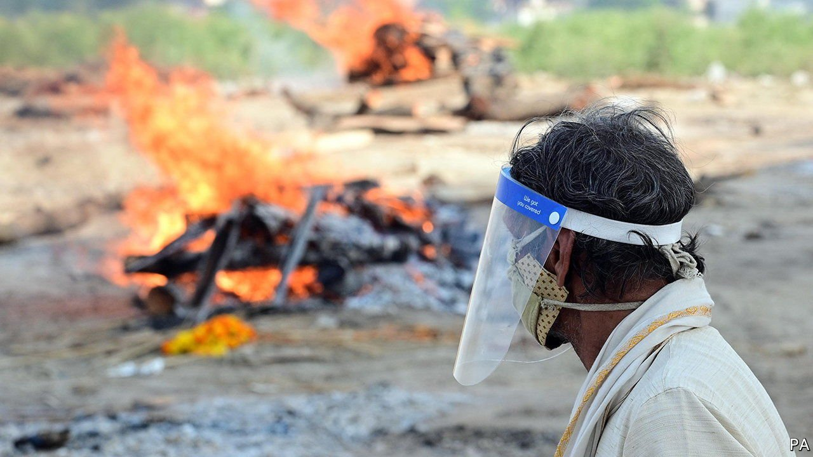
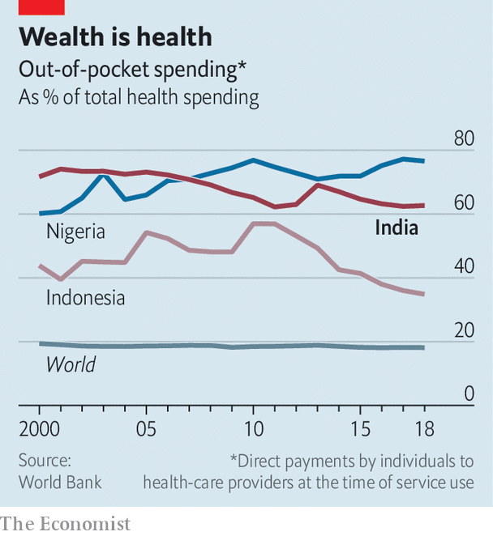

###### Let them eat dark chocolate

# India’s covid-19 crisis is devastating its most desperate people 

##### The poor are losing jobs, going hungry and falling victim to scams 

 

> May 15th 2021 

PYE DOGS and circling scavengers gave the first clue. When villagers approached the riverbank, the stench confirmed the horror. By the time authorities collected and buried all the bodies on May 11th, the count had risen to 71. And this was at just one bend in the sacred Ganges, by the village of Chausa on the border between Bihar and Uttar Pradesh, India’s poorest, most underdeveloped states. In the same week at least three other grisly human logjams were reported upstream.

These sad scenes reveal two things. One is the scale of the tragedy now sweeping India’s vast interior. Far away from city labs, no one gets tested, so no cases are recorded, so no deaths are captured in the official national toll, which at 258,000 is a small fraction .


The second thing the bodies in the Ganges reveal is how India’s second wave is worsening the already harsh lot of its poor. “People borrow money to pay for medicines, or for oxygen, or for an ambulance driver who has charged them extra covid rates,” explains Utpal Pathak, a local journalist. “Then they can’t afford the funeral.” In recent weeks, say residents of Chausa, the cost of a cremation has tripled. It is telling that the authorities, despite denying that poverty has anything to do with the scandal, have started supplying free wood to the funeral ghats of Chausa. Bihar has also capped the price of ambulances.

After the first covid-19 wave swept India last year, numerous reports tried to tally the cost to the poor. Pew, a research institute, estimates that whereas just 4.3% of Indians were earning less than $2 a day in January 2020, a year later this had risen to 9.7%, or 134m people. An in-depth study by Azim Premji University in Bangalore suggests that in the wake of last year’s nationwide lockdown, some 230m Indians slipped below a poverty threshold tied to the national minimum wage (around $45 a month). Its researchers found that, during the lockdown, 90% of the poor consumed less food. Six months later, their diets had not returned to normal. Over the course of the year the earnings of Indian workers, including the lucky 10% who hold salaried jobs, declined by a third.

Shocked by the pain it caused last year, the central government has left state and local governments to impose their own lockdowns during this wave. But though the economy has not come to a complete standstill, the sheer scale of the outbreak means lots of families have suffered just as much. For many, the biggest blow has been the loss of breadwinners. Indian Railways, which employs 1.2m people, says covid has killed 1,952 of its staff. The state of Uttar Pradesh in April put 1.2m civil servants to work running local elections and counting ballots. The vote was a super-spreader and an estimated 2,000 of these workers subsequently died, including 800 schoolteachers. Each of those deaths represented weeks of trauma and expense for the families seeking treatment and, for every person that died, perhaps another 20 were seriously ill.

 


With government spending on health stuck at a meagre 1.2% of GDP, in ordinary times Indians pay out of their own pockets for some 60% of health-care costs (see chart ). And in an ordinary year one in every 20 families is pushed into poverty by medical expenses. The past two months have been anything but ordinary. Millions of desperate Indian families have been forced to sell gold, to pawn possessions or to borrow at usurious rates, all too often in order to pay for unnecessary treatments prescribed by harried doctors, or to provide basic items lacking in government hospitals, from oxygen tanks to syringes. The variety of traps they have fallen into seems endless: medical staff demanding bribes to secure hospital admission, suppliers of fake medicines, and even, in several states, conmen who have painted over fire extinguishers to sell as oxygen cylinders.

In Delhi, India’s capital, police have set up a special unit to fight such scams. Mostly, however, the government is notable by its absence. Harsh Vardhan, the health minister, who has promoted herbal covid “cures”, last week advised Indians to eat extra-dark chocolate with “more than 70% cocoa” in order to beat covid-related stress. Perhaps he should read a recent World Bank report, which shows that 86% of Indian families cannot afford a basic balanced diet, let alone fancy chocolate. ■

Dig deeper

All our stories relating to the pandemic and the vaccines can be found on our . You can also listen to , our podcast on the race between injections and infections, and find trackers showing ,  and the virus’s spread across  and .

