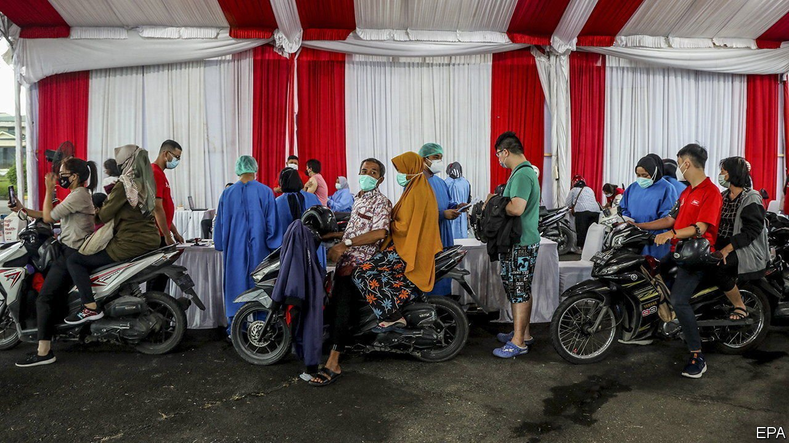

###### Join the (other) queue

# Private firms in Indonesia are starting their own vaccination effort 

##### Younger, wealthier people may get jabbed before older and more vulnerable ones 

 

> May 15th 2021 

IN TIMES OF hardship, Indonesians turn to each other for help. That is the idea behind gotong royong, or mutual assistance, the Javanese name for a custom in which villagers help build each other’s houses or clean up after a natural disaster. It is therefore unfortunate that the organisers of a private vaccination scheme have borrowed the name. When it launches on May 17th, “Vaksinasi Gotong Royong” (VGR) will inoculate millions of people against covid-19. But rather than encouraging Indonesians to help each other, it encourages the richer ones to help themselves.

When the government kicked off its vaccination drive in January, it pledged to jab 181.5m people, about two-thirds of the population, by the end of the year. The Indonesian Chamber of Commerce and Industry, known as Kadin, suggested that private companies could help move things along by paying for vaccines procured by the government and inoculating their employees and their families. The idea is to reduce the amount of time it takes for Indonesia to achieve herd immunity and defray the cost of the government’s free vaccination programme. “We have to appreciate that the government is trying its best,” says Shinta Kamdani of Kadin. “But I think they cannot do it alone.”


The government gave Kadin the green light in February. Given that just 7.6% of Indonesian adults have had their first dose so far, bosses are eagerly enrolling their businesses in the private scheme. More than 17,000 companies have signed up on behalf of 8.7m employees and their relatives. Kadin expects that it will eventually inoculate 20m Indonesians.

Yet the private effort may not turn out to be quite as mutually beneficial as advertised. The biggest hurdle for government procurers is not cost but supply, as the finance minister herself admits. Indonesia faces an acute shortage of vaccines. Indeed, VGR may in fact slow down the overall vaccination drive. Perhaps to avoid creating the perception that the private sector is siphoning off vaccines from the national stockpile, the government requires VGR to obtain its jabs from manufacturers who are not already supplying the public programme. But the government controls procurement, so an already frazzled bureaucracy must find and approve alternative vaccines for VGR. Honesti Basyir, the head of PT Bio Farma, the state company in charge of vaccine procurement, rejects the idea that VGR is overburdening his firm. Before the pandemic, his employees’ productivity had not been “maximised”, he says. Now they have just enough work to keep them busy. Other government departments may not be so lucky.

Perceptions of unfairness are another worry. The salaried types who will benefit tend to be richer and fitter than informal workers, who constitute 55% of the labour force. Just 13% of the elderly have had their first dose. If the scheme mostly vaccinates younger, healthier and wealthier Indonesians, it is likely to cause resentment among the rest.

There is already grumbling. Erni Subekti, a 49-year-old food vendor from Jakarta, the capital, thinks that Indonesia will achieve herd immunity more quickly with VGR, which pleases her. But the idea that the wealthy will get vaccinated before people like her rankles. Like many informal workers, Ms Erni cannot work from home. She contracted covid-19 in October. “We are at higher risk,” she says. “Shouldn’t we be prioritised as well?”■

Dig deeper

All our stories relating to the pandemic and the vaccines can be found on our . You can also listen to , our podcast on the race between injections and infections, and find trackers showing ,  and the virus’s spread across  and .

