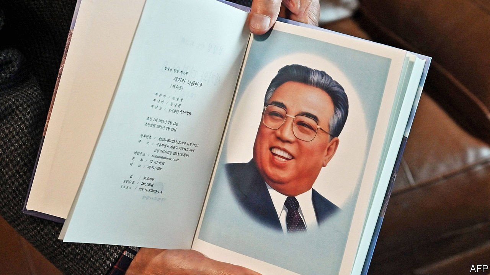

###### Silent sigh

# South Korea is pushing America for new talks with the North 

##### The 70-year stalemate between the two Koreas is unlikely to break without fresh diplomacy 

 

> May 15th 2021 

TO THE CASUAL reader, the biggest danger in perusing “With the Century” may be the book’s propensity to induce a deep sleep. Its author, Kim Il Sung, North Korea’s founding dictator, takes eight volumes and nearly 3,500 pages to recount his heroic revolutionary exploits. Whether the topic is glorious campaigns against the Japanese, earnest conversations with brave peasants, or long-winded meditations on the true meaning of juche  (self-reliance), the message is, “You had to be there”.

But that is not how Do Tae-woo, a lawyer for various right-wing groups, saw it when he filed an injunction last month against a South Korean publisher who produced a new edition of the memoir in the South. Publishing the book, Mr Do argued, was “the ultimate act of treason”.


South Korean law agrees. Under the national security act, enforced with minor changes since 1948, distributing material favourable to the regime in the North is punishable with up to seven years in prison. The South’s government blocks access to North Korean state media (except on the website of its own semi-official news agency, which publishes daily excerpts). When Mr Do sued, police began investigating the publisher that put out the memoir. Bookshops stopped selling it.

Though the law is no longer enforced with the same enthusiasm as in South Korea’s undemocratic past, its longevity is a reminder that the fundamental relationship between the two Koreas has changed remarkably little in the past 70 years. On paper, they are still at war, each considering itself the legitimate government of the other’s people and territory. Short of one side invading—a strategy that North Korea attempted with disappointing results in 1950—or North Korea collapsing, a fate that pundits have been predicting with a similar lack of success for decades, talking is still the only viable way improve things.

Precious little of that has been happening of late. The latest round of diplomacy, intended to persuade the North to abandon its nuclear weapons, fell apart at a summit between Kim Jong Un, the North’s dictator, and Donald Trump, then America’s president, more than two years ago in Vietnam. Last summer North Korea blew up the South’s de facto embassy in the border city of Kaesong, laying waste to a symbol of the detente that began in early 2018. The North has since resumed testing missiles and has increased the ferocity of its denunciations of South Korea and America.

Moon Jae-in, the South’s president, who is nearing the end of his term, lamented this on May 10th and vowed to make a last-ditch effort to improve things. “It is the aspiration of 80m Koreans to end the era of confrontation and conflict on the Korean peninsula and usher in an era of peace and prosperity,” he said. He promised to try in his last year in office to move from “an incomplete peace” to “an irreversible one”.

Improving relations with the North has been at the centre of Mr Moon’s presidency. But that goal remains elusive. The failure of the summit meeting with Mr Trump in Vietnam humiliated Mr Kim, who sacked most of his negotiators afterwards. He has made clear he has little interest in talking to the South without new concessions from America, which Mr Kim sees as his main adversary and negotiating partner. When the covid-19 pandemic began, he closed the border, cutting the North off even from China, its main trading partner. The lockdown appears to have hurt the North’s economy more than the international sanctions that were intended to persuade Mr Kim to abandon his nukes. The North still harangues the South about its failure to rein in defectors who send leaflets and money across the border. The rhetoric of Mr Kim’s regime is ever more paranoid. Its people are warned that “flying objects” (such as leaflets), packaging or even snow may carry the virus.

Mr Moon is meeting Joe Biden, his American counterpart, on May 21st. He hopes to persuade him to join a fresh attempt to break the impasse. Last month the Biden administration announced a new “calibrated, practical approach” to diplomacy with the North, without giving details. But it said nothing to irritate Mr Kim, who may have been pleased that America embraced the North’s talk of “the denuclearisation of the Korean peninsula” rather than referring only to North Korea. Rumours this week in Seoul, the South’s capital, hinted that the North may have responded positively to the possibility of further talks with America.

But the Koreas are probably quite low on Mr Biden’s agenda, as he faces foreign-policy crises on a variety of other fronts. He has yet to appoint a successor to Stephen Biegun, Mr Trump’s point man on North Korea, leaving no obvious interlocutor if the North indeed wants to talk. Unless it is fleshed out in the next few weeks, America’s new policy will be hard to distinguish from Barack Obama’s “strategic patience”, says Sung Ki-young of the Institute for National Security Studies, a government-affiliated think-tank in Seoul.

Other stumbling blocks may also impede talks. South Korean officials say they were happy to have been consulted on America’s new policy. But some of their attempts to mollify the North sit awkwardly with Mr Biden’s priorities. Police in Seoul this week interrogated Park Sang-hak, a North Korean defector who sent leaflets northwards last month, defying a new law. He could face up to three years in prison. In the same speech in which Mr Moon promised a push for peace, he also alluded to Mr Park’s case, stressing that his government had “no choice” but to enforce the law. Mr Biden’s people say they intend to pay more attention to human rights when talking to North Korea, presumably including those of Northerners in the South. Mr Moon will be hoping that when he goes to Washington next week, Mr Park’s fate gets less airtime than the exploits of Mr Kim. ■

