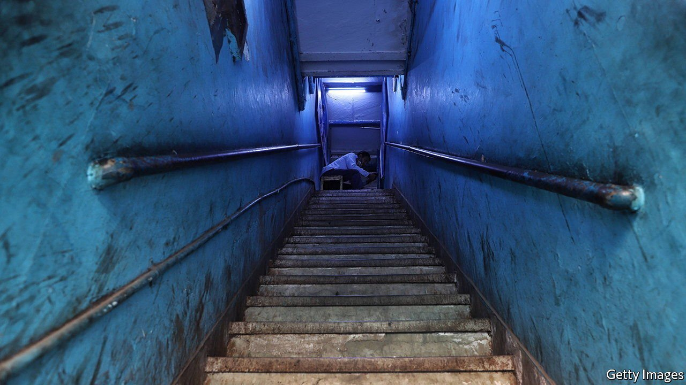

###### Acid test

# Rahul Raina’s debut novel is a rollicking urban adventure 

##### And a biting satire of inequality in India 

 

> May 15th 2021 

How to Kidnap the Rich. By Rahul Raina. Harper Perennial; 336 pages; $17.00. Little, Brown; £14.99

“THE FIRST kidnapping wasn’t my fault,” pleads the narrator, Ramesh Kumar, at the start of this debut novel. “The others—those were definitely me.” He recounts waking up on a floor next to the comatose, vomit-streaked teenager in his care, Rudi Saxena. A man wielding a cosh bursts in and takes the pair away. Ramesh loses a finger, Rudi is ransomed for $6m, and the abduction inspires them to turn from “kidnappees” into kidnappers.


Having snared readers with this gritty opening, Rahul Raina, a Kashmiri-British writer, traces the events that led to his characters’ desperate circumstances. Ramesh is an “educational consultant” who sits tests on behalf of the offspring of New Delhi’s elite. Rudi’s parents request the premium package for their dim-witted, spoilt-brat son, covering exams that are “the gateway to the best universities, the brightest futures, the whitest lives”. Ramesh comes top in the whole country.

Overnight, Rudi is transformed into a national celebrity with his own game show; Ramesh assumes the role of his manager and extorts a ten-percent cut. The affection of Priya, an assistant producer on the show, is an added bonus. But gradually his luck changes. Rudi spirals out of control on drink and drugs, an investigator trawls through his poor school results and smells a rat—and a slighted rival and a vengeful enemy swoop in to settle scores.

Like Mohsin Hamid’s “How to Get Filthy Rich in Rising Asia”, “How to Kidnap the Rich” purports to be a how-to manual but is in fact a rollicking urban adventure and a biting satire of inequality. Mr Raina adds a fast-paced crime caper and a stream of caustic humour. “I know a lie the size of ‘the British are only setting up a trading post’ when I see one,” remarks Ramesh. A man turning pale is “whiter than a Western panel on racial diversity”; a woman is “busier than our civil servants are in January editing government websites to remove any mention of last year’s targets”.

Some of the jokes fall flat. Ramesh’s moving back-story, and a farcical sequence in which he and his partner in crime disguise themselves in saris, belong in different books. Despite its over-exuberance, though, this is a highly entertaining first novel from a writer to watch. ■

