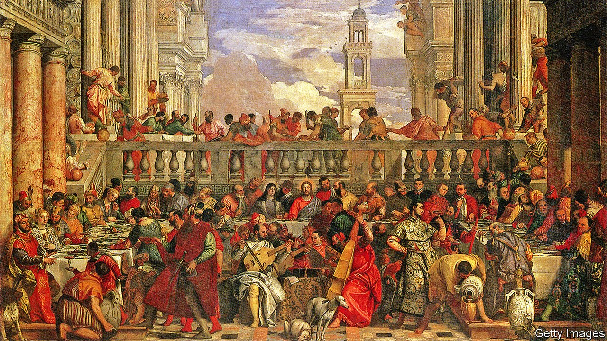

###### Booty haul

# When Napoleon stole a Venetian masterpiece 

##### Cynthia Saltzman tells a poignant story of conflict and culture 

 

> May 15th 2021 

Plunder. By Cynthia Saltzman. Farrar, Straus and Giroux; 336 pages; $30. Published in Britain as “Napoleon’s Plunder and the Theft of Veronese’s Feast”; Thames &amp; Hudson; £25

IN SEPTEMBER 1797 Napoleon Bonaparte’s troops stripped a huge 16th-century painting by Paolo Veronese from the wall of a Venetian monastery. Rolled around a wooden cylinder and packed into a crate smothered with tar, “The Wedding Feast at Cana” was shipped to the Louvre. Plundering art was designed “to rattle foes” and “leave a wound close to their hearts”, writes Cynthia Saltzman. Her perceptive book traces Napoleon’s systematic gathering of artistic treasures as he conquered Italy, focusing on Veronese’s masterpiece.


“The Wedding Feast” depicts Jesus turning water into wine at a party in Galilee. Veronese sets his version in aristocratic Venice. Marble columns and balustrades frame a boisterous cast of 130 life-size figures in sumptuous brocade and pearls. Servants swarm around the guests; onlookers throw flowers into the air. At the centre of the dining table sits Jesus, his head encircled by a halo of golden light. For this vast work—a “wonder of the world”, as Giacomo Barri put it in 1671—Veronese was paid a third more than Tintoretto was for his “Crucifixion” a couple of years later.

Napoleon engineered his quarrel with Venice. When a French ship tried to sail unauthorised into the lagoon in April 1797 the Venetians opened fire. Several soldiers were killed; war was declared. Venice soon surrendered. According to a treaty drawn up by Napoleon, the city promised to hand over 3m francs, five warships, 500 manuscripts and 20 paintings. A French art committee selected the works.

Even amid the somewhat excessive detail of battle campaigns and negotiations, the book keeps sight of the rich personalities linked by the painting. Veronese was a “first-draft”, speedy painter, rarely making mistakes or alterations (Titian, by contrast, was a ponderous reviser). After meeting Napoleon in 1796, a Venetian governor described him as “a vain man who believes he is superhuman”. An envoy saw him as “anything but good-looking”. Napoleon’s own claims to intellectual prowess—“a singular thing about me is my memory”—are put in perspective; he ranked 42nd out of 58 in his final military exam. Jacques-Louis David’s portrait of 1805 obsequiously shows him charging across the Alps on a virile white horse. Ms Saltzman says he rode a donkey on the steepest parts.

She is very good on Napoleon’s justifications for theft. The French, he said, were doing Europe a favour by rescuing these Italian masterpieces from neglect and obscurity. Previously only a few could see them; at the Louvre they would be on display to everyone. “Spoils of war” became “a public good”, Ms Saltzman writes. Meanwhile Napoleon and his wife, Joséphine de Beauharnais, dipped into the hoard to decorate their properties.

After his defeat in 1815, France returned only half the artworks stolen from Italy. “The Wedding Feast” was not among them, the Louvre’s boss claiming it would not survive the journey. Ms Saltzman ends with the painting’s life thereafter, including its influence on Vincent van Gogh and John Ruskin, and its concealment from the Nazis in assorted chateaux. Recently it has hung opposite, and in the shadow of, the “Mona Lisa”—a poignant end to an absorbing story of conflict and culture. ■

