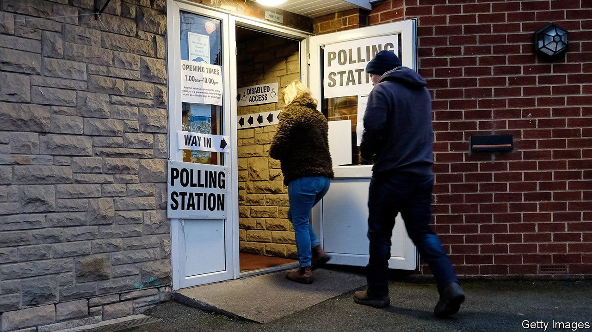

###### Voter identification

# American-style voter ID laws are coming to Britain 

##### They will have almost no effect on fraud, because there is hardly any 

 

> May 15th 2021 

VOTING IN MAINLAND Britain is astonishingly easy. You turn up at a polling station and state your name and address. An official finds your name on a list, draws a line through it, then hands you your ballot. The question must have occurred to many people: couldn’t somebody else pretend to be me?

Many Britons believe that happens a lot. In early 2019 Ipsos MORI, a pollster, found that 58% thought personation—pretending to be somebody else—was a serious problem nationally. Asked why they thought that, some said they had heard about fraud in the media while others cited local rumours. A few said it was simply human nature.


Personation was indeed once widespread in Northern Ireland, which is why the province has required identification since 1985. Elsewhere in Britain it is extremely rare. If somebody turns up at a polling station and finds that their name is already crossed off, they are given a “tendered” ballot. Just 1,359 of those were handed out in the December 2019 general election, out of an electorate of 47.5m, and tendered ballots are issued for other reasons too. Personation fraud was alleged 33 times that year, resulting in one conviction and one caution.

Still, the government judges the threat to the democratic process sufficient to warrant a big change to electoral rules. On May 11th it announced that it will legislate to require in-person voters to show photo ID. This is trickier in Britain, which does not require people to carry ID cards, than in countries which do. Driving licences and passports will be acceptable; so will pensioners’ bus passes and the “blue badges” held by disabled people. Anyone without approved photo ID will be allowed to apply for a free card.

Such a change would not block many people from voting. Seven local authorities asked voters for various forms of identification in May 2019, after warning that they would be doing so. On average, 0.4% of would-be voters who were asked for ID failed to show it, were turned away, and did not return to the polling station.

But many more might conclude that voting has become too much of a hassle, and not bother. “Not everyone gets as excited about elections as we do,” says Jess Garland of the Electoral Reform Society, which opposes the change. Any effect is likely to be uneven. A poll for the government found that 10% of non-white people would be less likely to vote in person if they were required to show photo ID, compared with 5% of whites.

