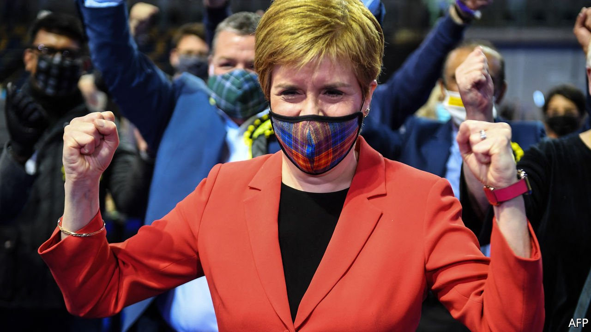

###### Let attrition commence

# Nicola Sturgeon’s nationalists retain power in Scotland 

##### The nationalists won, but not as convincingly as they had hoped to.Stalemate beckons 

 

> May 13th 2021 

IN A PHONE call on May 9th, Boris Johnson congratulated Nicola Sturgeon, leader of the Scottish Nationalist Party, and said how much he was looking forward to Glasgow hosting the UN climate conference later this year. There is much to congratulate her on. The SNP is once again the largest party in the Scottish Parliament, and is embarking on its fourth term in power. Ms Sturgeon, who has had high office since the days of Tony Blair, Mr Johnson’s predecessor bar three, is once again first minister.

Ms Sturgeon’s response was blunter. A second referendum on Scotland’s independence, she told the prime minister, is now a matter “of when, not if”. In fact, a long and gruelling stalemate awaits.


Mr Johnson’s government claims that, falling one seat short of a majority, the SNP lacks a mandate for a referendum. But the Scottish Parliament’s proportional voting system is intended to encourage coalitions, and together the SNP and the Scottish Green Party, which also backs independence, can pass a referendum law. Still, Scots are split on whether that is a mandate, and many are undecided.

The British government argues that whatever its composition, the Scottish Parliament does not have the power to organise a referendum. The Scotland Act, which underpins devolution, stipulates that the union is the exclusive preserve of Westminster. David Cameron, then prime minister, granted permission for a vote in 2014, when Scots plumped by a margin of more than ten points to stay in the union. Ms Sturgeon hopes Boris Johnson will do the same, in order to put a second referendum beyond legal doubt. A refusal, she says, would be a defiance of the will of the Scottish people and in itself an argument for independence.

Mr Johnson refuses, saying Scotland must focus on recovering from covid-19. He previously said that no referendum should take place for decades, but has recently adopted a softer, “not now” approach, which seeks to deflate rather than confront separatism. On May 8th he invited Ms Sturgeon to approach the “difficult journey” of recovery in a “spirit of unity and co-operation”. At the same time, the British government has little appetite for granting Scotland more powers. Instead, Mr Johnson plans to relocate more civil servants there and to allocate more funding for Scottish infrastructure directly from London.

Ms Sturgeon is opposed to “illegal, wildcat” referendums, knowing they would throw away the chance at independence and would alienate undecided Scots. But she will seek to jolt Mr Johnson’s hand, and test the limits of the Scottish Parliament’s powers, by daring the British government to block a referendum law in the Supreme Court in London. (A legal challenge could alternatively come from unionist campaign groups.) The nationalists would be likely to argue that the Scottish Parliament has the power legislate for a purely advisory referendum that did not automatically trigger independence, though politically it would be hard to ignore. Britain’s Brexit referendum of 2016 was in principle advisory, having no binding legal effect.

The court is increasingly serving as a forum for confrontation between Ms Sturgeon and the British government. Ms Sturgeon described a challenge over a law to entrench the UN convention on children’s rights in Scotland as “morally repugnant”. Even if the nationalists lose, cases can provide them with handy propaganda for their claim that their parliament is impotent.

Eve Hepburn, co-editor of “Scotland’s New Choice”, a new study on independence, argues that if the British government takes an “aggressive or dismissive” approach, reminiscent of Spain’s rejection of Catalan separatism, it will risk fuelling support for independence. But Mr Johnson’s deflection has some hope of working. Polls suggest roughly half of Scots favour independence in principle, but only 30% want a referendum within two years as Ms Sturgeon proposes. Scotland’s debate often echoes St Augustine: Lord make me independent, but not yet.

Mr Johnson has one overwhelming reason to hold firm against a referendum until after the next general election, expected in 2023 or 2024. In elections in 2015 and 2019, his party told voters in England, with some success, that the alternative to a Conservative government in Westminster was an unstable coalition between a weak English Labour Party and a rickety SNP. Nationalism endangers the union, but sustains the Tories. The SNP is just weak enough for the Tories to resist, but strong enough for them to claim the union is in peril with any other prime minister. ■

A version of this article was published online on May 8th, 2021

