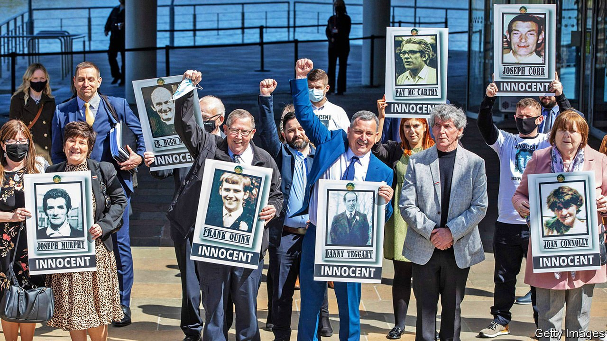

###### Slaughter in Northern Ireland

# The ten people killed in Ballymurphy in 1971 were entirely innocent 

##### A coroner’s verdict raises the stakes for the government 

 

> May 15th 2021 

AT 4AM ON August 7th 1971, the raids began across Northern Ireland. In a last, desperate attempt to quell bloody violence from the Irish Republican Army and loyalist paramilitaries, the unionist government in Belfast ordered a mass round-up of suspected gunmen. Hundreds of suspects were imprisoned without trial. But no loyalists were lifted, making the policy seem one-sided, and the intelligence was poor, meaning that many of those arrested were innocent. Nationalist anger boiled over into serious rioting and gun battles. In Ballymurphy, a nationalist area where west Belfast merges into the wildness of Black Mountain, ten people were killed within a radius of about 400 yards over three days.

Half a century after the deaths, joint inquests found on May 11th that at least nine of the victims were shot by soldiers. The coroner ruled that all the dead were “entirely innocent of any wrongdoing”, contrary to smears from the army at the time that they had been firing on soldiers or throwing petrol bombs. The same regiment—the Parachute Regiment—shot dead 13 unarmed civilians five months later on Bloody Sunday.


One of the slain was Father Hugh Mullan, a Catholic priest. He had just given the last rites to another victim, Bobby Clarke, who survived, and decades later recalled the priest's anguished cries as he took 15 minutes to die. Joan Connolly, a mother of eight, had gone out to look for her daughters when she was gunned down. Another victim, John McKerr, a former British soldier, had lost a hand in the second world war. He was killed while standing outside a Catholic church where he had been working as a joiner.

The inquests were the longest in Northern Irish history, running to more than 100 days of oral evidence, and were ordered because the deaths had not been adequately investigated at the time. More than 50 historic inquests are to be held, at an expected cost of £55m ($77m).

Unlike David Cameron, who immediately made a public apology for Bloody Sunday after an inquiry in 2010 said the deaths were “unjustifiable”, Boris Johnson did not apologise for more than 24 hours and when he did, it was in a private phone call with Northern Ireland’s first and deputy first ministers. He has infuriated victims’ relatives by promising to legislate to make it harder to prosecute soldiers for killings during the “Troubles”, but is under pressure from the other side. A month ago the minister for veterans was sacked for protesting that not enough was being done to prevent prosecutions. Theresa May, Mr Johnson’s predecessor, has warned that such legislation would mean a general amnesty: “We cannot legislate simply to protect British soldiers from prosecution. Any legislation to protect British soldiers will cover terrorists as well.”

Northern Ireland's divided politicians are largely united in their opposition to an amnesty. Mr Johnson is going to struggle to keep his party united without inflaming tensions in Ulster. ■

