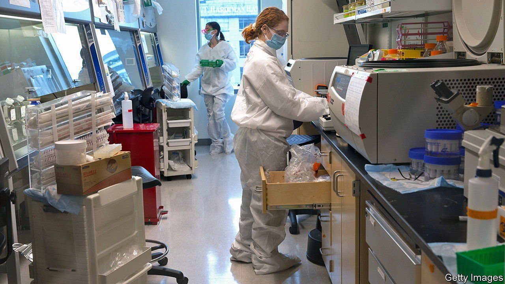
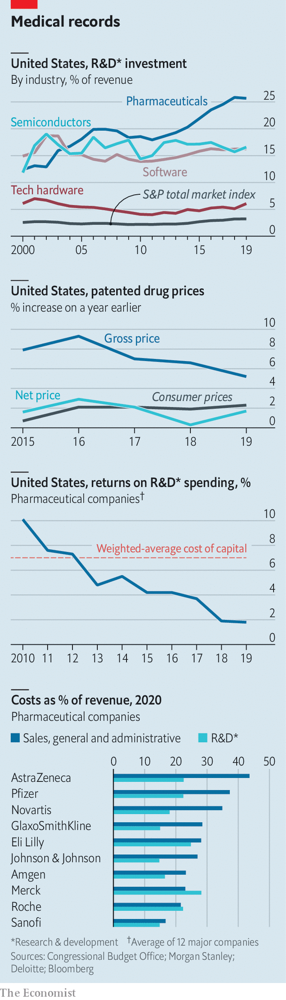

###### Less buck for the bang

# Are drug patents worth it? 

##### Politicians are attacking IP protection, but shareholders are Big Pharma’s bigger headache 

 

> May 15th 2021 

ONE OF THE first rules of American politics is not to pick a fight with Big Pharma. Its army of lobbyists in Washington, DC, has ensured that presidents from both parties, from Ronald Reagan to Barack Obama, have upheld the industry’s stout defence of intellectual-property (IP) rights, including in international treaties. Donald Trump threatened to impose drug price controls, which won bipartisan support in Congress, but intense lobbying ensured that his initiative flopped. That effort to rein in Big Pharma chimed with the industry’s global image as arrogant and greedy.

President Joe Biden is throwing his weight behind a proposal at the World Trade Organisation to waive patent protections for covid-19 vaccines. If Mr Biden is willing to rethink IP rights for covid vaccines abroad, he might also have the audacity to take on patent protection for new drugs at home. To judge whether America’s industry deserves such treatment, it is worth asking three questions. First, how much innovation is happening? Second, is rent-seeking behaviour—ranging from price gouging to patent manipulation—declining? Third, what might happen if patent rules were watered down?


Start with innovation. In the 2000s pharma investment fell out of fashion. But since 2010 America’s industry has raised spending on research and development (R&amp;D) sharply as a share of revenues, to over 25% (see chart). Venture funding into life sciences in America is booming, hitting a record high of $36bn in 2020, double the level in 2017. The number of new drugs approved by America’s Food and Drug Administration has more than doubled in the past decade. None of these measures is an ideal proxy for future innovation, but they suggest the mood has changed.

 


On rent-seeking, too, the picture is less dire that it was. Drug prices in America are still the world’s highest on average, but the rate of increase has slowed. According to IQVIA, a data firm, once secret rebates offered to big customers are discounted, net drug prices rose more slowly than inflation in 2018 and 2019. Political pressure is only one reason. Consolidation among health insurers and pharmacy-benefit managers (big middlemen) who pay for drugs gave them more power to negotiate price cuts. It has got harder to mint cash from blockbuster drugs. Deloitte, a consultancy, reckons that the internal rate of return on in-house R&amp;D at a dozen big drugs firms fell from 10% a decade ago to 2% in 2019—below their weighted-average cost of capital of 7%. The average cost to bring a drug to market has increased by two-thirds since 2010, to some $2bn. And the forecast for peak sales for each new drug has also fallen by half over that period. Often big firms prefer to buy smaller innovative rivals. According to EY, a consultancy, American drugs firms spent $185bn in the past five years on biotech acquisitions. Roughly a third of revenues at big drugs firms are the result of IP arising from acquisitions.

What would happen if patent rules were weakened? Rent-seeking would fall, but innovation might, too. One way of getting a sense of this is to look at how much innovation happens outside America, where IP rights are often weaker or less well enforced. In most industries innovation is now happening globally, not just in America, but in pharma it still has a powerful American skew. Two-thirds of worldwide biotech venture-capital investment takes place there. Despite China’s advances on other fronts, in life sciences it still accounts for only about 15% of the global total of venture-capital funding. Similarly, even as American multinational pharma firms have become more global (earning roughly half their revenues abroad), their preference for domestic R&amp;D has risen, with 88% of it done in America.

This suggests that America’s government will eschew wholesale changes that damage innovation. But it still might loosen the patent regime to reduce rent-seeking from old drugs. In 2019 the Federal Trade Commission, a regulator, found that the industry is relying less than it used to on egregious “pay for delay” agreements, through which it paid generics firms to hold off on launching low-cost rivals to pricey drugs coming off patent. However, Big Pharma is still using other wheezes, such as “evergreening” IP protection beyond the initial 20-year period by filing a thicket of patents on minor modifications. More can be done to rein in such abuses.

The S&amp;P index of big drugs firms has risen by roughly 20% over the past five years while the broader equity market has doubled. Despite miraculous covid-19 treatments, this year the pharma index has declined by nearly a tenth. It is clear that even as spending on innovation rises, presumably reflecting confidence that important IP rights in America will remain intact, investors think the opportunity to print easy money is not as good as it was. That seems about right.■

Dig deeper

All our stories relating to the pandemic and the vaccines can be found on our . You can also listen to , our podcast on the race between injections and infections, and find trackers showing ,  and the virus’s spread across  and .

