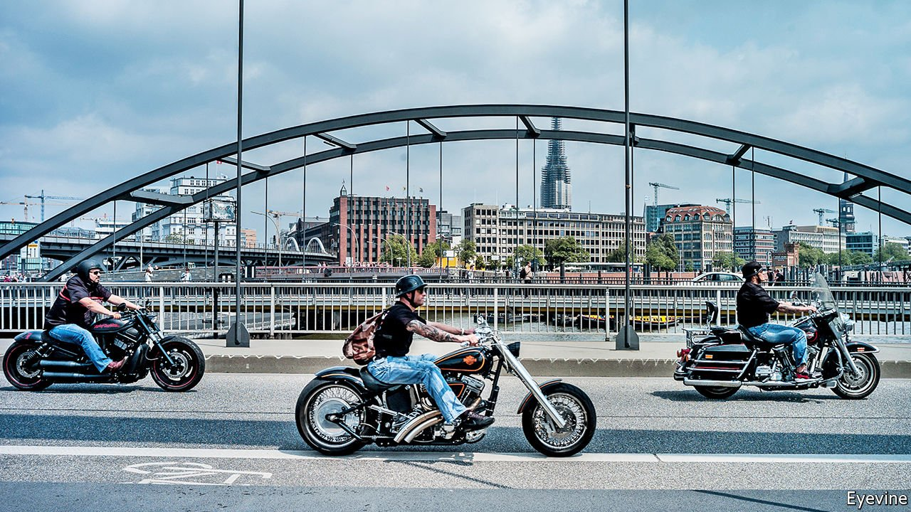

###### Uneasy rider

# Kick-starting Harley-Davidson 

##### A German wants to revive a legendary maker of motorbikes 

 

> May 15th 2021 

THE LARGE dealership with the distinctive orange logo in Berlin’s Huttenstrasse displays a range of Harley-Davidsons from a spectacular custom machine, “Der Texaner”, to the brand-new LiveWire, an electric bike. Yet the Midwestern motorcycle-maker’s only shop in the German capital is deserted owing to covid-19 rules mandating a time slot and a negative test result, which deters most bikers.

The shop is usually busy at this time of the year, says a sales assistant. But customers will not return, warns Jochen Zeitz, Harley-Davidson’s newish German chief executive, if the European Union goes ahead with the imposition of a 56% tariff on all imported Harley products from June 1st, which is part of the EU’s retaliation against tariffs on steel and aluminium imposed by the American government. The tariffs will make it impossible for Harley-Davidson to compete with rivals in Europe, says Mr Zeitz, who lodged a legal complaint against the decision as soon as the plan was made public last month.


Prohibitive tariffs will make Mr Zeitz’s challenging job even more difficult. Germany is his firm’s biggest market outside America. Around 260,000 Harleys roar down the country’s Autobahnen. In spite of the pandemic 11,000 new Hogs were registered in Germany last year.

A Harley board member since 2007, Mr Zeitz took over as interim chief executive in February 2020 when Matthew Levatich, his predecessor, quit after five years, having failed to revive the quintessentially American brand. Under Mr Levatich sales in America, where 70% of new Harleys are bought, declined for 12 quarters and the company’s shares lost 46% of their value. In May 2020 the bike enthusiast signed on permanently for the firm’s top job.

This is not Mr Zeitz’s first rescue mission. As chief executive of Puma, he transformed the maker of sports kit from an ailing parochial business in Franconia into a hipster brand. Yet fixing Puma may seem easy compared with a company that is battling declining motorcycle ridership, ageing customers and stiff competition from the likes of Triumph, Polaris and Ducati.

Mr Zeitz has cut costs and slashed 700 jobs as well as cutting the number of models by almost a third and quitting dozens of countries. A strategic plan presented in February includes a focus on more profitable heavyweight bikes and, with an eye on the future, electric power. The early signs are encouraging. In April Harley reported better-than-expected profits for the first quarter thanks in part to a revival of demand at home.

Even without looming tariffs the European market is probably Mr Zeitz’s biggest worry. European deliveries fell by 36% in the first quarter compared with a year ago because of lockdowns, shipping delays and the discontinuation of sales of two older models. The launch of the Pan America, a rival to BMW’s legendary GS model, may help to revive sales but piling tariffs onto its $20,000 price tag will deter even dedicated fans of the Harley brand. ■

