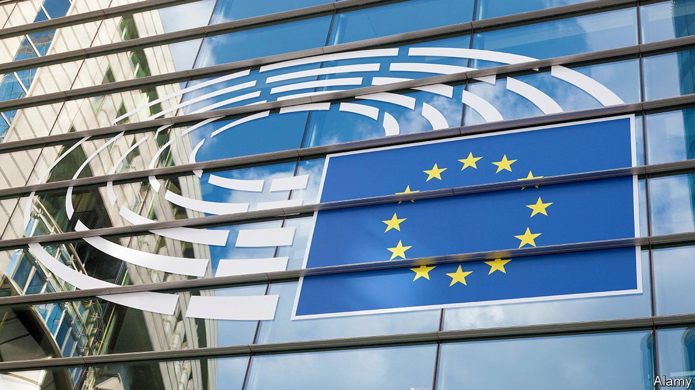
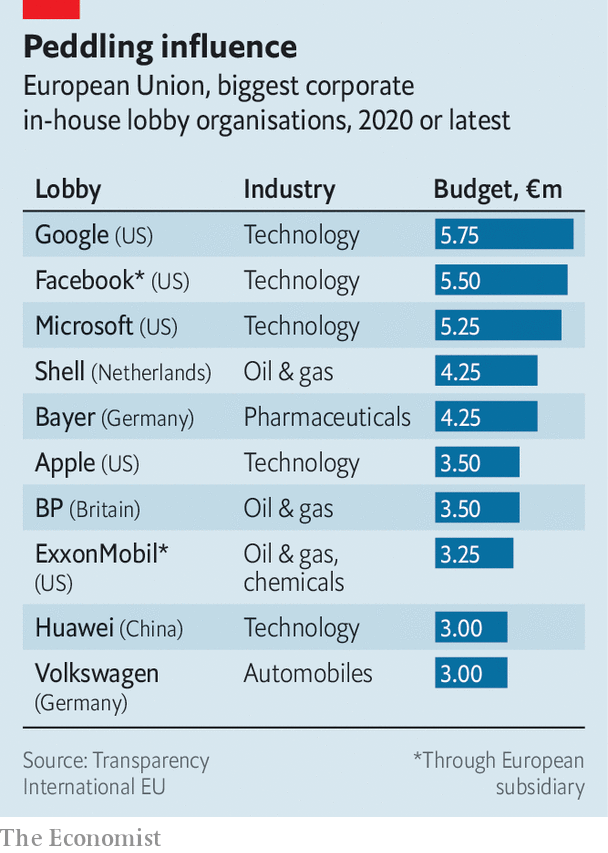

###### Swamp in the heart of Europe

# The power of lobbyists is growing in Brussels and Berlin 

##### Europe’s politics are getting more swampy 

 

> May 15th 2021 

EUROPEANS HAVE long assumed that excessive lobbying is only an American problem. But over the past 15 years Brussels has become the world’s second capital of the dark arts after Washington, DC, with Berlin not far behind. Both cities have become infested with new arrivals who are pushier and use more sophisticated techniques than old-fashioned associations such as the Federation of German Industry or BusinessEurope. Weak rules in both places are not designed to cope with the explosion of activity.

As international public-relations firms have moved in, big companies have also beefed up their in-house lobbying activities (see chart). Google and Facebook have opened offices in the government district of Berlin, near the Bundestag, Germany’s parliament, and in the Quartier Léopold of Brussels, close to the European Commission, the executive body of the European Union.


That adds up to plenty of lobbyists’ boots on the ground, according to Transparency International (TI), a watchdog. In Brussels 25,000 lobbyists with a combined annual budget conservatively estimated at more than €3bn ($3.6bn) seek to influence EU policy. Approximately 7,500 of them are accredited with the European Parliament, which means they are regularly able to meet with parliamentarians. Berlin is now reckoned to host up to 7,000 lobbyists with over €1bn to throw around every year.

 


This does not necessarily translate into political clout. “Deep pockets do not equal effective lobbying,” says Nick Aiossa of TI. Some companies throw money at in-house lobbyists, consultancies and marketing campaigns without much result. But good lobbyists try to be part of the debate they wish to sway as early as possible, so they can try to shape the agenda. As power at the EU is diffuse and decisions are the result of deals at the commission, the council (made up of the 27 heads of government) and the parliament, good lobbyists who can navigate the decision cycle of these three institutions can be invaluable.

Though the effectiveness of lobbyists is still debatable, a series of scandals in Brussels and Berlin convinced policymakers to strengthen rules. In 2011 journalists from Britain’s Sunday Times posing as lobbyists secretly filmed four members of the European Parliament ( MEPS) negotiating a deal to propose amendments to legislation in exchange for €100,000 a year. The EU subsequently introduced a register for lobbyists, but it is voluntary. And since 2015 EU commissioners and their cabinet are required to make public their meetings with registered lobbyists, as are senior members of the parliament. That leaves half of 705 MEPs who do not reveal their dealings with lobbyists.

Germany remained a regulation laggard compared with other European countries until last year, when Der Spiegel, a weekly newspaper, revealed that Philipp Amthor, the youngest MP in the Bundestag and a rising star of Angela Merkel’s Christian Democratic Union, was on the board of Augustus Intelligence, an American startup, and lobbied vigorously for the company at the ministry of economics. Mr Amthor initially denied receiving any compensation from the firm, but subsequently admitted getting share options that he did not disclose. The resulting furore reignited the debate about lobbying regulation.

A law passed in March will require members of the Bundestag to declare regular lobbying work. After further recent scandals involving MPs pocketing substantial commissions from companies making face masks, or receiving money from lobbyists for Azerbaijan in return for voting in favour of pro-Azerbaijani motions, the government has also drafted a bill with stricter ethics rules for parliamentarians that is winding its way through the Bundestag. The bill bans MPs from any lobbying work, accepting cash donations or making paid speeches.

These are steps in the right direction but it is not enough. “The next scandal is just waiting to happen,” says Hans-Martin Tillack, author of “Die Lobby Republik”, a book sounding the alarm about the growth of corporate lobbying in Germany. “The payments are the problem,” he says. Corporate donations to political parties remain untouched by the new legislation. Fabio De Masi, a parliamentarian for the Left party, argues for a complete ban on corporate donations to political parties and an upper limit for party donations from private individuals. Timo Lange of LobbyControl, a watchdog in Berlin, also notes that lobbyists will not have to report meetings with members of the government who are not also MPs.

The EU should consider tightening its rules further, says Mr Aiossa. Policymakers in Brussels will play a bigger role than ever in European business when they come to disburse billions of euros in pandemic-recovery funds. Suggestions include requiring policymakers to meet only registered lobbyists, for example, and listing those meetings on a centralised platform rather than, as now, on 88 different websites. An independent ethics body should be set up to monitor potential conflicts of interests and the “revolving door” of EU officials who join the private sector.

Lobbyists making more of a mark in Europe’s capitals is not necessarily the route to a swamp. Most lobbying is a legitimate, even necessary, part of the democratic process of balancing competing interests in policymaking. But more transparency will do wonders to the reputation of a profession that is often in the mire. ■

