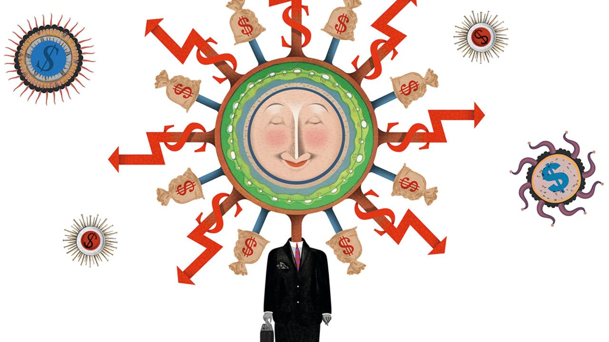

###### Schumpeter

# Will shareholders halt the inexorable rise of CEO pay? 

##### During the pandemic, bosses found new ways to feather their nests 

 

> May 15th 2021 

LAST YEAR was a terrible one for travel of any sort. You would not know it from the way some American chief executives trousered pay. Annual filings show that Larry Culp, boss of GE, whose jet-engine business stalled as aviation nosedived, earned $73m, almost triple his total pay in 2019. Christopher Nassetta, CEO of Hilton, a hotel chain, enjoyed a 161% pay boost, receiving $55.9m. Norwegian Cruise Line, which described 2020 as the hardest year in its history, more than doubled the compensation of its CEO, Frank Del Rio, to $36.4m. All three were among the corporate titans who grandly took cuts in their basic pay and/or bonuses during the pandemic. They pocketed far more than they gave up.

They did so thanks to a nifty conjuring trick performed in boardrooms across America last year. In effect, many boards airbrushed away the impact of covid-19 on performance-based pay either by removing a quarter or two of bad numbers in order to meet bonus targets, changing the metrics mid-course, or—as with Messrs Culp, Nassetta and Del Rio—by issuing new share grants after the pandemic gutted the previous ones. (Mr Culp and Mr Del Rio also got contract extensions.)


The result was a continuation of the inexorable rise of CEO pay in America during a year that, for mere mortals, was one of massive job losses, furloughing and government support. According to MyLogIQ, a data gatherer, the median pay of nearly 450 CEOs running firms in the S&amp;P 500 that have reported so far was $13.2m last year, an increase for the fifth year running. It said Mr Nassetta and Mr Del Rio were among two dozen bosses in that group who got a pay rise even though their firms lost money.

So now comes the backlash from investors, right? So far this year, shareholders have used “say-on-pay” votes at annual general meetings to censure an unusually large number of America’s biggest firms for gerrymandering pay policies, including GE, AT&amp;T, a telecoms giant, IBM, a tech firm, and Walgreens Boots Alliance, a pharmacy business. Pay consultants report that those CEOs yet to face combative shareholder meetings are “sweating it”. That is no bad thing if it suggests that institutions are so fed up with the stratospheric rewards on offer that they convince boards to put an end to them. But don’t bet on it. Shareholders remain in as much of a muddle over high pay as company directors.

To be fair, it’s a tricky issue. There is a widely held view in America that executive pay, like the stockmarket, always rises. That’s not strictly accurate. During the second world war pay fell, and for 30 years after barely budged. But since then, CEO pay inflation has been a fairly reliable assumption: the average level has risen about tenfold since the mid-1970s, vastly outpacing the income of average workers.

It is a phenomenon that extends well beyond chief executives. Superstars from J.K. Rowling, an author, to Cristiano Ronaldo, a footballer, also earn spectacularly more than their counterparts would have done in ages past, notes Alex Edmans of the London Business School. In such a competitive global market, high pay may be justified to recruit and keep the best people. Yet its merits are undermined when bosses reap the windfalls from extraordinarily good times, such as a stockmarket boom, but are spared the consequences of misfortune, such as a pandemic. As Mr Edmans puts it: “If you’re letting CEOs benefit from the upside, they have to feel the pain on the downside.” Boards tend to ignore that. Perhaps they, too, gain from perpetuating a system that keeps their own salaries high. For whatever reason, they threw around the painkillers last year like smarties.

Pliant boards are not the only problem. Pusillanimous investors are part of it, too. Until the pandemic, the average vote supporting management on say-on-pay proposals was 90% or more, says Semler Brossy, a pay consultancy. That’s a whopping approval rate. By contrast, Cal PERS, America’s most outspoken public-pension fund, in 2019 and 2020 voted against more than half of them, usually because the rises were not justified by mediocre market performance. Things appear to be changing. MyLog IQ says that the share of companies in the S&amp; P 500 that have failed say-on-pay votes so far this year is running at 6.1%, almost three times the level for the whole of 2019. Institutions claim that the issue has become more pressing because the “heads-I-win, tails-you-lose” approach to pay screams inequality. Yet their protest votes on pay remain relatively few, they are non-binding, and the number of pay recalibrations last year were unusually high, suggesting their fury on the issue may yet cool. Say-on-pay censure alone will not end America’s fat-cat era.

It is hard to imagine what will. Many shareholders instinctively cringe at the thought of taxation and pay caps, an option floated by left-wing Democrats. Yet their own collective efforts to modify the system are also feeble. Calls to lengthen the period executives hold shares to, say, five or ten years have so far gone nowhere. Efforts to stop boards benchmarking CEOs against lavishly paid members of peer-group companies have also flopped.

Doing well by doing good

It is quite likely, in fact, that shareholders will focus less on pay in coming years as they prioritise even more emotive issues, such as gender and racial diversity among firms they invest in, as well as climate change. By 2022 environmental, social and governance (ESG) goals are expected to be part of many more CEO pay schemes, especially as the credo grows of maximising value not just for shareholders, but for stakeholders. In the long term, these may help improve stockmarket returns. But in the short run the risk is that, while oversight is lax, some boards will use ESG criteria to distract attention from poor financial performance. One day the world may have cause to cheer the impact of a greater focus on sustainability. But in the meantime some CEOs will no doubt use it as a new way of feathering their own nests. ■

