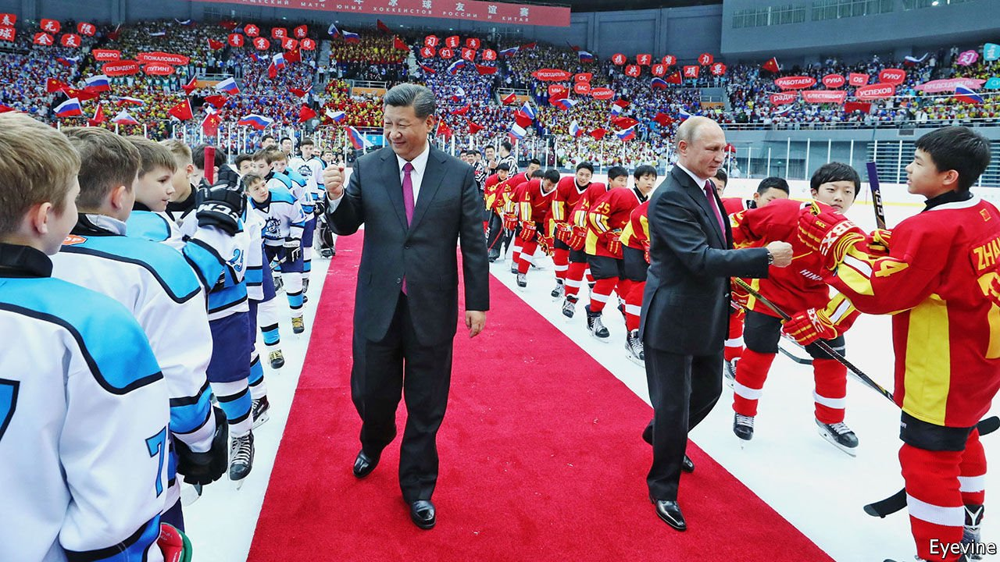

###### The puck stops here

# China is in danger of being humiliated at the winter Olympics 

##### Its ice-hockey team has been drawn against Canada and America 

 

> May 15th 2021 

IN 2018 THE Chinese men’s ice-hockey team qualified for the first time for the Olympic games, to be held in 2022 in Bei jing, under a special dispensation for the host country. The cold reality of what this would mean was brought home last year when China was drawn in the same group in the competition as two powerhouses of the sport, Canada and America. A “slaughter” is likely, says China Sports Insider, a website. That would be a propaganda nightmare for the Communist Party, especially given the notable enthusiasm President Xi Jinping has shown for the sport.

In 2014 Mr Xi told an interviewer in Sochi, Russia, that ice hockey was his “favourite” winter sport to watch. Ice hockey also features most prominently in an official video about Mr Xi and the 2022 games. At one point he tells a group of young ice-hockey players that China’s “hopes are pinned on your generation”.


Efforts to boost the current generation of contenders have not gone well. Kunlun Red Star, a Chinese-owned club competing in Russia’s ice-hockey league, was meant to help. Mr Xi and Russia’s president, Vladimir Putin, attended the opening ceremony at the team’s formation in 2016 (they also attended a youth ice-hockey event together in 2018, pictured). Red Star set out to solve Mr Xi’s problem by recruiting foreigners of Chinese descent, including veterans of America’s National Hockey League, to move to China and become eligible to represent the country in 2022.

But Red Star and the state sports bureaucracy appear to have had a falling-out, and responsibility for the national team has been passed like an errant puck between the club and Chinese officials. The relationship grew frostier still in 2019 when a squad made up of Red Star’s weaker players annihilated the Chinese national team, 10-0.

The International Ice Hockey Federation in Zurich, which granted China its spot in the Olympics, wants to avoid even more lopsided results in February. On May 8th René Fasel, head of the federation, held a call with ice-hockey officials in China, a spokesman says, to discuss “how best to prepare the Chinese team” for the games.

The only realistic solution is for China to bring in the ethnic-Chinese players Red Star has already recruited. They are waiting in cities from Vancouver to Boston for the call to play. China would still be expected to lose at the Olympics, but avoiding humiliation would feel like victory. ■

