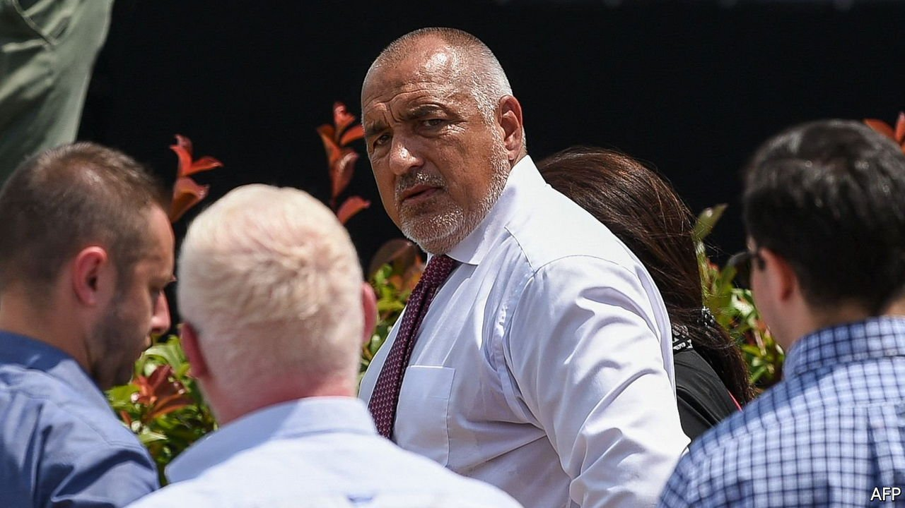

###### Battling Borisov

# Bulgaria’s outgoing prime minister is under fire 

##### Explosive allegations in parliament 

 

> May 15th 2021 

AT A PARTY the boss is playing cards with his friends. One of them shows a video about what happened to a businessman who did not do what they wanted; he was filmed being sexually abused in custody. Another member of the group, known as “the chicken”, has paid €2,500 ($3,025) to a glamorous woman to “take care” of the boss. Others give the big man gold bars as gifts. It sounds like something out of a gangster movie. But the “boss” is allegedly Boyko Borisov, Bulgaria’s prime minister until this week.

The description of the party and other allegations of misconduct were made by Svetoslav Ilchovsky, who owns an agricultural business. He was testifying on May 5th and 7th to a parliamentary committee examining the behaviour of Mr Borisov and his party, which has dominated politics since 2009. A general election on April 4th was inconclusive: no party was able to form a government. A new poll has been called for July 11th. Meanwhile the president, a political foe of Mr Borisov, appointed a caretaker government on May 11th.


Mr Ilchovsky’s allegations could hardly be more damning. The economy is controlled by men close to Mr Borisov and ministers are just “puppets”, he said. He claimed that the biggest power in agriculture was Ivan “the chicken” Angelov, and that he had been forced to sell chicken feed to Mr Angelov’s company at low prices. Mr Ilchovsky submitted false invoices to inflate the turnover of the company Mr Angelov owns with his brother in order to boost its value when it was launched on the stock exchange in 2018. Every agricultural producer or importer who did not do what was demanded of them was persecuted by the food-standards agency, which held up imports on the border or paralysed businesses with exacting health inspections.

Mr Borisov has denied all the claims and says he has never even met Mr Ilchovsky. Mr Angelov says that 95% of what Mr Ilchovsky says is untrue. On May 10th, however, Pavel Stoimenov, another businessman, made more, similarly damning allegations to the committee. He said he had “delivered” 1,000 votes to Mr Borisov’s party, but when he had tried to resist Mr Angelov’s demands, buildings belonging to his company had been set on fire.

Mr Ilchovsky said he complied because it was a “survival strategy”. “There is not a single EU-funded project in the agricultural sector where prices have not been jacked up or some fraud has not happened,” he added. The allegations are being sent to the EU public prosecutor’s office, not just Bulgaria’s, which is widely believed to be subject to political influence.

Everything the two witnesses claim, says Ognyan Georgiev, the economics editor of Kapital, a leading business daily, has long been rumoured, and Mr Borisov has survived scandals before. But public remarks by a former insider are “a very heavy blow. He was basically describing in ominous detail how our captured state works.”

Atanas Tchobanov, a founder of Bivol, an investigative news site, says Mr Borisov’s fall will take time, since his party is embedded in all institutions, including the prosecution service. But now, he says, a window of opportunity has opened. Mr Tchobanov is optimistic that the caretaker government will approve freedom-of-information requests he is about to submit about all sorts of sensitive questions. “It might be the tipping point,” he grins. ■

