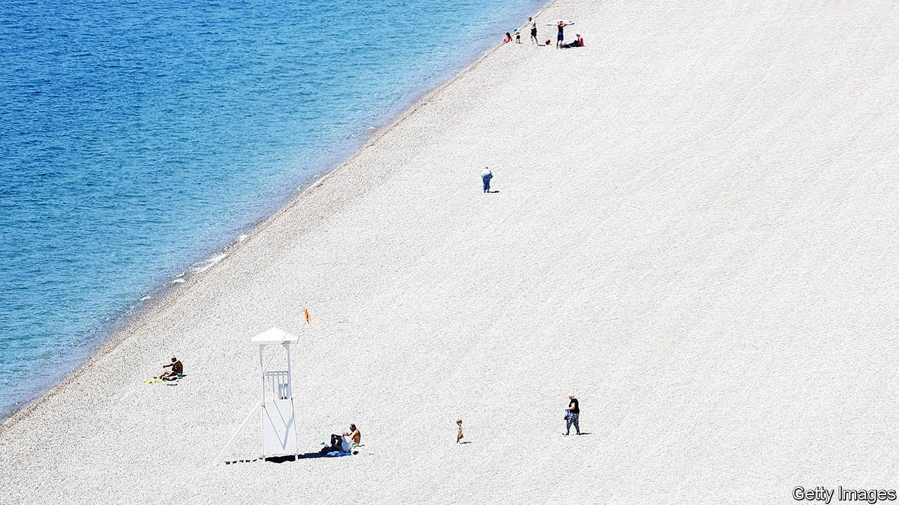

###### Where did everyone go?

# Pandemic tourism in Turkey 

##### Turks are stuck indoors. Foreigners have the country to themselves 

 

> May 15th 2021 

TOURISTS IN TURKEY are already spoiled. The food is excellent, the locals welcoming and the range of holiday options, from mountain hikes on the Black Sea coast to boat cruises on the Aegean and hot-air balloon rides over Cappadocia, are enough to last several summers. A prolonged currency crisis has seen the dollar strengthen against the lira by nearly 60% in just over two years, meaning that vacations in Turkey come cheap. A room in a luxury hotel can easily cost less than a cramped offering from Airbnb in a European capital. If they can only resist tweeting their thoughts about Recep Tayyip Erdogan (at least 36,000 people have been investigated for insulting Turkey’s thin-skinned president in a single year), foreigners will be in for a treat.

These days, they will also be in for a surprise, though whether it is a welcome one depends on one’s idea of a rewarding vacation. To resuscitate tourism, Turkey has declared holidaymakers exempt from covid-19 lockdowns. With locals ordered to stay home from late April until at least until May 17th, following a surge in infections and deaths, tourists have had the country almost to themselves. Foreigners in Istanbul walk down empty streets and board empty ferries. On the Mediterranean coast, they laze on empty beaches and go for long, lonely swims. Turks caught doing the same have been plucked out of the water by gendarmes and fined 3,180 lira ($380), more than the monthly minimum wage. Locals cannot buy alcohol during the lockdown, the result of a government ban. Foreigners can drink freely at hotels.


Things are about to get even more interesting. As of May 15th, travellers from more than a dozen countries, including Britain, will no longer be required to produce a negative covid-19 test on arrival in Turkey. The foreign minister, meanwhile, has pledged to vaccinate “anyone a tourist is likely to see”, meaning hotel staff and the like, by the end of the month. Turks who are still waiting for their first shot, and who are unlikely to end up within eyeshot of a visiting foreigner, bristled. The vaccine roll-out has slowed. Of the 100m doses of the Sinovac vaccine China promised to send to Turkey, only 27m have arrived.

Turkey badly needs the income from tourism. A couple of years ago, the industry generated $34.5bn. That dwindled to $12.6bn last year because of the pandemic, swelling the country’s already unhealthy current-account deficit. This year may be even worse. Tourism revenue between January and March was down by 40% compared with the same period last year. This week Britain placed Turkey on its “red list” for travel, banning visits for pleasure and imposing stringent quarantine rules. That decision forced UEFA, Europe’s football association, to move a Champions League final between two English clubs, Manchester City and Chelsea, from Istanbul to Porto, in Portugal. Russia, which sent more tourists than any other country to Turkey last year, has suspended nearly all flights to the country until June. This came after Mr Erdogan criticised Russia’s annexation of Crimea and offered to support Ukraine’s plans to join NATO.

The new lockdown has brought down covid-19 infections, which had soared to over 60,000 a day in April, offering some hope that tourism may rebound during the summer. But closing down the country to locals while rolling out the red carpet for foreigners has not gone down particularly well. “Turkey unlimited,” read a mock tourism advertisement making the rounds on the internet, accompanied by a picture of a nearly deserted beach. “Now available without Turks.”

“This is ridiculous,” says Kaan Alpan, a banker in Bodrum, a popular vacation spot on the Aegean coast. “If we had closed down correctly at the right time, we would have been able to open by now.” Were he a foreigner, Mr Alpan would be free to cool off in the sea. As a Turk, the most he can look forward to is a quick trip to the grocer. Even some tourists are uneasy. Anara, visiting from Kazakhstan, says she does not plan to go swimming while her Turkish neighbours are stuck indoors. “I wouldn’t want to do that to them,” she says. “That would be unfair.” ■

Dig deeper

All our stories relating to the pandemic and the vaccines can be found on our . You can also listen to , our podcast on the race between injections and infections, and find trackers showing ,  and the virus’s spread across  and .

