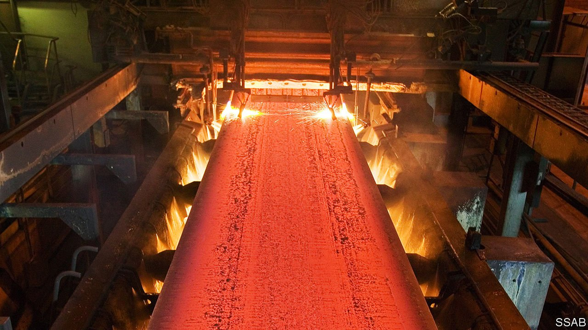

###### Green steel

# Plentiful renewable energy is opening up a new industrial frontier 

##### Competitors are alarmed 

 

> May 15th 2021 

NORRLAND IS THE largest of Sweden’s three historical “lands”. It spans the top half of the country and is sparsely populated, the more so the farther north you go. The few people who live there have long relied for work on mining, the army and forestry. Most of Sweden’s industry is far to the south. But Norrland abounds in hydropower. Power that is cheap and—crucially—green, along with bargain land and proximity to iron ore, is sparking an improbable industrial revolution, based on hydrogen, “green” steel and batteries.

SSAB, a steelmaker, is poised to deliver its first consignment of “eco-steel” from a hydrogen-fuelled pilot plant in Lulea, a northern city. Volvo, an industrial-vehicle firm these days, will use the steel to build lorries. Of the six or seven tonnes that its typical lorry weighs, around five consist of steel. And for each tonne of steel produced using fossil fuels, around two tonnes of planet-cooking carbon dioxide get belched into the atmosphere.


To make steel, iron ore must be melted at high temperatures and reduced from iron oxide to iron, a process that typically involves burning fossil fuels, releasing huge amounts of carbon dioxide. Replacing them with hydrogen as a reducing agent eliminates more than 98% of the carbon dioxide normally released. The hydrogen is made by electrolysing water, using electricity produced by hydro-power. This approach involves almost no carbon-dioxide emissions at all.

Scania, another automotive firm, is also hoping to exploit Norrland’s cheap hydro-power. It plans to make 15,000 battery-powered trucks a year by 2025, around 15% of its annual production. To that end it has invested in Northvolt, a new battery-making enterprise powered by Norrland’s hydro-electricity. Northvolt’s main facility is in Skelleftea, 130km south-west of Lulea. It is also building a battery-recycling plant there (see Science section). By the end of 2021 the company hopes to have churned out enough batteries to store 16 gigawatt-hours. Carl-Erik Lagercrantz, Northvolt’s chairman, wants to scale that up eventually to 150 gigawatt-hours a year. If he does so by 2030, he will be supplying a sizeable amount of the European Union’s expected annual demand of some 450 gigawatt-hours of electric-vehicle battery capacity by 2030.

Mr Lagercrantz also wants to get into the green-steel business. Taking inspiration from SSAB’s pilot project, he decided to have a go at hydrogen-based steelmaking too, and founded H2 Green Steel. Production will be based in Boden, an old army town 30km north-west of Lulea. The new plant will make 5m tonnes of flat steel a year by 2030, a small but meaningful percentage of the 90m tonnes that is currently consumed annually in the EU.

Northern Sweden’s steelmaking leaps are being emulated elsewhere in Europe, in response to similar environmental pressures which will only increase if, as looks very likely, Germany’s Greens enter government after the election in September. Europe produces a still significant 16% of the world’s steel. Big producers in Germany and Poland, where the industry is mostly coal-based and very dirty, are nervy. Even neighbouring Norway is in danger of losing out. It too has the gift of rich renewable-energy resources, but underinvestment means there may soon not be enough of this green electricity to meet the demands of both households and industry.

Meanwhile, all the green-tinged investments have knock-on effects for the rest of the economy of northern Sweden. Claes Nordmark, the mayor of Boden, says house prices are rising and contractors are queuing up to build apartment blocks in anticipation of H2 Green Steel’s new facility. Other companies are vying to supply the steelmaker, or to take advantage of its products. Expecting a jump in population, Mr Nordmark and his colleagues in the region are building schools and sporting facilities. Your correspondent encouraged him to abandon Swedish reticence and brag. “Those in the south think there is nothing here. But now we can offer the green jobs that people dream of—and an amazing lifestyle,” he beams. ■

For more coverage of climate change, register for The Climate Issue, our fortnightly , or visit our 

