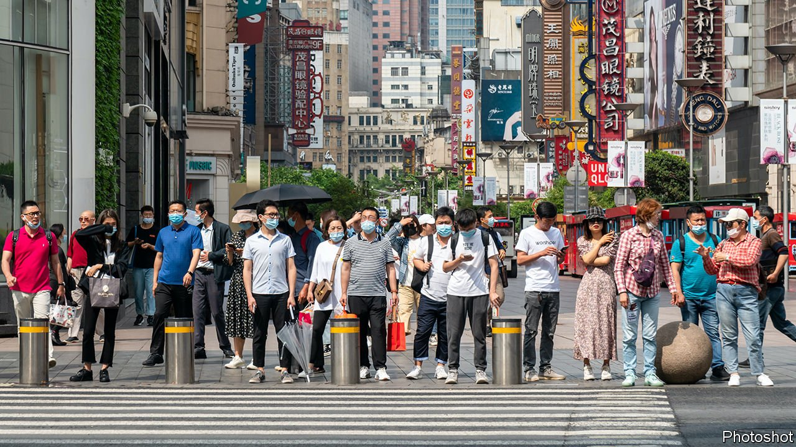
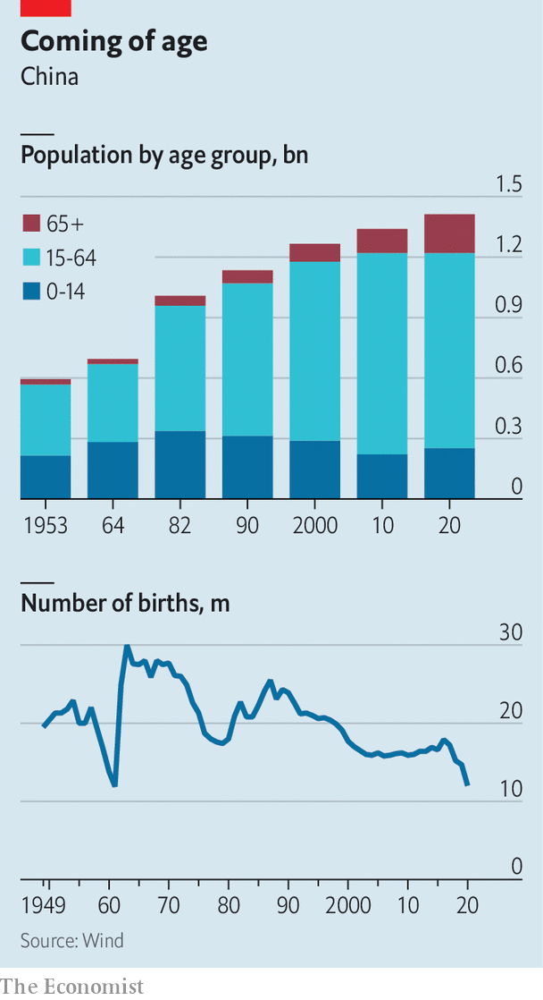
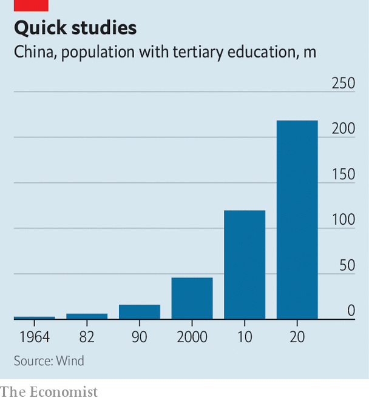

###### Older and wiser

# China’s census shows its population is nearing its peak 

##### It is also more urban and better educated 

 

> May 13th 2021 

RARELY DOES a census attract attention and controversy—unless the country counting its people is both the world’s largest and on the brink of decline, and its statisticians are notorious for fiddling their figures. So the results of China’s seventh census, conducted last year and released on May 11th, were big news. According to the data, the population reached 1.41bn last year, up by 5.4% from a decade ago. That ran contrary to a report last month in the Financial Times saying that China’s population , which would have marked the first decline in six decades.

Adding to the intrigue around the census was its delay. The National Bureau of Statistics had originally promised to publish the figures in the first half of April. As ever with Chinese data, there were some oddities. Taken at face value, the population increase in 2020 when compared with annual birth figures suggested that, miraculously, no one died last year.

 


For those willing to grant Chinese officials a modicum of trust, the controversies can be explained away. It is misleading to compare China’s annually reported population figures, extrapolations based on tiny samples, with its , in which boffins try to tot up everyone in the country. Demographers said the covid-19 pandemic, during which tens of millions of migrant workers returned to their rural homes, caused delays to the count. And upward revisions to past population data help resolve the death-free miracle (millions did in fact pass away last year).


Beyond the controversies, the census shone a light on the demographic trends reshaping China. For a start, the country is ageing rapidly. The number of people aged 60 and older hit 264m last year, up by more than 80m over the past decade, as China added roughly a Germany’s-worth of old folk. Longer lifespans are a marker of development success.


More worrying, though, is the plunge in fertility. Births last year fell to 12m, down by nearly 20% from 2019. When China ended its one-child policy in 2015, the government expected a baby boom. Instead, soaring housing and education costs and other realities of modern life led more women to choose not to marry.  of 1.3 children per woman is about the same as Japan’s, and well below the 2.1 needed to keep a population stable. If China’s officials are to be believed, its population is still growing but will peak in the next few years—nearly a decade earlier than some government advisers had expected.

Rapid ageing will change the state’s role in society and add to fiscal pressures. For decades, benefiting from a bulge of young workers, officials could focus their spending on infrastructure. Now they will have to spend more on health and social care, and threadbare pension plans. All this raises questions about whether China will grow old before it grows rich.

But the census also showed how demographic changes are making China a more potent economic force. In 2020 it was home to 218m university graduates, nearly double the number in 2010. Even if the working-age population is declining, the dramatic increase in skills makes for a more formidable workforce. Moreover, migration from farms to cities, long a driver of economic growth, has continued. Nearly 64% of the population lived in urban areas last year, up from less than 50% in 2010.

 


As people move in search of opportunities, they are redrawing China’s map. The rust-belt provinces in the north-east lost millions of younger residents over the past decade, while prosperous coastal areas, notably Guangdong and Zhejiang, gained millions. As a whole, China is getting older, more educated and more urban. But that change is not evenly spread. The outside world is understandably focused on the question of when China’s population will peak. Within China, the widening gap between haves and have-nots is just as pressing a concern. ■

