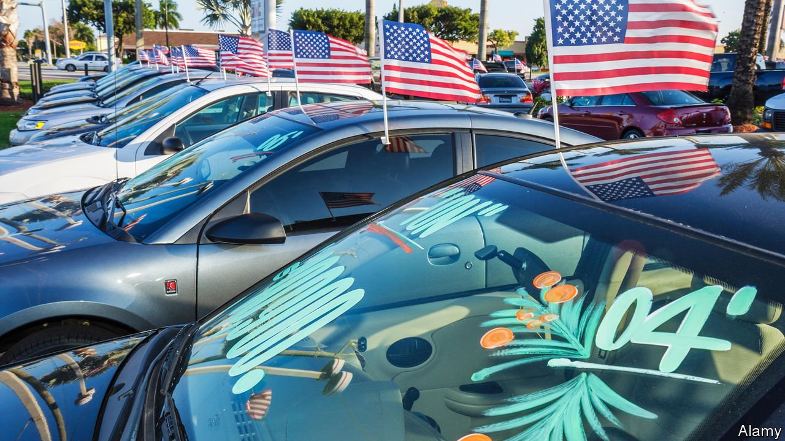
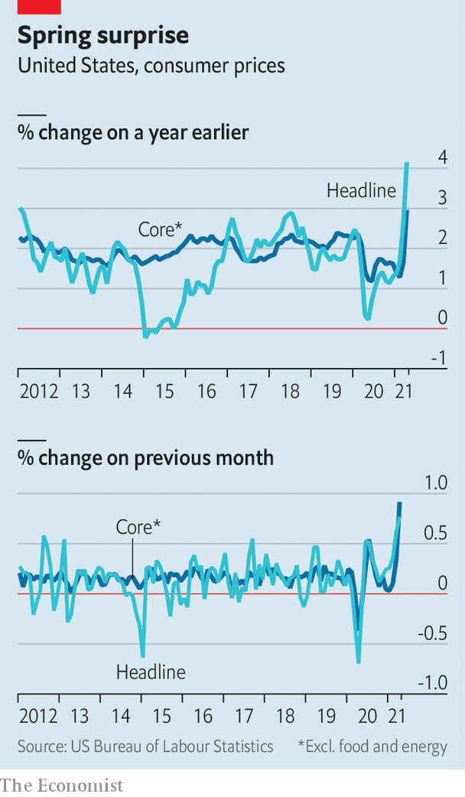

###### Jump scare?

# Consumer-price inflation in America jumps up to 4.2% 

##### Shortages and bottlenecks imply more price rises will follow. But will they last? 

 

> May 13th 2021 

AS AMERICA’S ECONOMY bounces back from the pandemic, aided by, the main question on investors’ minds is if and when inflation will take off. The Federal Reserve has vowed to tolerate a period of above-target price rises so that the economy can get back on its feet; Jerome Powell, its chairman, has said it is “not even thinking about thinking” about raising interest rates. Yet with many asset prices underpinned by rock-bottom rates, investors have been jumpy, fretting that high inflation could force the central bank’s hand.

Then came a big inflation surprise. Figures published on May 12th showed that America’s consumer-price index rose by 4.2% year-on-year in April, a rate not seen since 2008, and considerably higher than the 3.6% that had been expected by forecasters. The S&amp;P 500, America’s main stockmarket index, fell by 2% that day.


By far the biggest factor behind the acceleration relates to the past, rather than the price pressures of today, as last year’s oil-price falls depressed the base used to calculate the annual rate. Yet even the monthly increase, stripped of more volatile food and energy prices, was 0.9%, the strongest since the 1980s. Data for a single month cannot tell you whether runaway inflation is around the corner. But the release says something about the realities of economic reopening.

 


Consumer demand in the world’s largest economy is roaring back. Stimulus cheques worth up to $1,400 were doled out to many Americans earlier in the year. Now a successful vaccination campaign is allowing them to get out and spend and restrictions to loosen. According to a tracker compiled by JPMorgan Chase, a bank, credit-card spending rose from a tenth below its pre-pandemic trend in the six months to March to only just below it by May.

The speed and nature of the post-lockdown bounceback seems to have caught many firms off guard. Not since the mid-1970s have companies been so likely to report delays in supplier deliveries, according to research published in March by Goldman Sachs, a bank. American retailers’ inventories, relative to revenues, have plunged to all-time lows, suggesting that shops are running out of things to sell. Many firms, especially smaller ones, had ordered insufficient supplies and are now frantically catching up. (By contrast, the inventories of large listed firms have not declined, either because they were better able to forecast the coming spending binge, or because their supply chains are more diversified.)

Yet surges in demand cannot immediately be fulfilled. Take imported supplies, for instance. Even at the best of times extra demand for international deliveries takes a while to sate; a ship can take a few weeks to sail from China to America. The added complication in 2021 is that firms must also contend with shortages of containers in some ports. Some were stuck in the wrong place during the first wave of lockdowns.

Moreover, workers cannot be hired overnight. Firms are  enough staff to fill open positions—perhaps a big reason why the jobs report for April, published on May 7th, showed that America had added just 266,000 jobs, well below the 1m or so that many economists had expected. The number of unfilled positions is running at an all-time high.

Take the surge in demand and strained supply together, and you get to higher prices. Used cars and trucks are a good example. Their prices rose by a staggering 10% in April, contributing to the headline-inflation surprise. With people nervous of flying and public transport, more may want to get behind the wheel instead to see relatives in other parts of the country, or to get to work. But a global shortage of computer chips has also constrained the supply of new vehicles.

Assured of sustained demand, other companies may also begin to pass on higher costs to customers. The cost of shipping items from China to America is now three times as expensive as it was before the pandemic, and input prices have picked up in the spring.

What, if anything, can these pressures tell you about inflation to come? In order for it to stay high, such price rises will need to keep repeating, pushing up wages in turn. But the present phase could reasonably be regarded as temporary, as suppliers adjust to shifting consumer tastes. Even as economies locked down in 2020, for instance, firms quickly found new ways to source material and bottlenecks eased. The current spike would then prove transitory.

Yet as the recovery proceeds, other surprises will come. The combination of a generous Treasury, a tolerant Fed and a reopening economy puts America in uncharted territory. Brace yourself for more inflation scares in the coming months. ■

A version of this article was published online on May 12th, 2021

