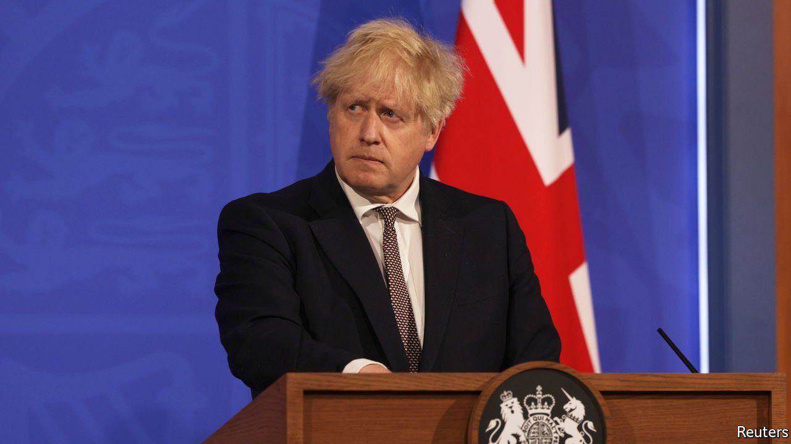

###### British politics

# The Queen’s Speech reveals the meaning of Johnsonism 

##### The prime minister wants a big state that crimps civil liberties 

 

> May 13th 2021 

CONSERVATISM, AS PRACTISED by the British Conservative Party, is a capacious creed, open to a wide range of interpretations. For Margaret Thatcher, it meant the moral and economic discipline of the free market; for David Cameron, liberal centrism and the embrace of globalisation.

Boris Johnson’s interpretation has been hard to decipher, partly because it has been obscured by the chaos of covid-19 and partly because he has never shown any commitment to a set of political ideas. So the Queen’s Speech, delivered on May 11th, in which the government presents its programme for the next session of parliament, was of particular interest. It was the clearest expression so far of what might one day be called Johnsonism.


That Mr Johnson is now thought quite likely to be in power for long enough to have his own “ism” would have surprised many just a year ago. His management of the early stages of the pandemic was lethally slipshod, and there was much grumbling about his leadership. However, on May 6th the Conservatives  in a by-election and in a series of local polls.

Mr Johnson’s popularity springs from several sources. One is a , and consequent liberation of the population from lockdown. Another is Mr Johnson himself. His boisterous willingness to outrage liberal sensibilities goes down well outside the cities, and his finely tuned political instincts have led him to espouse a combination of cultural conservatism and statist economics that has more in common with Gaullism or Eisenhower’s “modern Republicanism” than it has with Thatcherism or Cameron-style conservatism.

Some of the intervention that the government promises is welcome. It plans to boost investment in R&amp;D and to “level up” the country by splashing out on infrastructure and on vocational education, which both need money and attention. It promises to reform the planning system, which allows homeowners to veto development and thus condemns Britons to live in expensive rabbit-hutches.

Mr Johnson’s solution to the problem of NIMBYism is to limit local authorities’ say on planning, giving central government more control over development. Whether or not he will really face down angry suburbanites in the Home Counties over new houses—he has already bottled out of a previous attempt—this approach derives from the fundamental problem with Johnsonism: his tendency to grab power. If local authorities do not want development, Mr Johnson’s answer is not to give them more say over taxation and thus an incentive to grow, but to force them to accept it. If parts of the country are poor, his answer is not to allow them to develop their own growth strategies, but to create a central fund to give them money.

The government is extending its control over the economy, too. Its plan for freeports is an attempt to direct investment to particular parts of the country. It is taking the opportunity that Brexit offers to give itself more discretion over handing out money to private companies and over using public procurement to further its levelling-up agenda. Both should send shivers down taxpayers’ spines.

The programme also includes a constitutional power-grab. Mr Johnson has had his sights set on the judiciary ever since the Supreme Court prevented him from proroguing Parliament over Brexit in 2019. That explains plans to limit the judges’ power to challenge the executive, as well as to restore the executive’s discretion over when to call an election, which Mr Cameron’s coalition government had renounced.

And as state power extends, so civil liberties will be crimped. The government has entertained new restraints on protest, limitations on asylum and voter-ID requirements. It looks set on meddling in culture and universities. These measures are all designed to press culturally conservative voters’ hot-buttons.

Johnsonism unbound

For a prime minister who hopes to use his newly recovered mandate to call an early election and wants to be seen to be doing stuff, the extension of central-government power has a clear appeal. For this newspaper, which puts a high price on civil liberties and believes that smaller states and freer markets make for more prosperous countries, it does not. ■

A version of this article was published online on May 12th, 2021

