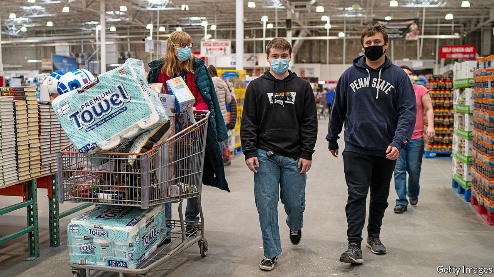
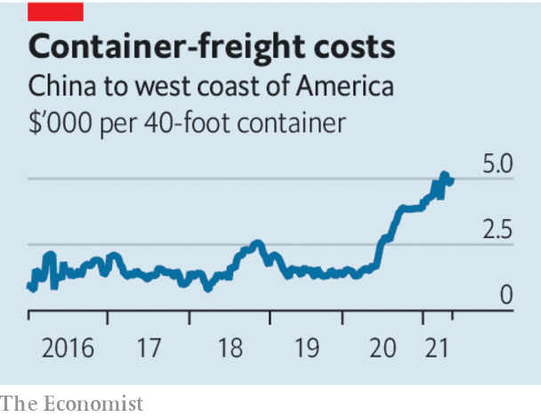

###### Boom and gloom

# The coming global economic boom could have a sting in the tail 

##### Supply shortages are acute in America 

 

> May 15th 2021 

THE GLOBAL economy is entering unfamiliar territory. After a decade of worries about inadequate demand and spending power in the aftermath of the global financial crisis, signs of insufficient supply are now emerging. A lack of goods, services and people means that red-hot demand is increasingly met slowly or not at all. There are already signs that supply bottlenecks may lead to nasty surprises which could upset the post-pandemic recovery. Nowhere are shortages more acute than in America, where a boom is under way. Consumer spending is growing by over 10% at an annual rate, as people put to work the $2trn-plus of extra savings accumulated in the past year. More stimulus is still being doled out.

The boom is creating two kinds of bottleneck. The first relates to supply chains. There are shortages of everything from timber to semiconductors. The cost of shipping goods from China to America has tripled. Companies have not reported supplier delays this severe in decades. In the past year many firms have cut their investment in logistics. Lockdowns have left some container ships stranded. Companies are trying to go from 0 to 60 and it shows.


The second kind of bottleneck is in labour markets. In April America created only 266,000 jobs, many fewer than the 1m or more that had been expected. Yet job vacancies are at all-time highs, and so firms are struggling to fill positions. Economists argue over whether generous unemployment benefits are giving people a reason not to look for work. It also takes time for people to move from dying industries to growing ones.

 


As booming demand runs up against tight supply, inflation is in the spotlight. In April American consumer prices , up from 2.6% in March. This partly reflects “base effects”: oil prices are only as high as they were in 2019, but 272% higher than in April 2020. It also reflects a genuine underlying rise in global prices. China’s factory-gate prices are rising at the fastest rate in over three years.

Central banks insist that their maximal stimulus must continue for fear of jeopardising the . Lael Brainard, a governor of the Federal Reserve, has said that the inflation spike as the economy reopens will be “largely transitory”. Jerome Powell, the chairman, sees little reason to worry. The Fed will tolerate somewhat above-target inflation for a bit, in part because it expects prices soon to fall back. So do many forecasters.

Yet this approach carries dangers. One is that inflation fades slowly. The supply bottlenecks of the early phase of the pandemic in 2020 cleared fast, but there is no guarantee this will happen now. Inflation expectations may also rise if people come to believe that central banks will act slowly and too late. Many companies are now discussing inflation with their investors. Bond-market traders think the Fed will be forced to act sooner than it wants. Bill Dudley, a former governor, worries that the Fed will have to raise interest rates to as high as 4.5% to cool the economy.

This points to the danger that sharp rate rises rock markets. So far the main event has been a sell-off in tech stocks, which is manageable. Banks are well capitalised. Yet the recent implosions of Archegos, a hedge fund, and Greensill Capital, a finance firm, are a reminder of the hidden leverage in a financial system that has come to depend on low interest rates. The post-pandemic boom may not always be exciting for the right reasons. ■

