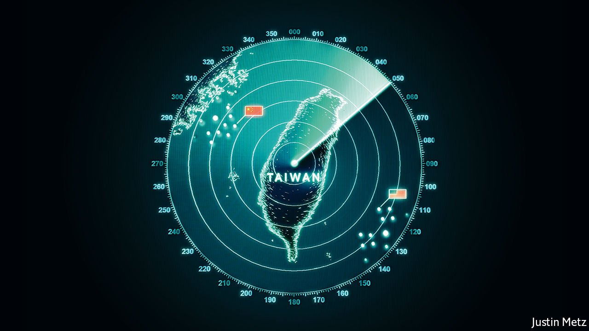
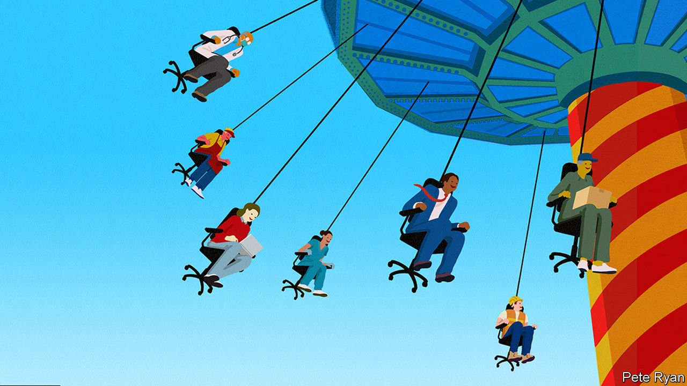
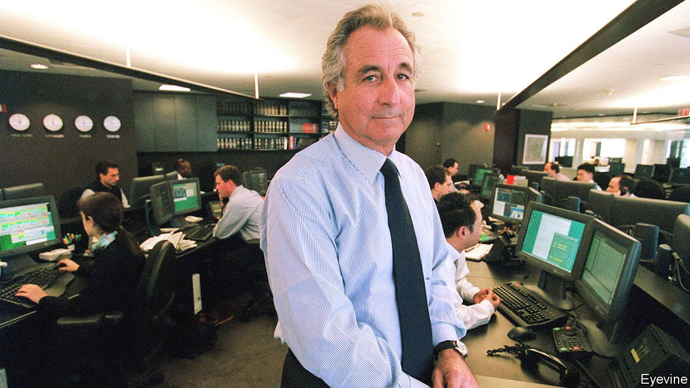
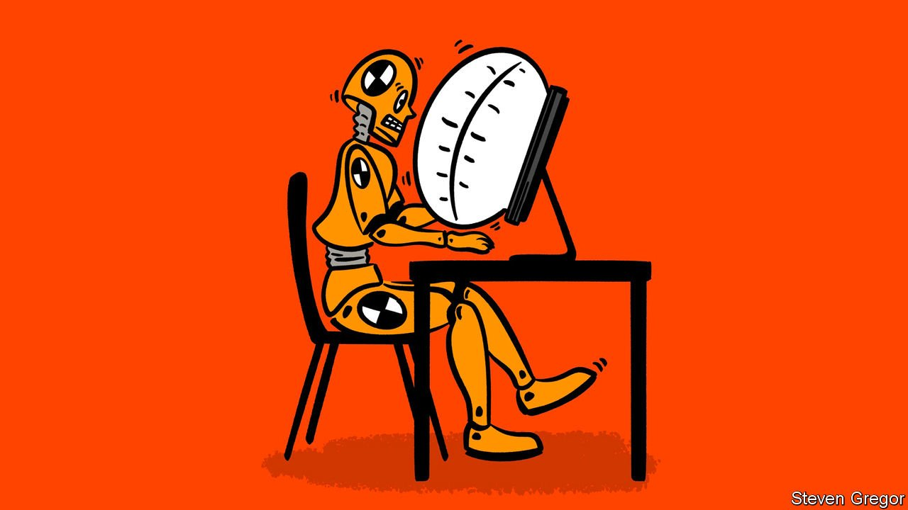

###### On Taiwan, Scotland, Spain, suicide, patents, workers, Dickens, the C-suite

# Letters to the editor 

##### A selection of correspondence 

 

> May 15th 2021 


Complacent Taiwan

Though the risk of escalation between Taiwan and China is increasing, the Taiwanese public remain nonchalant about the possible outbreak of war (“”, May 1st). The chief reason is the global demand for semiconductor chips. Mark Liu, chairman of Taiwan Semiconductor Manufacturing Company, has said that his firm is the silicon shield preventing Taiwan from an attack by mainland China. This view is widely shared by the Taiwanese public. Su Tseng-chang, the prime minister, thinks that “as long as the world needs Taiwan, the island will be safe.”


This mentality, based on the belief that the international community will protect Taiwan because of its economic importance, is ill-founded. Even though the discussion centres on the disruption of the supply chain for chips, Taiwan’s strategic importance does not guarantee its safety. Ignoring these perils can only put the island in a more dangerous position.

C.Y. HUANG

President

FCC Partners Asia

Taipei

 


Scots who want to stay

The possible preference of the Scottish counties that lie on the border with England not to join a Scottish separation from the United Kingdom should be considered seriously (“”, May 1st). These counties have voted against the Scottish National Party in elections for the Scottish and Westminster parliaments, and, by nearly two to one, against devolution in 1979 and independence in 2014. This is the same margin by which Scots voted to remain in the European Union, prompting Nicola Sturgeon to claim that Scotland was being dragged out of the bloc “against our will”.

Sauce for the goose?

JACK PONTON

Earlston, Scottish Borders

 


The church in Spain

It is true that Spain’s constitution of 1978 “separated church and state, but acknowledged Spaniards’ religious faith” (“”, May 1st). But it went further than that. Article 16 declares: “the public authorities shall take the religious beliefs of Spanish society into account and shall in consequence maintain appropriate co-operation with the Catholic church and the other confessions.” No other religious group is mentioned by name. The left at the time viewed this as introducing covert confessionalism.

Furthermore, the church is the only one that benefits from the system that allows taxpayers to donate 0.7% of their annual tax income to it, without increasing their total tax bill. Yet there are a significant number of Muslims in Spain as well as Jews and Protestants.

According to the 1979 agreement between Spain and the Vatican, the church was meant to work towards self-financing, but this has not happened. Spain remains far from being a French-style secular state.

WILLIAM CHISLETT

Elcano Royal Institute

Madrid

Covid and community

 looked at the economic impact of covid-19 on suicide rates (April 24th). The reported decrease in suicide, perhaps surprising given many people’s financial hardship, could be explained by the work of Emile Durkheim. In “Suicide”, the late-19th-century French sociologist studied people who took their own life and how they interacted with society. He described four types of suicide, one of which is egoistic suicide, when an individual does not feel a sense of belonging.

It is well known that in times of war suicide rates drop. This is generally ascribed to a “we’re all in it together” sentiment in a unified fight against a common foe. It is plausible that the war on covid has united societies in this way and suicide rates have fallen as a consequence.

NICK AIREY

Psychiatrist

Sheldon, Devon

 


Patent law

“” (April 24th) made the point that British lawyers have lost the right to practise in Europe, potentially undermining the reach of British courts and practitioners. One important area where the links remain is patents. The European Patent Convention (and its associated European Patent Office) is an international treaty organisation independent of the EU, and so British-based patent attorneys can still prosecute European patent filings in Munich and The Hague. Britain is a member of its board.

British patent courts are often used to clear the way for new innovators faced by threats of injunctions or costly licences. That’s an important service the British legal system can still provide to the world.

TONY CLAYTON

Former chief economist at the Intellectual Property Office

Sevenoaks, Kent

 


Not every worker gets a lift

Tearing down barriers to occupations through meritocratic access to education and retraining will not create more opportunities for low-skilled workers hoping to “climb the ladder” to high-skilled jobs (“”, April 10th). This assumes talent and ability are evenly distributed and that some people will work harder to jump on a waiting empty elevator, pushing the button to reach a higher socioeconomic position.

Mobility is upward and downward. The higher floors have a finite space. The elevators are also full of people on the way down. Anne Case and Angus Deaton call this the dark side of democracy in “Deaths of Despair and the Future of Capitalism”. Those left behind are devalued and disrespected as “losers”. The meritocratic elite contribute to the culture of overwork, their success making everybody else feel that they have failed.

CHRISTOPHER VOISEY

Singapore

 


A Dickens of a story

Pyramid schemes of the type described in your obituary of  (April 24th) form important components in two novels by Charles Dickens, “Martin Chuzzlewit” and “Little Dorrit”. The modus operandi in both cases is remarkably similar to your account. Decades before the infamous Ponzi scheme, I’d like to know whether they came purely from the fertile imagination of the great author, or whether such con tricks existed in England at the time. It seems safe to assume that Madoff’s victims did not have the benefit of reading either book in their youth.

JOHN DOUGLAS HEY

Calgary

 


Too many Cs at work

I laughed out loud at satire of chief impact officers (April 10th). Each one I have met struggled to articulate what good or service they practically made available. The expansion of the C-suite has been mind-boggling in my own organisation. When I asked our chief information-security officer for policy advice on the medical data of our staff, he asked the chief people officer, chief information officer and chief technology officer to refer the query I had raised to my own office, on the advice of the chief medical officer.

Fortunately I get on well with our chief mental health officer. Perhaps he can alleviate these challenges to my sanity.

JACK SEABROOK

Auckland, New Zealand

