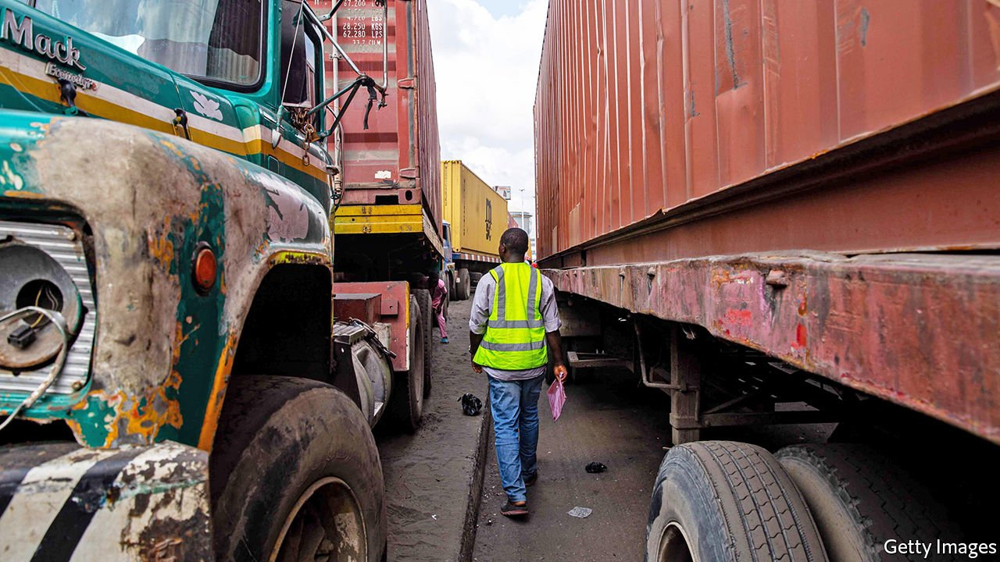
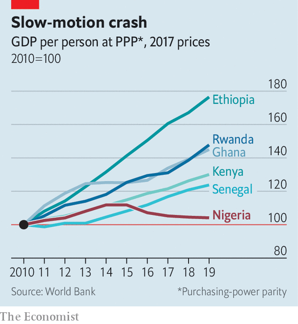

###### Hard times

# Nigeria’s economy is stuck in a rut 

##### Rising oil prices will bring short-term relief, but may delay essential reforms 

 

> May 13th 2021 

TALK THAT everything is expensive fills the air at a market in Lagos, Nigeria’s commercial capital. Since February the minibus fare from home to the market has doubled, says Emmanuel Mokwe, who sells kitchen utensils. So has the price of food, he adds grimly. “It’s just chaos,” says Dotun Babande, who runs a juice shop across town. Inflation is running at 18%. For food it is 23%, the highest in two decades. More than half of Nigerians are underemployed or unemployed. Before covid-19 about 80m of Nigeria’s 200m people lived on less than the equivalent of $1.90 a day. The pandemic and population growth could see that figure rise to almost 100m by 2023, says the World Bank.

Nigeria’s economic woes also help explain a vertiginous rise in crime. More people were kidnapped in the first four months of this year than all of last year, according to Jose Luengo-Cabrera of the World Bank. This has added to worsening violence around three flashpoints: the jihadists of Boko Haram in the north-east; a long-standing conflict between farmers and cattle-herders across central Nigeria; and fighting between government forces and Igbo separatists in the south-east.


Covid-19 has slammed economies everywhere, but Nigeria’s economic malaise predates the pandemic. GDP per person has fallen every year since 2015, when oil prices slumped (see chart). The World Bank reckons that by the end of the year real income per person in Nigeria, home to one in six of sub-Saharan Africa’s people, will be at the same level as it was in the 1980s. Reform is desperately needed, but fiendishly difficult to enact.

 


Although oil makes up about 9% of Nigeria’s GDP, it accounts for 80% of export earnings and about half of government revenues. A long slump in its price—from over $100 a barrel in 2014 to less than half that for most of last year—has squeezed the supply of foreign exchange. Normally economies would adjust by letting their exchange rates fall, making imports more expensive. This can be painful in the short term since it fuels inflation. But usually it helps boost exports by making them more competitive. If Nigeria could make, grow or mine more for export, it would be less vulnerable to swings in the oil price.

Instead, the government of President Muhammadu Buhari has restricted imports in an effort to prop up the currency, which he sees as a measure of Nigeria’s strength. In an attempt to conserve dollars, the central bank has banned those intending to import almost 50 items from buying foreign currency. Last month wheat and sugar were added to the list. In 2019 Mr Buhari closed Nigeria’s land borders to goods to stop smugglers undermining local producers. Both moves have fuelled food-price inflation.

They have also hobbled manufacturing firms by making it hard for them to obtain inputs. Manufacturers would be lucky if they get 20% of the forex they request, says Muda Yusuf of the Lagos Chamber of Commerce and Industry. Ajibade Oluwabukunmi imports medical equipment and uses the volatile black market, where dollars cost almost 30% more than the official rate. “Nigeria is in a shambles,” he laments. Despite all its unorthodox controls, the central bank was forced to devalue the naira twice last year. Businesses are getting neither a stable currency nor access to dollars.

The government may slowly be changing its tune. Bismarck Rewane, an economist who is also on the president’s council of economic advisers, says that “the futility of a Robinson Crusoe economy became very clear for everybody”. The government is starting to pay more attention to exporters, he claims, pointing to the partial reopening of land borders for goods in December and Nigeria’s signing of the African Continental Free Trade Agreement in 2019.

Yet sustained growth in exports requires more than just opening the border. Many firms are uncompetitive because they are hampered by red tape and government failures. “Government is the biggest problem for business in Nigeria,” says Bashir Abdulrahman of Credent Capital and Advisory, an investment bank.

Electricity blackouts are maddeningly frequent. Roads are often poor and ports clogged up. Moving a container 20km from the port of Lagos to the city can cost $4,000, almost as much as shipping it 12,000km from China. Nigeria ranks 131st out of 190 countries on the World Bank’s ease-of-doing-business index. Although some industries, such as information technology, are growing, this is “in spite of the government”, says Tayo Oviosu of Paga, a mobile-payments company.

The government has tried to give the poor more aid to get them through the pandemic. It also promises to improve infrastructure. But spending on salaries and other annual costs chews up 75% of the federal budget, leaving little money to invest in roads or railways. With a view to freeing funds for infrastructure, the government last year promised to cut costly fuel subsidies. Yet that has been halted in the face of opposition.

The stalled reform is typical of Nigeria’s troubles. For decades cash from oil has been used to subsidise things like fuel and electricity. The easy revenue also allowed the federal and state governments to get away with abysmal tax collection. Worse, it fostered corruption.

Many Nigerians have had enough. Between 2014 and 2018 the percentage who want to emigrate rose from 36% to 52%, one of the highest levels in Africa. Rising oil prices this year will ease the shortages and boost government finances. Yet that may reduce the pressure to fix deeper economic problems, admits Kayode Fayemi, a state governor. Nonetheless, he believes there is an “almost overwhelming consensus” on the need to restructure the economy. “If we don’t do it,” he warns, “we run the risk of disintegration.” ■

