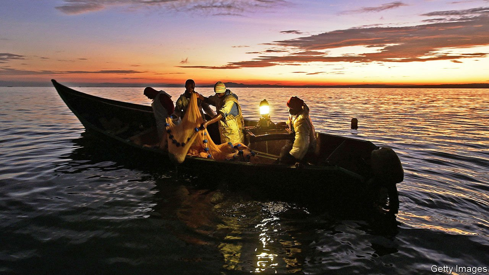
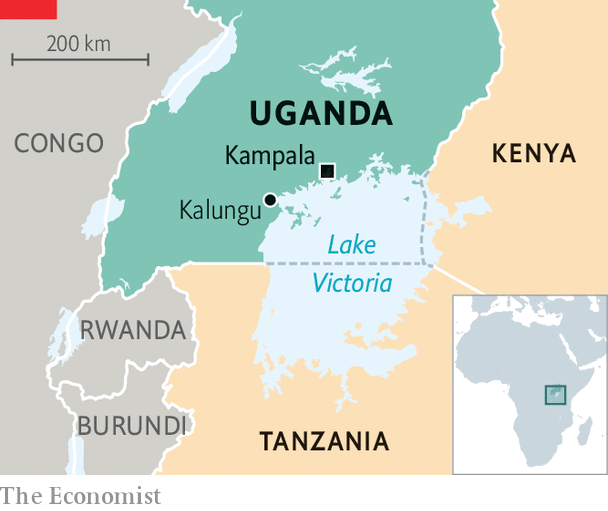

###### Finny business

# The reinvention of Africa’s biggest lake 

##### Commercial fishing has brought profits—and violence—to Lake Victoria 

 

> May 15th 2021 

THE OLD fishermen at Cape landing site in central Uganda can remember when they first came, in the 1990s, to this sliver of rock that lies between a forest and the lake they call Nnalubaale. There were nine settlers then. Now there are more than 600: sinewy boat-hands, gleeful children and stiff-backed women drying silver fish in the sun. Yet the drinking dens and timbered houses retain an air of impermanence. A fisherman is a wanderer, they say, like a herder always seeking fresh pasture.

These waters are never still. Lake Victoria, as English-speakers know it, is Africa’s largest freshwater lake, roughly the size of Ireland. In 1960, about 9m people lived in its catchment, mostly in the riparian countries of Uganda, Tanzania and Kenya; today, more than 60m do. The twin intrusions of market and state are transforming the fish in its waters and life on its shores, bringing export revenues, violence and an ecological crisis.


The lake was once home to around 500 species of small, brightly coloured haplochromine cichlids, which nurture their young in their mouths. Colonial officials considered them to be “trash fish” of little economic value. In the 1950s a rogue fisheries officer dropped Nile perch into the lake, hoping to create a commercial fishery. The newcomers “accepted the terms” of their employment, says Anthony Taabu-Munyaho of the Lake Victoria Fisheries Organisation, an intergovernmental body. In the 1980s an increase of Nile perch and algal blooms killed off more than half the haplochromine species. One team of ecologists described it as possibly “the largest extinction event among vertebrates” in the 20th century.

 


The old lake had been ecologically diverse and economically unproductive. The new one is the dominion of the Nile perch, which are packed in styrofoam and ice and flown to distant corners of the world. Processing factories, owned by Indians and Europeans, clean and fillet the fish for export. The law forbids them to operate trawlers, so they buy through middlemen from artisanal fisherfolk.

There are perhaps 77,000 vessels on the lake, most of them open wooden boats with two- or three-man crews. They catch Nile perch, tilapia and tiny silver cyprinids, lured by kerosene lamps on moonless nights. A lucrative side-trade exists in fish maw, the swim bladder of the Nile perch, valued in China for its supposed medicinal properties. Chinese traders will pay more for the maw than for a whole fish fillet. Fishermen call it “lake gold”.

In the early 2000s commercial fishing boomed. Then the Nile perch started to die out. Fishermen used small-mesh nets to catch immature specimens, which they traded across east Africa. Such practices were illegal, but the elected management committees at the landing sites were often led by the least scrupulous fishermen.

Overfishing was bad news for Uganda, on the northern shores of the lake, where fish products had become the second-largest export. Sujal Goswami, a factory-owner who chairs the exporters’ association, blames “the greediness and insensitiveness of the fisherfolk” for a collapse in stocks. By 2017 only five fish factories were left in Uganda, where once there were more than 20. The president, Yoweri Museveni, had seen enough. He decided to call in the army.

Military patrols helped fish stocks recover and six factories reopened. But fishermen were arrested, beaten and drowned in encounters with the army. Ziyad Nsereko had been fishing for only a few months when he and a friend drowned in March. A relative says they fell into the water after soldiers rammed their boat; the army says they jumped in while trying to escape. At his former landing site in Kalungu district the locals count nine deaths in similar incidents. When soldiers catch you, “they beat you until they see blood,” says a fisherman. A trader, hobbling and holding a crutch, says he was beaten for selling undersized fish.

The commander who took over the army operation in December, Lieutenant-Colonel Dick Kirya Kaija, admits that it used “a lot of force” at first. He paints a picture of the lake as “a harbour for criminals” who operate “like a network of drug dealers”, bending rules to import contraband nets. It is true that some businessmen own fleets of 100 boats or more. “They are damn rich,” complains Colonel Kaija, “and they have befriended security personnel, they have befriended ministers.”

But punishment falls mainly on their crews and those who fish for their own supper. “The government doesn’t help when those poor people are knocked into the water,” says a fisherman. “It’s like they are working for the rich.” Uganda has banned boats shorter than 28 feet, although larger ones, with bigger engines, require capital and credit. Aishar Nakamanya used to employ two workers to fish from her canoe, until the army burned it and seized her gear. Now she is reimbursing the owner of the outboard motor she had hired, rather than paying the fees that would keep her children in school.

Some kind of enforcement is necessary, as even many fishermen acknowledge. In Uganda alone, fish factories employ 5,600 people directly. Perhaps 1m in all, from hauliers to boat-builders, depend on the industry. Those livelihoods face multiple threats. Climate change makes extreme weather more likely, and the destruction of lakeside wetlands makes its impact more dramatic. Last year the lake rose to its highest level since records began, inundating homes. This year dead Nile perch washed up on the shoreline, a mysterious phenomenon thought to be caused by low oxygen levels.

Fisheries officials want to tame this turbulence. They are talking up fish-farming and plan to establish a paramilitary lake unit, similar to the rangers which fight poaching in national parks. They envisage a lake that is policed and profitable. That might create jobs, but would be utterly unlike the Nnalubaale of the past. ■

For more coverage of climate change, register for The Climate Issue, our fortnightly , or visit our 

