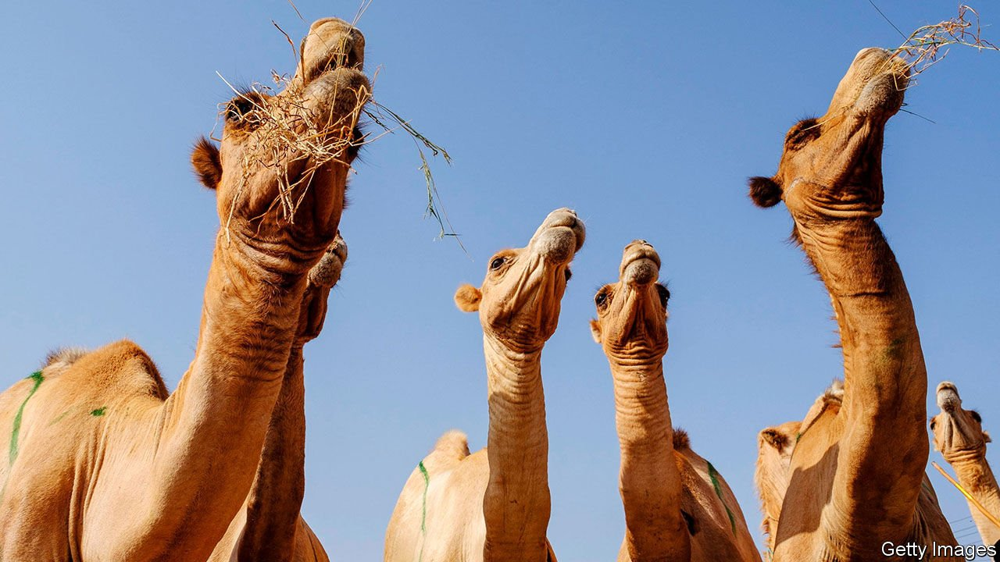

###### Humponomics

# Why camel traders are getting the hump 

##### In Somaliland women are disrupting traditional ways of selling camels 

 

> May 13th 2021 

IN 1906 LORENZ HAGENBECK received a request from the German government to supply its colonial army in South-West Africa (modern-day Namibia) with 1,000 camels. The animal trader sought out the main force in the industry: Somalis. But upon seeing how they haggled, Hagenback was confounded, “for I had not mastered the secret finger-language used in that trade”.

More than a century later clandestine, tactile negotiating can still be seen in Hargeisa, the capital of Somaliland. The city’s livestock market is a bustling and noisy place: goats bleat, camels bellow and sellers extol their animals’ constitutions. When it comes to reaching a price, however, all is silent. The parties on each side of the trade slip an arm under a shawl. The buyer makes an offer by grabbing the sellers’ fingers. The number of fingers gripped and knuckles pressed determines the bid. If it is too low the seller manoeuvres the hold. On and on they go, hands like human abacuses, until a deal is done.


Hassan Ahmed Hersi, a livestock broker, is not familiar with the economic term “asymmetric information”. It is a situation in which some participants have access to data or details that others do not, which can lead to market failures. “When brokers are negotiating, I don’t want others standing around to know the price,” he says. Brokers, who sell on behalf of rural herders, control much of the supply of humps. By using the cloak they hoard information about prices, too, giving them an edge. If the next buyer does not know the previous price, he can end up paying more.

Yet “change is coming”, says Warsame Ahmed of the University of Hargeisa. Herders like Mr Hersi grumble that using the cloak is becoming less common. One reason is that others in the market increasingly insist on bargaining in the open. “People think we’re hiding something,” he says, with his arm under a cloak. Meanwhile, mobile phones and messaging apps make it easier for buyers to ask fellow clan members in rural areas for the latest prices. That way they know if they are being stiffed.

Female traders are another big change. “There are becoming more and more of us,” says Hadan Yasin. Perhaps half of the market is staffed by women. Since imams say that Islamic law forbids men and women who are not related from touching, their deals are done verbally. By entering the market they are boosting competition and price transparency. And they are giving the likes of Mr Hersi the hump.

