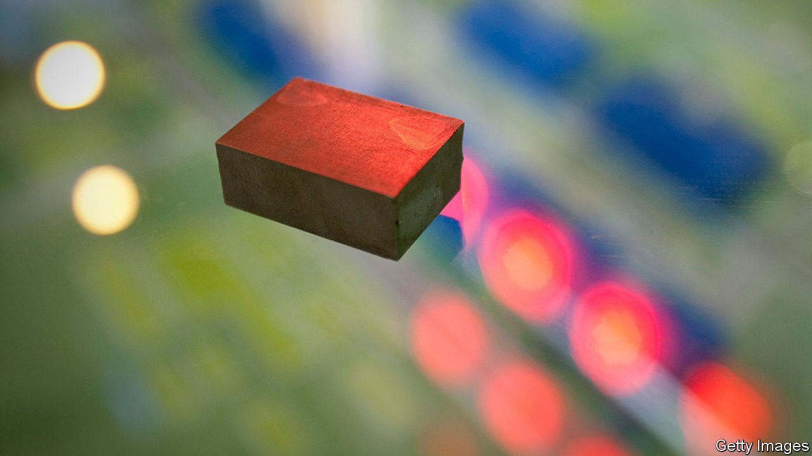

###### Recycling

# A way to recover rare earths from electric motors’ magnets 

##### First, you react them with hydrogen 

 

> May 13th 2021 

THE MOTORS driving today’s  use powerful magnets made from . Not all rare earths are actually that rare. Neodymium, for instance, is about as abundant as tin. But good, workable deposits are scarce, and many are in China, which has, in the past, imposed export quotas. This, combined with an absence of substitutes, make rare earths pricey enough to constitute more than half of such a motor’s cost. Yet virtually none is recycled—a deficiency that extends also to the motors in computer hard drives, cordless tools and domestic appliances, and to the generators (essentially, electric motors in reverse) in wind turbines.

The problem, says Allan Walton, who leads the Magnetic Materials Group at the University of Birmingham, in Britain, is that the process of shredding and separating usually applied to electronic waste makes the recovery of rare earths hard. Rare-earth magnets are brittle, and break into particles which oxidise readily in air. The result is a residue which is of little, if any, commercial value.


Dr Walton and his colleagues hope to change this, using a process developed by Rex Harris, now an emeritus professor at Birmingham, to recycle neodymium, the rare earth most widely employed in electric motors. In Dr Harris’s process, components containing neodymium-based magnets destined for recycling are tipped into a vessel that is then pumped full of hydrogen. A reaction between the hydrogen and the neodymium causes the material of the magnets to expand until it shatters. The result is a demagnetised powder. Once the vessel’s contents have been tumbled and sieved, and the hydrogen removed, the extracted powder is of a quality good enough for it to be processed straight back into magnets.

To recycle neodymium in this way, Dr Walton and his team have set up a firm called Hypromag. They say the resulting magnets need 88% less energy to make than equivalents produced from scratch. To help commercialise the process, Hypromag has teamed up with Bentley, a British subsidiary of Volkswagen well known for its luxury cars, which is now developing a range of electric models. Even petrol-driven Bentleys, however, contain lots of . Some operate features found routinely in other vehicles—power steering, self-winding windows and the multiple loudspeakers in the audio system. Less common in other marques are the motors that pamper the occupants by massaging their backs through the seat covers. All of these, though, will eventually be grist to Dr Walton’s mill.

Correction (May 12th 2021): The original version of this article suggested wrongly that Hypromag's magnets needed 15% less energy to make than equivalents produced from scratch

A version of this article was published online on May 11th, 2021

