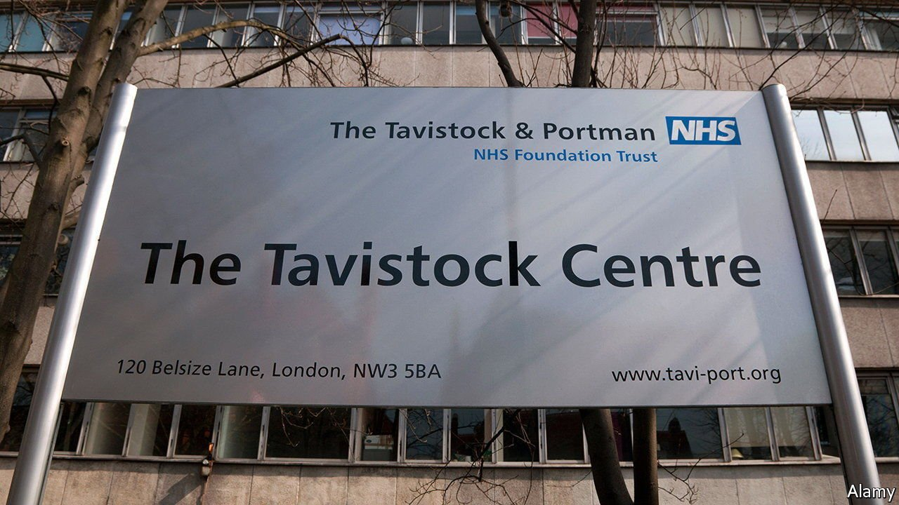
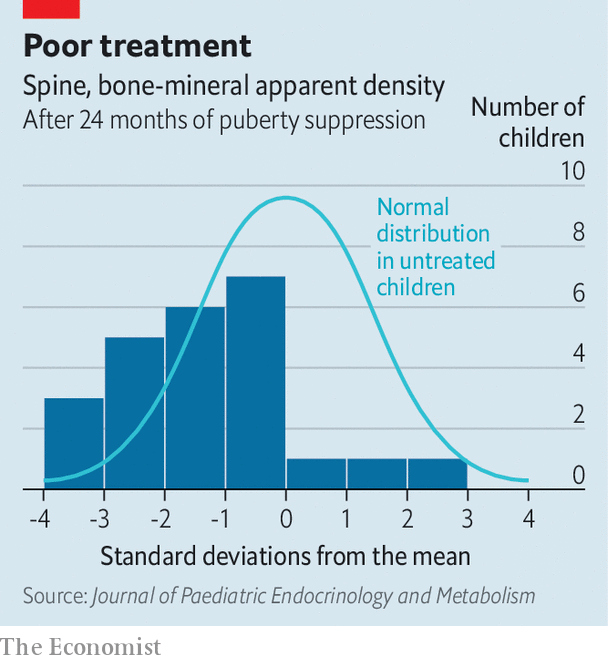

###### Gender medicine

# Doubts are growing about therapy for gender-dysphoric children 

##### Drug treatments seem to do little good, and may be harmful 

 

> May 15th 2021 

GENDER MEDICINE was once an obscure specialty. Patients with gender dysphoria were typically middle-aged men wishing to live as women. Things are different now. First, there are many more patients. Referrals to a specialist clinic attached to the Free University of Amsterdam rose 20-fold between 1980 and 2015. The Gender Identity Development Service (GIDS) at the Tavistock Clinic in London, England and Wales's only paediatric gender clinic, sees 30 times more people than a decade ago. The patients have changed, too. Most are now female and in their teens. Many are treated with drugs to block the onset of puberty. These are often followed by hormones to promote development of physical characteristics of the opposite sex, as part of an approach called affirmation therapy.

Last June, though, Finland revised its guidelines to prefer psychological treatment to drugs. In September Britain launched a top-down review of the field. In December the High Court of England and Wales ruled that under-16s were unlikely to be able to consent meaningfully to taking puberty blockers, leading GIDS to suspend new referrals, though a subsequent ruling held that parents could consent on their children's behalf. On April 6th Arkansas passed laws that make prescribing puberty blockers and cross-sex hormones to children illegal. Also in April the Astrid Lindgren Children's Hospital in Stockholm, a part of the Karolinska Institute, announced that it would stop prescribing puberty blockers and cross-sex hormones to those under 18, except in clinical trials.


Those sceptical of affirmation therapy point out two problems. Evidence is lacking, and what exists is not reassuring. A review by Sweden's health authorities in 2019 found little research, mostly of poor quality. Britain’s National Institute for Health and Care Excellence found that puberty blockers did little to dispel gender dysphoria or improve patients' mental health (though they do not make such feelings worse). Moreover, existing studies suggest that, without intervention, most children with gender dysphoria end up reconciled to their natal sex as adults.

 


There is also evidence that the drugs may cause serious harm. One example is described by Michael Biggs of Oxford University in a letter published on April 26th in the Journal of Paediatric Endocrinology and Metabolism. Bone-mineral density (BMD) usually rises sharply in puberty. But of 24 GIDS patients who had been prescribed puberty blockers, a third had BMD scores in the bottom 2% of their age groups (more that two standard deviations below the mean, see chart).

One patient, who began puberty blockers aged 12, suffered four fractures by the age of 16. That medical history, says Dr Biggs, would usually be enough to diagnose osteoporosis—normally a disease of the elderly. Animal studies suggest puberty blockers may cause cognitive damage, too. Cross-sex hormones have been linked to heart disease, strokes and sterility.

The combination of rising prescriptions and flimsy evidence leads some doctors to fear a medical scandal is brewing. Others think that the only scandal would be to change course. A bill before Canada’s parliament, for instance, would leave affirmation as the only legal treatment for gender dysphoria. The argument continues. ■

