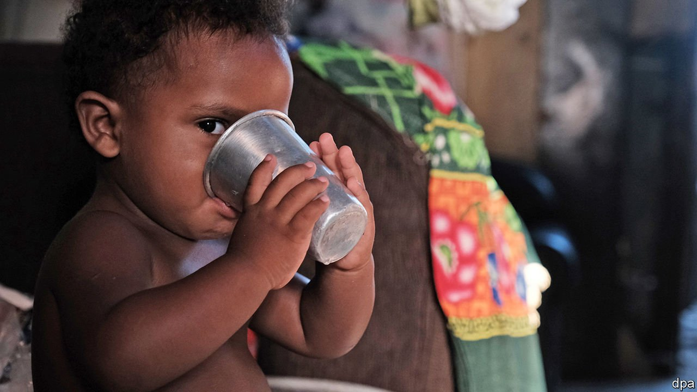

###### An old scourge returns

# Brazilians are increasingly going hungry 

##### As covid-19 rages, many poorer people can no longer afford enough food 

 

> May 15th 2021 

DENIZE XAVIER DE CARVALHO, a 40-year-old single mother, scoops rice onto the four plates in front of her. She adds a small spoonful of beans to each one as she turns off the stove. The pressure cooker sitting on the burner hisses as it cools, with a few chicken feet inside to feed her and her three children. This is the first time the family, who live in a slum in Rio de Janeiro, have eaten meat in months. Ms Carvalho, who lost her job as a waitress at the beginning of the pandemic, often can only feed her children bread and margarine. “It’s really hard,” she says, “to hear your children crying for a piece of bread and sometimes not having anything to give them.”

For decades malnutrition was a problem in Brazil, as the country struggled to lift millions of families out of extreme poverty. In the mid-1990s a series of programmes, starting with the creation of a National Council for Food and Nutritional Security ( CONSEA), began to curb poverty rates, and with it rates of hunger. Thanks to the commodity boom in the 2000s, and a push under the government of Luiz Inácio Lula da Silva, who was president from 2003 until 2011, Brazil was removed from the list of undernourished countries in the World Food Programme’s Hunger Map in 2014. This was achieved by a mix of policies, including the introduction of a national school-meals programme, an increase in the minimum wage and the Bolsa Família (family grant), which provided stipends to people who kept their children in school.


But the improvements in nutrition appear to be reversing. Food insecurity—a lack of consistent access to enough food—affected over half of homes, or 117m Brazilians, during the first year of the pandemic. According to a study by the Brazilian Research Network on Food Sovereignty and Security ( PENSSAN), an NGO, some 19m Brazilians, or 9% of the population, suffered from severe food insecurity in 2020.

As in most countries, hunger afflicts some groups more than others. Single black mothers, such as Ms Carvalho, tend to be the worst affected. According to the study by PENSSAN, those in the north and north-east were most likely to go hungry last year. Rural people also have a higher rate of severe food insecurity.

The numbers of hungry Brazilians started creeping back up after the recession in 2014-16, when millions of workers lost their jobs and most programmes to fight hunger suffered drastic budget cuts. When Jair Bolsonaro, the president, took office in 2019, he scrapped CONSEA, too. According to Elisabetta Recine, co-ordinator of the Observatory of Food Security and Nutrition Policies at the University of Brasília (and formerly the head of CONSEA) this meant that the country was already in a bad way before the pandemic.

But covid-19 has made everything worse. For a start, rising consumer prices, caused by a tumble in the the real, have hit the poorest hardest. During the first year of the pandemic food prices rose by 15%, almost three times the overall inflation rate of 5.2%, according to the Brazilian Institute of Geography and Statistics. The price of rice jumped by 70%, that of soya oil by 88%, potatoes by 48% and milk by 21%. Ms Carvalho complains that a bag of rice that once cost 10 reais ($1.90) is now three times as expensive.

At first, federal emergency aid was fairly generous. In April last year Mr Bolsonaro’s government announced that poor families would receive 600 reais a month, and those headed by single mothers twice as much, to help them weather the pandemic. But five months later, the amount was halved. According to Vilma Pinto, an economist at the Fundação Getulio Vargas, a university in São Paulo, the government had underestimated how much this would cost, thinking that only those already enrolled in government assistance programmes would need it. In the end the government spent 293bn reais, almost treble what it first announced. The government had not realised just how many people were living in a state of precarity, explains Ms Pinto.

Last month the budget for emergency aid was reduced further, to 44bn reais a year. Eligibility for payments was restricted to those who already receive food aid or families with incomes below 550 reais per person per month. As a result some 22m people who received emergency aid last year will not do so again this year. Similarly, some state-level programmes which provided aid in lieu of free school meals have become slightly less generous (though some schemes, such as Rio de Janeiro’s, are now offered to all public-school students, not just those who receive Bolsa Família benefits).

For Ms Carvalho the emergency aid is a boon, but she claims that it cannot be relied upon entirely, and that there are months when nothing is deposited onto the card she was given to receive the meal benefit, possibly because of an error. “Sometimes I go to the supermarket and when I go to pay with the card there’s nothing on it,” she says. “Then I have to put everything back and leave with nothing.” ■

