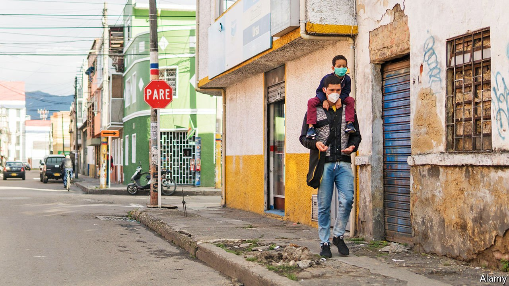
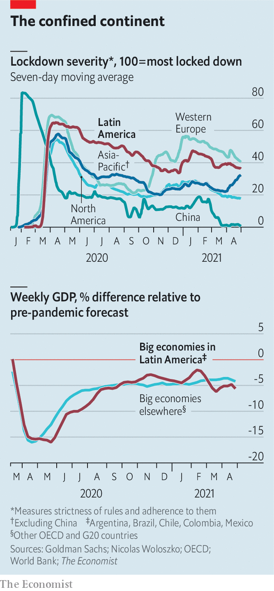

###### A long way down

# Why Latin America’s economy has been so badly hurt by covid-19 

##### Global GDP contracted by 3% last year, but that of Latin America and the Caribbean fell by 7% 

 

> May 13th 2021 

BEFORE THE pandemic hit, Jaime Alirio Pinilla, a 45-year-old in Bogotá, the capital of Colombia, was employed as a construction worker. “But because of this shit I lost my job and now work on the streets,” he says, standing behind a steel cart from which he sells orange juice, sweets, cigarettes and coffee. Colombia has already had one of the longest lockdowns in the world; now it also faces daily clashes between protesters and security forces, as riots over the economic situation continue for a third week. “We've been locked up for more than a year, and we can’t bear this any longer,” says Mr Pinilla. “The economy is ruined, we’re surviving, not living.”

The covid-19 pandemic provoked the deepest global recession since the second world war. But one region has  than any other—and by a stretch. Global GDP contracted by 3% last year, but in Latin America and the Caribbean output fell by 7%, the worst of any region tracked by the IMF (although India, almost a region in itself, did worse). In 2020 people in Latin America worked 16% fewer hours, almost twice the loss globally. Several countries in the region have done extraordinarily badly: Peru’s GDP, for instance, fell by 11% last year. And whereas some economies are now roaring back as restrictions are lifted, in Latin America the mood is if anything darkening.


The simplest explanation for the region’s terrible performance relates to public health. The Economist’s excess death model estimates that Latin America and the Caribbean has the highest number of excess deaths in the pandemic, relative to population, of the world’s regions. As vaccinations in other parts of the world reduce the spread of the disease and the damage it causes, in many parts of Latin America the coronavirus rages unchecked. In , where the populist president, Jair Bolsonaro, has refused to wear a face mask or be vaccinated, the official daily death toll at one point exceeded 4,000 a day (it is now about 2,000). Even countries that had previously done a good job of controlling the pandemic, such as Uruguay, are struggling with soaring case numbers.

 


The spread of the disease spurred some governments across the region to implement the world’s toughest lockdowns. A quantitative measure produced by Goldman Sachs, a bank, assigns a score from zero to 100 to assess the severity of a country’s rules on lockdown, the degree of adherence to such strictures and any voluntary social distancing (see chart). No region has had a more home-bound year than Latin America, with movement 70% more constrained than in North America.

Argentina and Chile have been the world’s second- and fourth-most restricted countries, respectively. Peru tops the list. There the initial lockdown felt like living through the darkest days of the war against Maoist insurgents in the early 1990s. No one was allowed to leave home except to buy groceries. Police officers and soldiers strictly enforced a curfew. Lockdowns this tough make much economic activity impossible, even if many of the region’s poorest people have little choice but to defy stay-at-home orders in an attempt to make ends meet.

In addition to the severity of Latin America’s outbreak and the associated lockdowns, two other factors have contributed to the region’s painful economic contraction: the structure of local economies, and the scale and design of fiscal stimulus. Take economic structure first. A range of evidence suggests that the region is especially vulnerable to lockdowns. Many countries in Latin America and the Caribbean are highly dependent on receipts from international tourists. Aruba, a Dutch island in the Caribbean especially reliant on visitors, saw GDP fall by 25% in 2020.

Recent research from the IMF finds that employment in what it calls “contact-intensive sectors”—the kind where it is impossible to do a job without being in physical proximity to others—is especially important in Latin America and the Caribbean. Jobs in industries such as restaurants, shops or public transport account for 43% of total employment, compared with 30% in emerging markets as a whole.

A region with high inequality, Latin America has an unusually large share of people working as domestic staff for richer folk, which inherently involves the mixing of households. For a recent paper, Louisa Acciari of University College London and colleagues surveyed domestic workers in multiple countries, and found stories of inadequate personal-protective equipment and violations of their rights. Indeed the first official covid-19 death in Rio de Janeiro last March was a maid who had been infected by her employer, according to state officials; the woman had been to Italy and, they allege, did not bother to send her maid home once she became sick.

The final factor behind the region’s dreadful economic performance is fiscal policy. One way of measuring whether a country’s fiscal response to the pandemic has been large enough involves comparing two things: the change in a country’s overall budget deficit, and its lost output during the pandemic. Borrowing a methodology developed in a research paper by Goldman Sachs, The Economist calculated the adequacy of pandemic-induced stimulus for 193 countries. Many governments around the world have, for every dollar of lost output, boosted their spending by a dollar. A few, such as those of the United States and Australia, have been substantially more generous. Latin America, although implementing more generous fiscal stimulus than in past recessions, has been stingy even relative to other emerging markets, with the median country adding just 28 cents of extra deficit spending for every dollar of lost output.

The design of the stimulus also has shortcomings. Countries with the most successful plans have sent vast amounts of money directly to people. That has helped break the link between job losses and cuts in households’ spending, supporting the economy. Latin America, by contrast, has mostly focused its resources elsewhere, including on building up underfunded health-care systems.

Not all Latin American countries have taken this route. In Brazil, spending by Mr Bolsonaro’s government has made up for lost output almost completely. This helped reduce the incidence of extreme poverty even as the pandemic gripped the country, although the level of emergency aid to poor households has recently declined, and hunger and other forms of deprivation .

Yet some governments have been puzzlingly austere. Nowhere is this truer than in , led by the self-proclaimed left-winger Andrés Manuel López Obrador. Mexico’s puny stimulus programme (of 17 cents per dollar of lost spending) stems from Mr López Obrador’s monastic and autarkic sensibilities, which make him instinctively leery of debt but especially so when it is funded by foreign financiers. In Colombia  were sparked by the attempt on April 28th by Iván Duque’s government to push through a tax reform, but have grown into something far larger. Much of the discontent stems from the perception of an inadequate or misguided response to covid-19, which has allowed 2.8m people to fall into extreme poverty.

The economic carnage will not last for ever. But the annual growth in GDP of 3-4% that Latin America and the Caribbean can expect, once restrictions are safely lifted, remains some way below the rates that the United States and some other countries are about to see. A recent surge in commodity prices will help less than many think: an index of world commodity prices remains below where it was for much of the period since the global financial crisis. And because of feeble stimulus households have not accumulated big chunks of savings, as they have in many richer countries, so there will be no post-lockdown spending binge. As the riots in Colombia show, the region hardest hit by the pandemic faces yet more trouble. ■

A version of this article was published online on May 10th, 2021

Dig deeper

All our stories relating to the pandemic and the vaccines can be found on our . You can also listen to , our podcast on the race between injections and infections, and find trackers showing ,  and the virus’s spread across  and .

