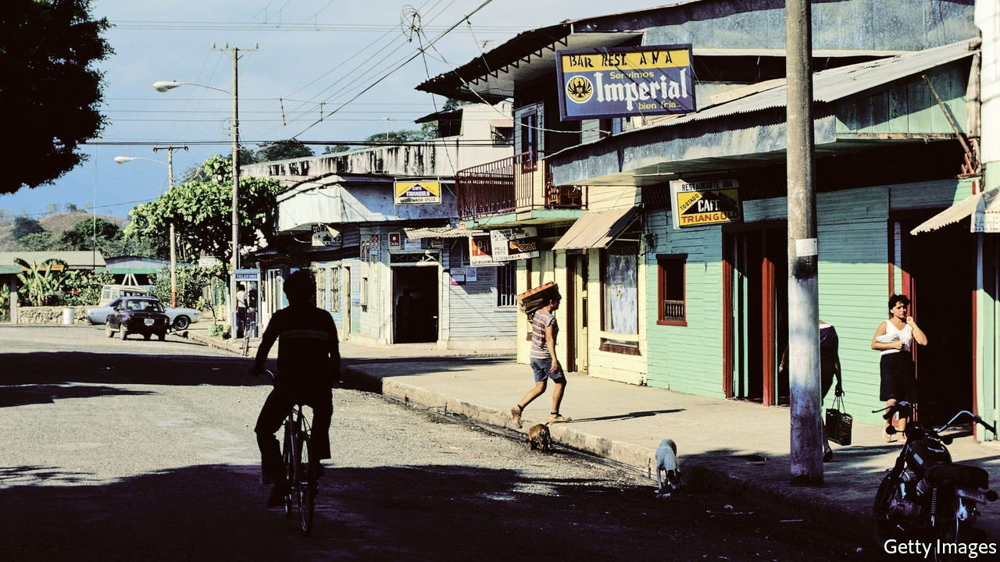

###### Off the grid

# Why it is easy to get lost in Costa Rica 

##### The country uses a mix of vague places, distances and compass directions as addresses 

 

> May 15th 2021 

“PEOPLE REFER to a corner shop, a bar, a tree—even a tree!” exclaims Rolando Granja Enríquez, a postman. For a place with well-developed public services, Costa Rica’s addresses are a conundrum. Nearly everyone uses vague places, distances and compass directions, rather than street-names and postcodes: 200 metres west of such-and-such juice bar, 100 metres north of the house with the pink fence, and so on. Worse, sometimes the landmarks used as reference points have long gone, says Mr Enríquez.

This archaic method may be quaint and infused with local history—indeed neighbouring Nicaragua has a similar system. But it has a high economic cost, says Geovanny Campos, the head of logistics at Correos de Costa Rica, the postal service. Exactly how much is unknown: the last study, over a decade ago, estimated a toll of $720m annually.


The lack of clear addresses obstructs the smooth delivery not only of letters, but of other public and private services, too. Police, for example, may be slow to respond to calls for help if they cannot find the caller. Food takes longer to deliver, resulting in lukewarm chifrijo (pork and beans). The past year has been particularly troublesome, as many Ticos (as people from Costa Rica are known) have stayed at home and ordered goods online.

In 2002 the post office came up with a plan for naming the streets, which became a government decree in 2005. Since then just 30% of Costa Rica’s 82 municipalities have worked with the post office to name their streets. Overall the initiative has been a failure, admits Mr Campos. Other institutions do not seem terribly interested in change. Even in towns where streets and houses have numbers, all too often locals keep using the old way of specifying places.

Despite this the postal system in Costa Rica is fairly efficient. Only around one in 20 letters is returned to the sender because it cannot be delivered. Many companies that will not ship to Mexico, which has a decent address system but tricky customs, deliver to Costa Rica. That is thanks to old hands like Mr Enríquez, who spend years in the same neighbourhood and come to know it and its residents. But what will happen when Mr Enríquez and his colleagues retire?

