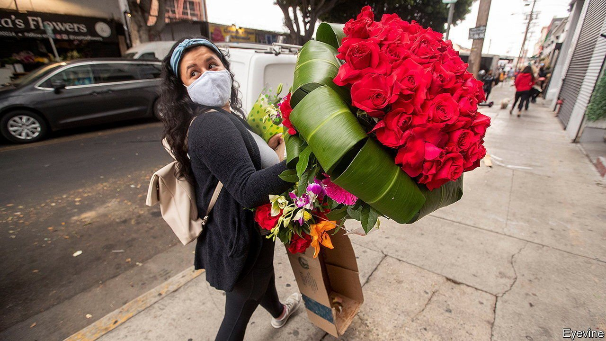
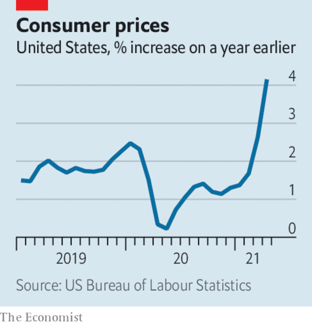

###### 

# Business this week 

#####  

 

> May 15th 2021 

 


 soared to 4.2% in April, higher than expected and fuelling concerns that rising consumer prices may become a problem for the American economy. Inflation hawks blame the huge amounts of stimulus injected into the economy and a boom in consumer demand (prices for used cars were up by a fifth, year on year). Global supply bottlenecks are also pushing up costs for manufacturers. The Biden administration, however, thinks inflationary pressures are temporary and will ease later this year.

Commodity prices are also going up, with the prices of iron ore and copper reaching record highs, in part because China’s factories are sucking up supplies. Oil prices are on the ascent again, approaching $70 for a barrel of Brent crude.


The FBI launched an investigation into a cyber-attack that forced the closure of the , which stretches from Texas to New Jersey, providing half the transport fuel for America’s east coast. A criminal gang called DarkSide claimed responsibility. It describes itself as apolitical. There was some panic-buying of petrol (gas) as pump prices soared.

With the outlook for inflation uncertain, stockmarkets bounced around as investors pondered whether the Federal Reserve would change direction and raise interest rates. The share prices of high-growth big tech companies have fallen in recent weeks because higher bond yields lower the value of their forecast earnings.

Markets were also rattled by weak data on the American jobs market. Employers added 266,000 people to their payrolls in April, well below the numbers for February and March. And job vacancies hit 8.1m at the end of March, the most since records were first compiled in 2000. That led to a lot of head-scratching by economists trying to explain a lack of hiring when the economy is taking off.

Just warming up

 by 1.5% in the first quarter compared with the previous three months. The post-Christmas lockdown hit output hard in January, but by March it was expanding again as businesses adapted to the restrictions. GDP was still 6% smaller than before the start of the pandemic in February 2020.

SoftBank reported net income of ¥5trn ($46bn) for the year ending March 31st, a record annual profit for a Japanese company. Much of that came from gains in its vision-fund investments, particularly Coupang, a South Korean e-commerce company that went public in March. It reported a deep quarterly loss this week, despite rising sales.

Elon Musk, a vocal backer of digital currencies, reversed his three-month-old policy and said that Tesla would not now accept bitcoin as payment for its cars because of the environmental effects from the electricity used to power the currency on computers.

The EU’s General Court, the second highest in the bloc, ruled that the European Commission was wrong to order Amazon to pay €250m ($300m) in taxes to Luxembourg, finding that the commission had not proved the firm received special tax treatment. The same court made a similar decision last year in the case of Apple; the commission is appealing that ruling to the European Court of Justice.

America’s Department of Defence agreed to remove Xiaomi from its ban on American investment in companies that are said to have ties to the Chinese army. The maker of smartphones and other devices had already won a suspension of the ban in court.

Almost 40% of the shareholder vote at AstraZeneca’s annual meeting rejected the salary package for its CEO, the latest in  dished out during the pandemic. The pay policy—which increases the potential bonus and stock awards for Pascal Soriot—was approved by just 60% of shareholders at the meeting.

There were more signs of a recovery in the tourism industry. TUI, the world’s largest tour company, said there had been a clear pickup in demand. Although it doesn’t expect its business in 2021 to reach pre-pandemic levels, bookings for holidays next year from Britain, one of its biggest customer markets, are exceeding bookings at this point in 2019.

Choose your words carefully

The share price of Meituan plunged, after the Chinese shopping platform’s chief executive posted an ancient poem on social media that was taken as a swipe against the government. Like Alibaba, Meituan is in the government’s cross-hairs for being too big and influential, and is under investigation for alleged anti-competitive practices. Wang Xing posted a poem written during the Tang dynasty over 1,000 years ago, which criticised the emperor’s attempt to crush dissent.

