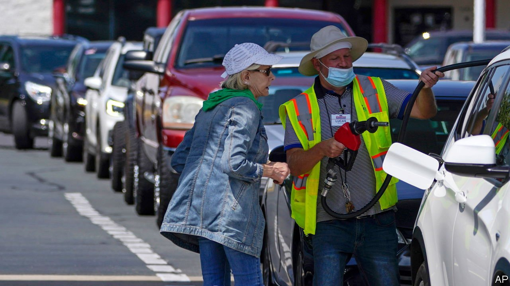

###### Post-Colonial studies

# A cyber-attack exposes risks to America’s energy infrastructure 

##### And the threats are likely to grow 

 

> May 13th 2021 

PIPELINES, LIKE cables and substations, are the type of dull, critical infrastructure that Americans don’t think about until, suddenly, they must. On May 7th a cyber-attack prompted Colonial Pipeline, a firm headquartered in Georgia, to shut down a tube stretching from Texas to New Jersey that supplies about 45% of the petrol and diesel used on the east coast. Federal officials confirmed that DarkSide, a  gang believed to be based in the former Soviet Union, was responsible. “We’re not talking about some small pipeline,” explains Amy Myers Jaffe, author of “Energy’s Digital Future”, a new book. “We’re talking about the jugular.”

On May 12th Colonial Pipeline said it had “initiated the restart of pipeline operations”, a carefully worded statement that conveys both the difficulty of returning to normal and a desire to contain panic. That day average petrol prices topped $3 a gallon for the first time since 2014. Much depends on whether more drivers rush to buy petrol, as they did in the oil shocks of the 1970s. If 30m car-owners with half a tank decide to fill up, reckons S&amp;P Global Platts Analytics, a data group, they would guzzle over 4m barrels, more than the recent daily demand of the entire eastern seaboard. Many are already buying while they can. Long queues formed at petrol stations in the south-east on May 11th. Some stations limited purchases; others ran out of fuel. The White House said it had established “an inter-agency response group” to “ensure a continuing flow of fuel”.


Even if supplies are restored quickly, however, America faces a more stubborn problem. Despite more than a decade of attention to cyber-security, the country’s energy infrastructure—the pipelines, power generators and grids on which the economy depends—remains exposed to hackers. Indeed the energy system may yet become more vulnerable, not less.

Securing oil and electricity assets used to mean guarding against physical attacks: a bombing of a refinery, for instance. Those risks remain, but hackers can also inflict grave damage. In 2010 the Stuxnet worm, generally believed to have been deployed by Israel and America, targeted a nuclear facility in Iran. In 2015 and 2016 Russian hackers caused blackouts in Ukraine.

Aware of such risks, American executives and politicians have tried to mitigate them. The American Petroleum Institute, the country’s main oil lobby, has held an annual conference on cyber-security since 2006. The Department of Energy dutifully developed “The Energy Sector Specific Plan” for cyberthreats, in 2015, “The Multiyear Plan for Energy Sector Cybersecurity”, in 2018 and “The 2020 Cybersecurity Multi-year Program Plan”, to name but a few.

Yet weaknesses remain. The shutdown of the Colonial Pipeline exposes gaps in companies’ cyber-armour. It also reveals the idea that shale oil might guarantee energy security to be a fallacy. Oil may be fungible but oil infrastructure is not, notes Michael Tran of RBC Capital Markets. America’s north-east is particularly exposed to attack, Mr Tran says. A dearth of local refineries makes the region dependent on pipelines and tankers for oil products.

The federal government’s cyber-defences are imperfect, too. The Government Accountability Office (GAO), the agency charged with criticising other agencies, has found cyber-security a particularly rich subject. The Transportation Security Administration (TSA) is supposed to help safeguard oil and gas pipelines; in 2019 the GAO identified “factors that limit the usefulness of TSA’s risk assessment”. In March the GAO reported that the Department of Energy’s plans for cyber protection “do not fully address risks to the grid’s distribution systems”, leaving big cities vulnerable.

Worryingly, cyber-attacks may increase in number and ambition. Hackers are using ransomware to infiltrate larger companies and seek higher payments. Their  has roughly doubled over the past year, according to Coveware, a tracking firm. Furthermore, changes to the electricity system may, without sufficient planning, make it more vulnerable. As more devices are connected to the internet, hackers have a larger number of targets. As more cars run on electricity rather than combustion, a blackout can wreak broader damage. And as transmission lines connect distant power systems, helping to balance intermittent wind and solar power, a problem in one grid can have an impact on another.

These challenges are not unique to America. But they pose a particular headache for President Joe Biden, who is trying to win support for climate proposals in his  Limiting climate change and fighting cyberthreats are hardly mutually exclusive endeavours. Mr Biden must make a credible case that he can make America’s energy system both greener and more secure. ■

 this article has been updated to include the Colonial Pipeline’s partial reopening

A version of this article was published online on May 12th, 2021

