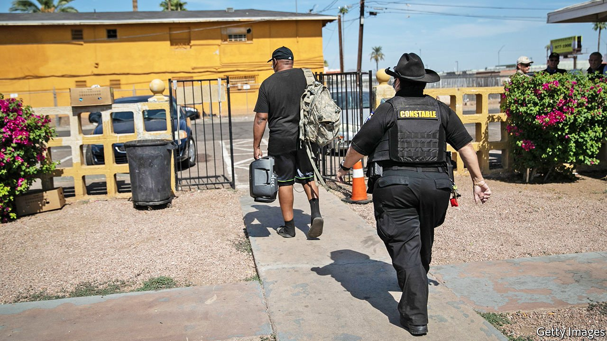

###### Shelter in place

# In America, a million evictions take place in a normal year 

##### Covid-19 prompted a giant experiment in halting them. What were the consequences? 

 

> May 15th 2021 

BEFORE COVID-19, evictions were a hot topic, thanks to the publication of “Evicted”, a rare wonk-bestseller by Matthew Desmond of Princeton University. The book follows eight families turfed out of their homes in Milwaukee, their possessions unceremoniously dumped on the pavement. Mr Desmond estimates that there are 1m evictions a year in America, a staggering number given the relatively small number of people affected (about 2.3m adults and children). Then, when covid-19 hit, an experiment took place. The Trump administration issued an edict pausing evictions, a policy continued by the Biden White House. On May 5th a judge struck down the federal moratorium, apparently ending the experiment. What were the results?

The federal moratorium actually consisted of several policies spanning the Trump and Biden administrations. From March to August 2020 it was part of the CARES Act. From September it took the form of a directive from the Centres for Disease Control and Prevention (CDC), which was extended three times to end on June 30th this year. The CDC claimed authority on the ground that evicting people in the middle of an epidemic was a public-health risk. That seems to be true. From May to September 2020, 27 states lifted their eviction moratoriums. Comparing the trend before the pandemic to the trend in infection and deaths once the moratoriums were lifted, researchers estimate that states without moratoriums experienced covid-19 infection rates twice as high as states with them.


As this suggests, state and local governments have interpreted the moratoriums differently. New Hampshire required landlords to file affidavits stating compliance with the CDC before proceeding with an eviction. Some have paused removals but not court hearings, filings and eviction notices. Other places have refused outright to comply, for example Jackson County, Missouri, which included half of Kansas City. This patchwork of policies has confused millions of Americans, with several hundred faced eviction despite federal policies that seemingly banned it.

Forty-three states issued some form of an eviction moratorium during the epidemic. The Eviction Lab, a research group headed by Mr Desmond at Princeton, estimates that the federal moratorium prevented at least 1.6m eviction filings in 2020. This reduced filings by 35% compared with the historical average, a notable achievement during an economic slump. By contrast, during the two-week pause between the CARES Act ending in August 2020 and the CDC eviction moratorium beginning in September, evictions rose back to pre-pandemic levels.

The cost of this policy fell mostly on landlords. And in many poor post-industrial cities, the kind of place featured in “Evicted”, much affordable housing is supplied by small landlords. Many of them are struggling to make ends meet themselves. Some are being forced to sell off properties to cut their losses. These sales could reduce the availability of low-cost housing, pushing up the cost of housing and, eventually, resulting in more evictions.

What, then, are the lessons of the evictions pause? One is that the policy needs to be paired with help for tenants and landlords, in the form of rental assistance or vouchers. Billions of federal dollars have been provided for pandemic-related emergency rental assistance ($25bn under the Trump administration and $22bn under the Biden administration). But the Urban Institute, a think-tank, estimates that at least $50bn is needed to cover rent owed. And according to the Eviction Lab, many tenants are being evicted before the funds are being disbursed. In Texas, only 250 households received assistance out of 70,000 applicants by the end of March.

Increasing the stock of affordable housing would also help. In 1999 the Faircloth Amendment, an amendment to the Housing Act of 1937, capped the amount of housing that could be owned by the Public Housing Authority. So for any public housing unit to be built, one must be taken away. Finally, unlike the procedure in criminal cases, renters facing eviction are not guaranteed a lawyer. So whereas 90% of landlords have legal counsel, only 10% of tenants do. And lawyers make a difference. In New York City, 84% of renters represented by counsel avoided eviction after the city made lawyers more widely available. That would also slow evictions down, without penalising landlords unfairly. ■

