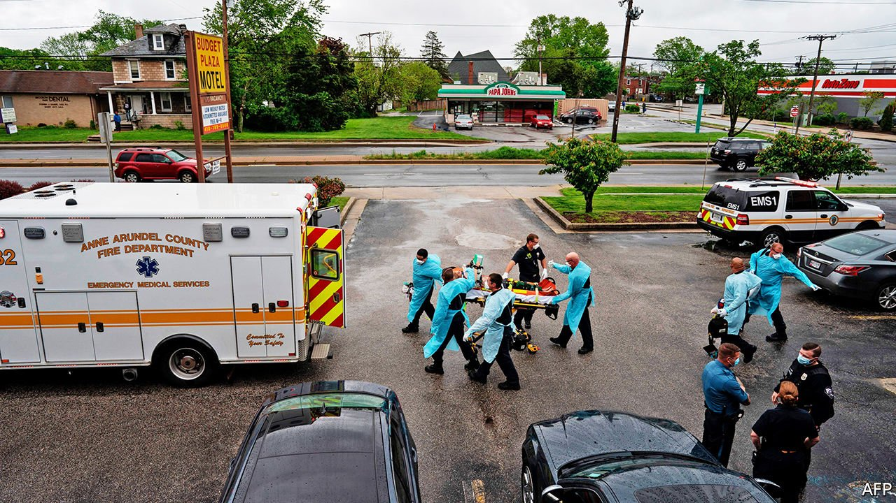
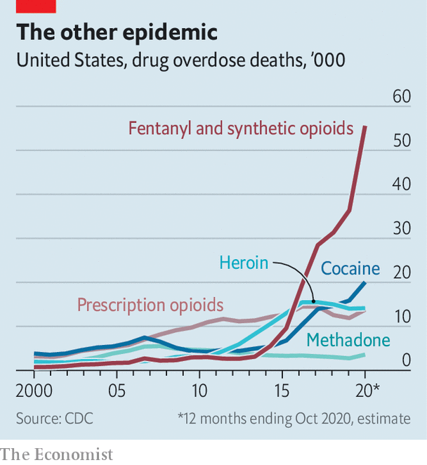

###### The other epidemic

# Last year, more people in San Francisco died of overdoses than of covid-19 

##### This is part of a worrying national trend, following changes in drug markets 

 

> May 15th 2021 

THE FIRST time Jean was offered heroin, she declined. One night, though, when she was 18 or 19, she decided to give it a try. Over the next few years, heroin led to meth, and meth led to fentanyl. It wasn’t until she got pregnant in 2017 that she decided to seek help. “I was at a point in my life where I kept consistently hitting rock bottom and I was OK with that,” says the 29-year-old from Denver. “But when I found out that I was pregnant with my daughter, I wanted better for her.”

Not everyone has such a realisation. While covid-19 rampaged across the country, America’s other epidemic has quietly boiled over. Provisional data from the Centres for Disease Control and Prevention (CDC) suggest that just over 90,000 Americans died by drug overdose in the 12 months to October 2020, a 30% increase on the previous year. That is more than the number of people who were killed last year by car crashes (42,000) and guns (44,000) combined. Roughly 55,000 of those who overdosed died from synthetic opioids such as fentanyl, a 57% jump year-on-year.


The pandemic seems partly to blame for the increase. Dr Chris Thurstone, the director of behavioural health services at Denver Health, says the isolation wrought by lockdowns can worsen depression and anxiety, and substance abuse often increases during economic downturns, when people have lost their jobs or are worried about their finances. More people may have used drugs alone, or been unable to seek medical help when clinics closed or stopped accepting new patients. But there is more to the story. America’s opioid epidemic has entered a dangerous new phase thanks in large part to shifting—and modernising—drug markets.

The roots of the epidemic , such as OxyContin, which was introduced in 1996. In the 15 or so years it took for the prescription opioid crisis to turn into an illicit opioid crisis, the geography of the epidemic remained relatively stable. Many hoped fentanyl, which is up to 100 times more potent than morphine per gram, would not spread beyond the East Coast and Appalachia, where it has wreaked the most havoc. Users in Western states have historically preferred black-tar heroin, which does not mix as well with fentanyl, to the white-powder heroin found in the east. “Opiate users generally have their drug of choice,” says Bill Bodner, who runs the Los Angeles division of America’s Drug Enforcement Administration (DEA). Older westerners addicted to opioids, “were tar heroin users, they are tar heroin users, and they are going to continue to be tar heroin users.”

 


Yet recent tallies show that the scourge has now found purchase in the West too. In San Francisco, more than twice as many people died from an accidental drug overdose last year as from covid-19. The city’s chief medical examiner estimates that fentanyl was detected in the bloodstream in nearly 73% of overdose deaths. In Las Vegas, overdose deaths from fentanyl increased from just 16 in 2015 to 219 in 2020.

Fentanyl’s spread is as much about geopolitics and organised crime as it is about local drug markets. China is the biggest supplier of the chemicals used to make fentanyl, and until recently the drug was often mailed directly to the United States in small parcels. In 2019 the Trump administration successfully lobbied the Chinese government to ban the illicit production and sale of fentanyl and similar substances. Afterwards, says Matthew Donahue, deputy chief of operations for the DEA, direct shipments “virtually stopped”.

Fentanyl did not disappear, however. Chinese producers simply took the long way round, shipping the chemicals to Mexico for drug cartels—which were already trafficking heroin, meth and cocaine—to then move across the border. The amount of fentanyl seized by Mexican security forces nearly quintupled between 2019 and 2020. Once across the border, the cartels, Sinaloa and Jalisco New Generation chief among them, use their established networks to distribute the drug throughout the United States.

It is not just the route that fentanyl travels that has changed. The drug is also shape-shifting. In Mexico, fentanyl is pressed into counterfeit pills made to resemble painkillers like OxyContin or hydrocodone. Just two milligrams of fentanyl can be fatal, so a pure fentanyl pill—or one pressed with another drug such as heroin or cocaine—can be deadly many times over. When the DEA tested sample pills from drug seizures between January and March of 2019, 27% contained a lethal dose of fentanyl. John Pelletier, who runs the narcotics division of the Las Vegas Metropolitan Police, said his team responded to a fatal-overdose call where the two victims had their phones open to check the side-effects of OxyContin, not realising they had ingested a fentanyl pill.

Counterfeit pills are great business for the cartels. Fentanyl can be produced at one-hundredth the cost of heroin, says Keith Humphreys of Stanford University. The cartels “don’t need a field of poppy plants,” says Mr Donahue, “they just need a basement, house or small warehouse.”

The spread of fentanyl has changed the demographics of who is dying from opioids. In 2014, opioids killed whites at twice the rate as African-Americans. The overdose death rate among black Americans more than tripled in the five years to 2019 as fentanyl infiltrated the supply of illicit drugs. Young people in their 20s and 30s are also dying in greater numbers.

Higher death rates among younger Americans reflects a shift to online drug markets. The dark web, an obscure corner of the internet, has long been a source for illicit drugs. Now, counterfeit pills are readily available on gaming and social-media platforms such as Instagram or TikTok. The pandemic has accelerated the trend: Americans turned more frequently to the internet for drugs just as they did for toilet paper and groceries.

All this paints a bleak picture. Officials warn that the other epidemic, which has steadily worsened for decades, will get deadlier still before it gets better. President Joe Biden’s American Rescue Plan, which was passed in March, included nearly $4bn for mental health and substance-abuse services. Mr Biden has also made it easier to prescribe buprenorphine, a drug used to treat opioid addiction.

That is welcome, but 90,000 people dead suggests the need for a more muscular response. It would help if the dozen states that declined to expand Medicaid under the Affordable Care Act would change their stance, as that could provide methadone for addicts. Congress could also restart Medicaid—the government health-insurance programme for poor people—for prisoners in the weeks before they are released. A study in 2018 found that the risk of opioid overdose for former inmates in North Carolina was up to 40 times higher than for the state’s general population. It would be great to think that the problem could be fixed by choking off supply. But one constant of border policy in this and the previous administration is that fentanyl can always find a way in. ■

Dig deeper

All our stories relating to the pandemic and the vaccines can be found on our . You can also listen to , our podcast on the race between injections and infections, and find trackers showing ,  and the virus’s spread across  and .

