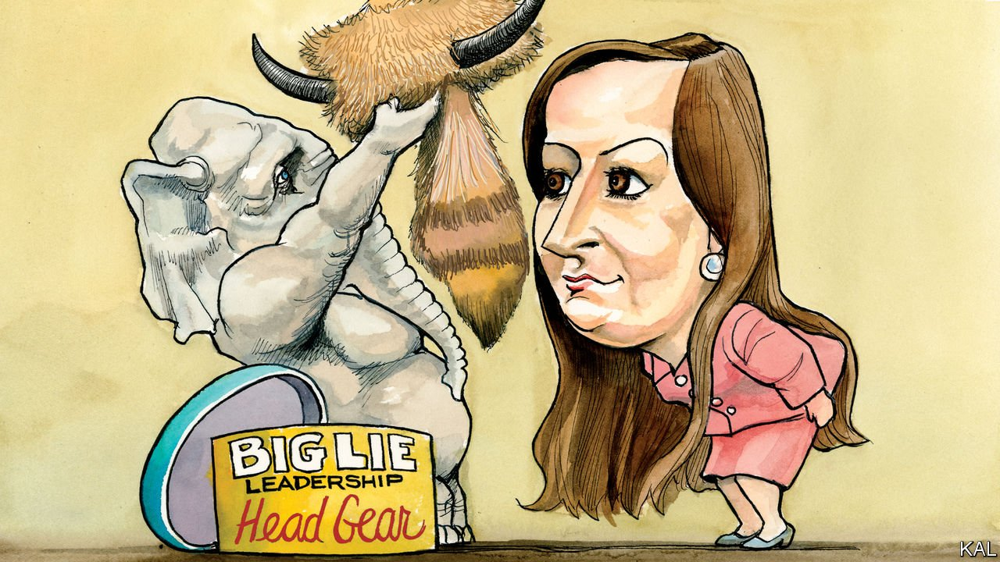

###### Lexington

# Liz Cheney’s demotion is a death rattle for principled conservatism 

##### Republicans have become hooked on Donald Trump’s method 

 

> May 15th 2021 

NOT LONG ago the prospect of House Republicans replacing a middle-aged security hawk as their number three with the 30-something representative of a district that voted for Barack Obama twice might have suggested something important about the party’s ideological direction. Yet only the most credulous commentators are treating the impending replacement of Liz Cheney, a Republican blue-blood and scourge of progressivism from Wyoming, with Elise Stefanik in those terms. In reality it indicates a party abandoning conservative ideology altogether.

There are few more trenchant conservatives than Ms Cheney, who was sacked from the Republican leadership this week. The daughter of a vice-president renowned for those qualities, she voted for Donald Trump’s bills 93% of the time and has rarely come across a centre-left proposal she did not view as deviant socialism. Ms Stefanik, by contrast, is a 36-year-old Harvard graduate who opposed Mr Trump’s tax cut, was once known for advocating gay rights and has been called a “liberal” by the Club for Growth. But that explains neither her rise nor Ms Cheney’s fall; intellectual argument is yesterday’s Republican politics.


Ms Cheney’s offence against the new conservative orthodoxy is her refusal to accept that last year’s presidential election was stolen. She further claims, accurately, that those who promulgate this lie, including the former president and most of her Republican colleagues, are responsible for deceiving millions of voters with potentially calamitous consequences, of which the ransacking of the Capitol by a pro-Trump mob on January 6th was but a foretaste. “I will not sit back and watch in silence while others lead our party down a path that abandons the rule of law and joins the former president’s crusade to undermine our democracy,” she said before her removal. Ms Stefanik is one of those others.

The 36-year-old’s rapid rise from the ranks owes everything to her warm embrace of Mr Trump’s lawlessness. A former critic of his Muslim ban, border wall and ill behaviour, she made an unexpected lurch to Trumpism during the former president’s first impeachment trial, which she inaccurately called “baseless and illegal”. Richly praised by the former president, she began aping him. She jettisoned her commitments to bipartisanship, gay rights and tax realism. She caricatured her Democratic electoral opponent, Tedra Cobb, as “Taxin’ Tedra” (which was maybe what the former president had in mind when he called her a “gifted communicator”). Perpetuating his rigged-election lie was the next step.

Ms Stefanik joined the Republican vote—just hours after the insurrection—to reject the election results. In an interview-cum-hustings with Steve Bannon, she dived further off the edge by backing a Republican audit of the vote in Arizona’s biggest county that is to election security what Mr Trump’s view on disinfectant infusions was to covid-19 medicine. The auditors are examining ballot papers for traces of bamboo, in response to an online rumour that thousands were fraudulently smuggled in from Asia.

There is little chance that the capable Ms Stefanik believes such nonsense. According to Representative Adam Kinzinger of Illinois, only around five Republicans in Congress do. Indeed Ms Stefanik’s careful choice of words gives her away. While dignifying all manner of debunked Trumpian election falsehood, in what might sound like an admirably restrained way (“…I do not take this action lightly. I am acting to protect our democratic process…”), she refuses to say outright that the vote was stolen. The troubling reality of American politics is not that she and other ambitious young Republican lie-peddlers, such as Josh Hawley and Matt Gaetz, are deceived, but that they are incentivised to behave in this mendacious, anti-democratic way. And, further, that they see no impediment to doing so.

Currying favour with Mr Trump, though rewarding, is only part of the explanation for that. The former president’s loss of office and media platforms presented his party with an opportunity to distance itself from his falsehoods that it has simply shown no interest in taking. Beyond their fear of the former president, Republicans have become hooked on his method, which in essence involves firing up the party’s relatively small and fearful base, while trying to compensate for the Democrats’ greater numbers by suppressing their vote. Kevin McCarthy, the Republican leader in the House, exemplified the first in a letter announcing his intention to knife Ms Cheney. Her truth-telling, he claimed, was impeding Republicans’ efforts to stop Democrats “destroying the country”. Republican state legislatures—independently of Mr Trump—are pursuing the second course, through some 400 legislative efforts to tighten voting rules. In several states, Joe Biden’s winning margin was smaller than the number of votes cast by methods, such as emergency postal ballots, that have since been banned.

In totality, this Republican campaign is less a new course than an escalation of grubby tactics that predated Mr Trump; and which Democrats, in the form of gerrymandering, also dabbled in. The sliding descent into skulduggery this represents (rationalised by an increasingly feverish view of the other side) explains why so few House Republicans have resisted it. Ms Cheney and Mr Kinzinger have done so, in effect, by seeing a distinction between seizing dubious advantages in the democratic system and assaulting it for partisan gain. It is no coincidence that they are motivated more by ideology than power for its own sake. Ms Stefanik and her peers see no such distinction. They, also not coincidentally, mostly entered Republican politics after the party had started jettisoning ideas for scaremongering and the pursuit of power by any means.

Working on the Cheney gang

Ms Cheney’s demotion leaves this group in control of a caucus that has a good chance of taking the House at next year’s mid-terms. To her credit, she vows to continue fighting to bring her party “back to substance and principle”. She has her work cut out. ■

For more coverage of Joe Biden’s presidency, visit our dedicated 

